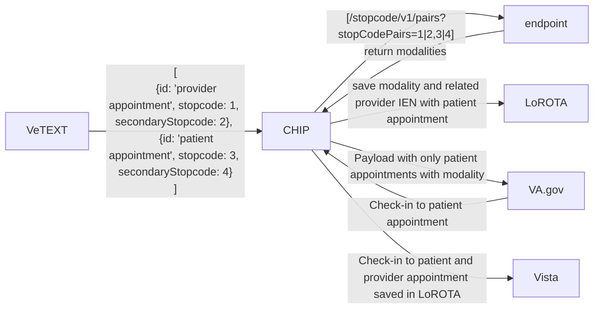

# The problem

We currently don’t have a good way to properly identify appointment modality.

The modalities that we want to know for check-in, and pre-check-in:
 - In person
 - Phone
 - CVT (video appointment at a clinic)
 - VVC (video appointment from home)

One challenge with CVT specifically is that there are two appointments as a group that make up the appointment. One for the patient and one for the provider. There is no field that ties these appointments together. We need to only display the patient appointment to the patient, but we need to update the status of both when the patient completes pre-check-in or day-of check-in.

# What we are currently doing

We are maintaining a list of stopcodes and secondary stopcodes in CHIP that we use to identify appointment modality. If there is no match, we assume that the appointment is in-person. 

We were using this for pre-check-in to allow the application to be used for phone appointments, but we stopped a few months ago and are filtering out all known non-in-person appointments for both day-of and pre-check-in.

We have not previously supported CVT or VVC for pre-check-in or day-of check-in.

# Proposed solution

We will utilize a new stopcode endpoint to identify appointment modality. CHIP will use the pairs endpoint for each appointment to assign modality. All non-supported modalities can get filtered out at this level. Supported modalities will use the patientModality value and set that to the `kind` field that gets stored in LoROTA.

For CVT appointments, this endpoint could help determine the group. But I think a more reliable way to identify the group will be to look for appointments scheduled within ~5 minutes of each other. Once we identify the pair of appointments, we can store the provider appointment IEN within the patient appointment object in LoROTA. When setting a new status on  an appointment we can check if there is a relationship in the appointment object and if there is also set the new status on that IEN as well. This will keep the frontend from rendering the display for the provider appointment while giving us the ability to progress that status of both appointments in VISTA.

# Next steps

 - We need to get access to the new stopcode endpoint once it is ready.
 - We need to setup CHIP to use the endpoint.
 - A list of all patientModaility values possible would be nice.

# Assumptions

We will support in-person, phone (telehealth), CVT (video at a clinic), and VVC (video from home) for both day-of check-in and pre-check-in.

We will update the following statuses for both CVT appointments (provider and patient):
 - preCheckInStarted
 - preCheckInComplete
 - eCheckInStarted
 - eCheckInComplete

# Open Questions

How can we test these different modalities in stage? We are especially interested in testing the appointment pair scenario for CVT in stage.
