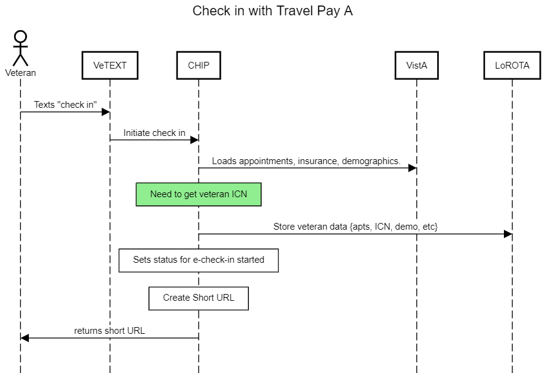

# Travel Pay Engineering details

## Overview

We have two options: 

1) Syncronously call the BTSSS API and wait for a response. This is the simplest option, but has some risk
2) Queueing service for asyncronous processing. This is more moving parts, but has less risk and more scalability

key: things in green are new additions to the workflow

## Syncronous

### Diagram

#### Check in Initialization

> built with[https://sequencediagram.org/](https://sequencediagram.org/);  [source](../assets/day.of.check.in.initiated.with.travel.pay.1.txt) 

#### Check in Flow

> built with[https://sequencediagram.org/](https://sequencediagram.org/);  [source](../assets/day.of.check.in.with.travel.pay.1.sync.txt) 

### Pros

- Simple to implement
- Feeback for the user is instant
- Can gather MVP analytics while we build a more robust solution
- If the claim submission fails, the Veteran is at the clinic to get help

### Cons

- The BTSSS API is a risk for handling the claim creation in a timely manner to not interfer with check in
- Will increase manual review process load, but we can mitigate by doing a slow control roll out and only doing a max of XX% of users before scaling up
- This solution more than likely won't scale out of the box.

## Queueing 

### Diagram

#### Check in Initialization

> built with[https://sequencediagram.org/](https://sequencediagram.org/);  [source](../assets/day.of.check.in.initiated.with.travel.pay.1.txt) 

#### Check in Flow

> built with[https://sequencediagram.org/](https://sequencediagram.org/);  [source](../assets/day.of.check.in.with.travel.pay.1.queue.txt) 

### Pros

- Looks possible for a job per item: https://github.com/mperham/sidekiq/wiki/Scheduled-Jobs
- More claims will go straight to approval and not require manual review
- Can scale better
- No need to worry about latency of the BTSSS API

### Cons

- More moving parts, comes added complexity
- User has to wait to get feedback on the status of the claim (may not be that much of a con?)
- More work till MVP

## API Docs

- [Sample JSONs from API](./btsss-injest-api-samples/)
- [API Doc](../assets/BTSSS_Claim_Ingest_API_ICD.docx)

## CURL calls

### POST for token 

curl --location --request POST 'https://login.microsoftonline.us/f7c49e36-971b-42c7-b244-a88eed6c0bf6/oauth2/v2.0/token' \
--form 'grant_type=" client_credentials"' \
--form 'client_id=" <your SPN client id provided by VAEC>"' \
--form 'client_secret=" <your SPN client secret provided by VAEC>' \
--form 'scope="4a77476c-ceed-45db-ad7e-ac2bbbc4f72a/.default"'

### POST for claim

curl --location --request POST 'https://dev.integration.d365.va.gov/EC/dev/ClaimIngestSvc/api/ClaimIngest/submitclaim' \
--header 'Authorization: bearer {{TOKEN}}' \
--header 'Content-Type: application/json' \
--data-raw '{
    "ClientNumber": "CLI-00001002",
    "ClaimantID": "{{patient ICN}}}",
    "ClaimantIDType": "icn",
    "Appointment": {
        "AppointmentDateTime": "2022-09-01"
    },
    "MileageExpense": {
        "TripType": "RoundTrip"
    }
}'