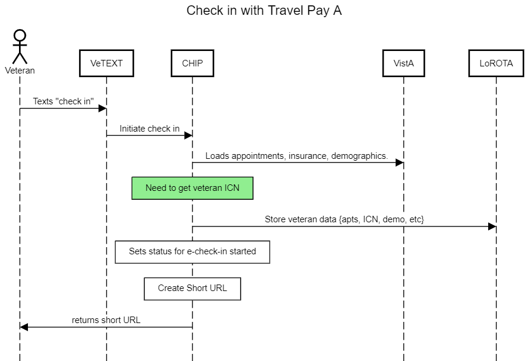
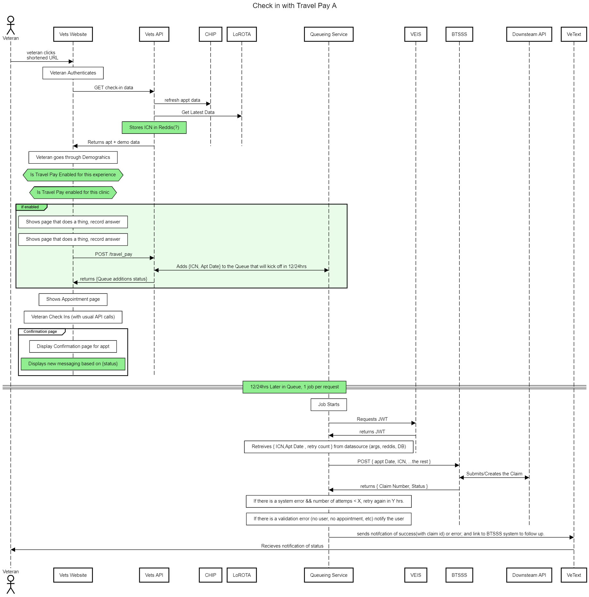

# Queueing 

> Parking until/if needed

### Diagram

#### Check in Initialization

> built with[https://sequencediagram.org/](https://sequencediagram.org/);  [source](../assets/day.of.check.in.initiated.with.travel.pay.1.txt) 

#### Check in Flow

> built with[https://sequencediagram.org/](https://sequencediagram.org/);  [source](../assets/day.of.check.in.with.travel.pay.1.queue.txt) 

### Pros

- Looks possible for a job per item: https://github.com/mperham/sidekiq/wiki/Scheduled-Jobs
- More claims will go straight to approval and not require manual review
- Can scale better
- No need to worry about latency of the BTSSS API

### Cons

- More moving parts, comes added complexity
- User has to wait to get feedback on the status of the claim (may not be that much of a con?)
- More work till MVP