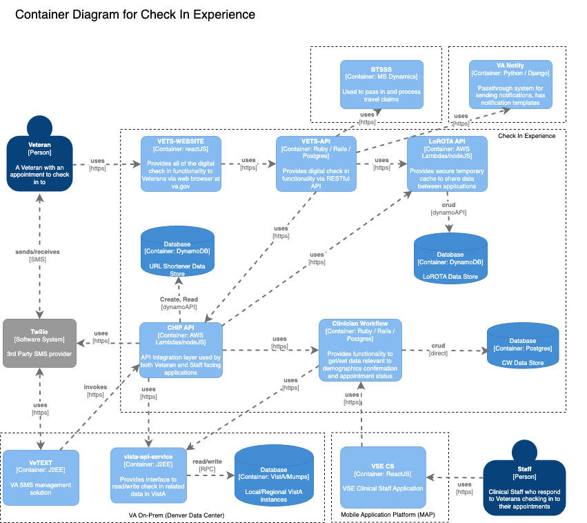

# Check In Experience Architecture Description

## What is Check In Experience (CIE)?

Description of CIE

## TL;DR Overall Architecture

- Description

### Check In Experience System Context Diagram:

- Description

### Check In Experience Container Diagram:

- Description

### vets-website Component Diagram

- Description

[vets-website Component Diagram image ToDo](./todo)

### vets-api Component Diagram

- Description

[vets-api Component Diagram image ToDo](./todo)

### CHIP Component Diagram:

- Description

### Lorota Component Diagram

- Description

[Lorota Component Diagram Todo](./todo)
