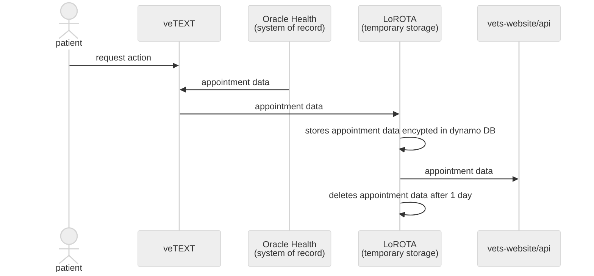

## Oracle Health data-flow diagram


### Data flow description
A patient requests to do a travel claim by texting veTEXT. veTEXT searches Oracle Health for that patient's appointments for the current day. If found the appointments are fetched and sent to LoROTA. LoROTA is a dynamo database in AWS cloud that encrypts data at rest. LoROTA also stores authentication for the patient to use to start the application. When authenticated, LoROTA sends the appointment data to vetswebsite/api to use in the application. The data in LoROTA only lives for a day.

### Data example
```
{
"patient": {
  "dob": "1935-04-07",
  "cellPhone": "+15555555555",
  "name": "Last,First"
},
"appointments": [
  {
    "id": "4822366",
    "startDate": "2024-03-18T12:00:00.000+00:00",
    "endDate": "2024-03-18T12:30:00.000+00:00",
    "length": 60,
    "status": "Confirmed",
    "patient": {
      "address": "1166 6th Avenue\n22\nNew York, NY 23423\nUS",
      "birthDate": "1980-08-11T04:00:00.000+00:00",
      "cellPhone": "+55 (55) 5555-5555",
      "deceased": false,
      "edipi": "1000000105",
      "icn": "1013220078V743173",
      "email": "humberto.ganesh+@lumahealth.io",
      "ethnicity": "Hispanic, Latino, or Spanish Origin",
      "gender": "female",
      "homePhone": "5155556789",
      "id": "12724066",
      "language": "English",
      "maritalStatus": "Married",
      "mrn": "6930",
      "officialName": "SMART II, NANCYU NHA EEEEEE",
      "practitionerId": "4122622",
      "practitionerName": "Cerner Test, Physician - Hospitalist Cerner",
      "usualName": ""
    },
    "patientStatus": "accepted",
    "practitionerIds": [],
    "practitionerNames": [
      "Dr. Jones"
    ],
    "wardId": "32216049",
    "wardName": "Endoscopy",
    "buildingId": null,
    "siteId": null,
    "organizationId": null,
    "stationNo": "530",
    "cancellationReason": null,
    "comment": null,
    "description": "Surgery Rapid",
    "patientInstruction": null,
    "reasonCode": [
      "I have a cramp"
    ],
    "serviceCategory": [],
    "serviceType": [
      "Mental Health",
      "Primary Care"
    ],
    "serviceTypeCodes": [
      "4047611",
      "394576009"
    ],
    "serviceTypeGroupNames": [],
    "slot": [],
    "timezone": "America/Los_Angeles"
  }
]
}
```
