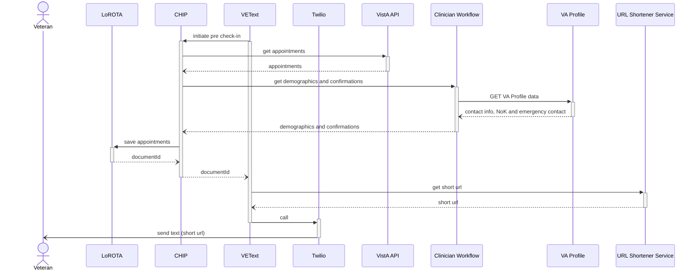
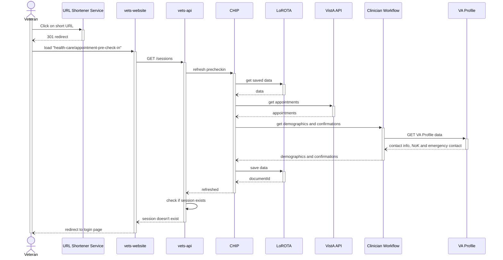
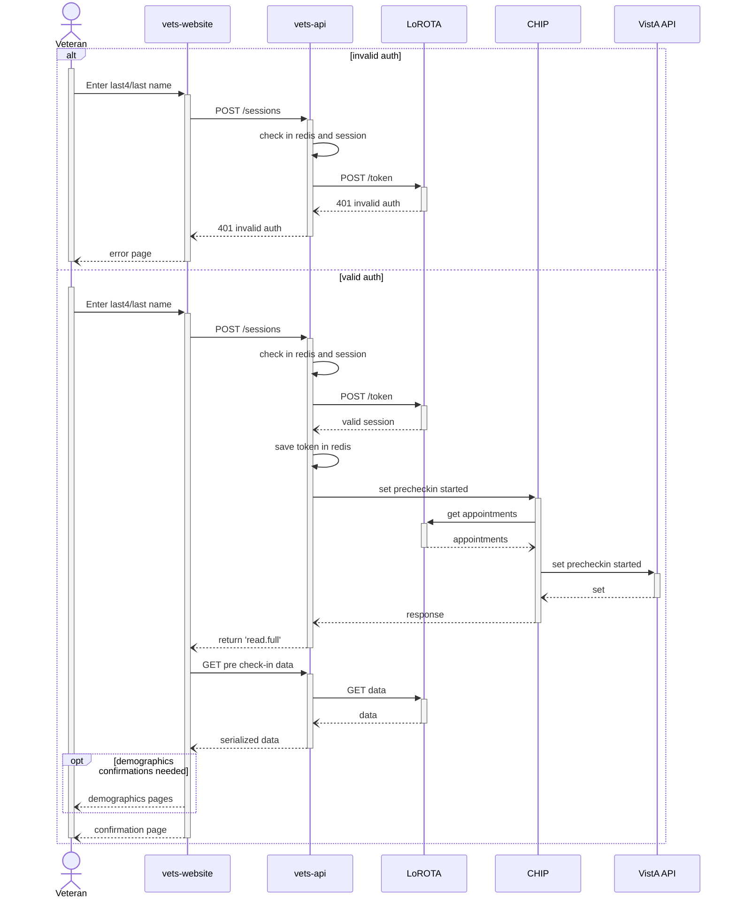
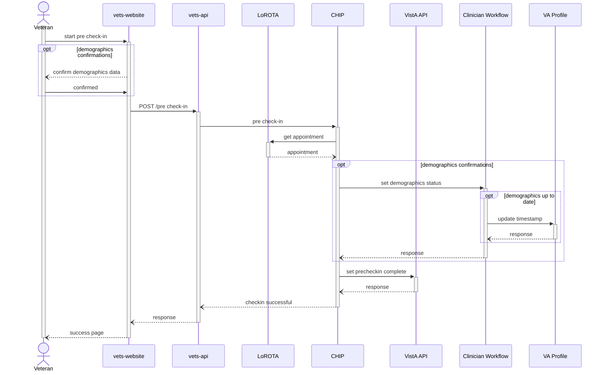

## Pre Check In Sequence Diagrams

### Initiate Pre check-in

Pre check-in is inititated by VEText based on a configurable number of days prior to the appointment. VEText calls CHIP initiate pre check-in lambda, which gets the relevant details about the Veteran's appointment and demographics and saves the data in LoROTA. VEText returns the shortened URL to the Veteran in a text message for them to start pre check-in.

### Start Pre check-in

When Veterans click on the link in the text message, they are redirected to the website that calls vets-api to start pre check-in. This is more involved than the start of day of check-in process as vets-api also calls CHIP to refresh the pre check-in data in LoROTA so that Veterans are shown the latest data. Once the refresh is done and an existing session is not found, they are redirected to the auth page.

### Authentication

This is the flow when Veterans submit their last4/last name to complete the LoROTA low auth flow. If successfully authenticated, LoROTA returns the stored data from DynamoDB. The data includes patient's demographic update status. If any of the demographic data requires updates, they are shown those demographic pages to confirm that their data is correct. One additional step in pre check-in authentication scenario is when vets-api calls a CHIP lambda to set the pre check-in started status in VistA.

### Complete Pre check-in

After Veterans confirm their demographics data (if shown), website calls vets-api which calls a CHIP lambda to complete the pre check-in scenario. CHIP sets the PRE-CHECK-IN COMPLETE status in VistA. If the Veterans confirm their demographics information, the status is set in Clinician Workflow.

