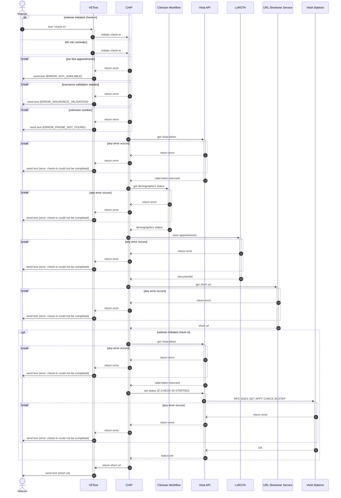
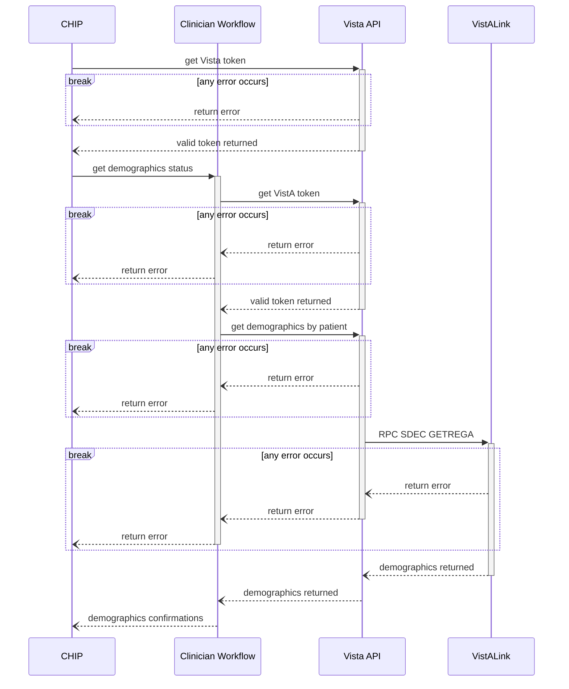
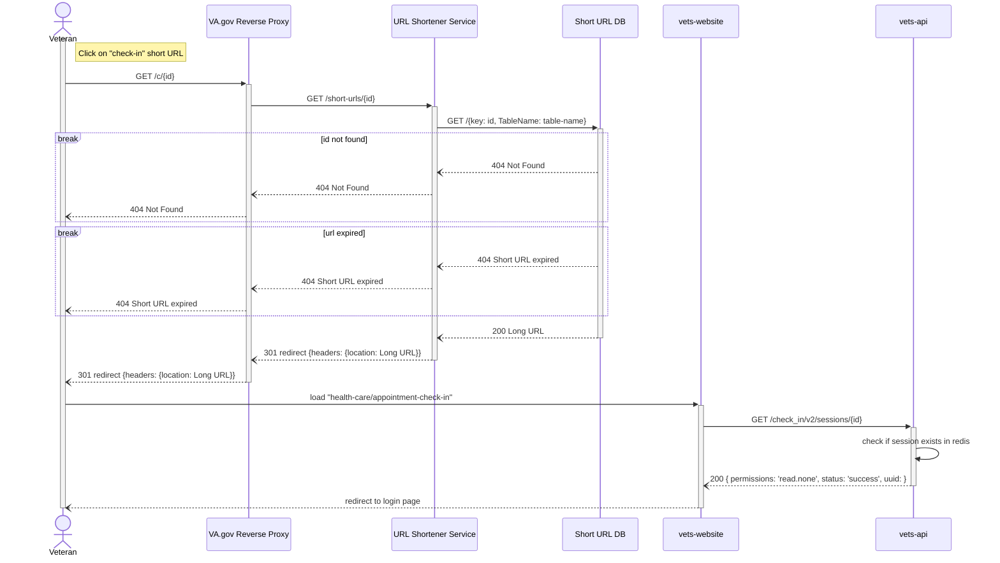
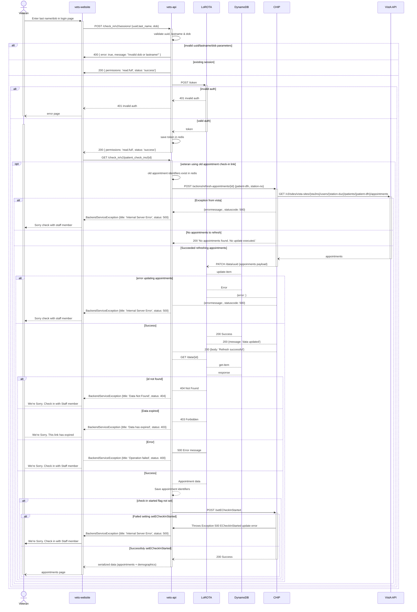
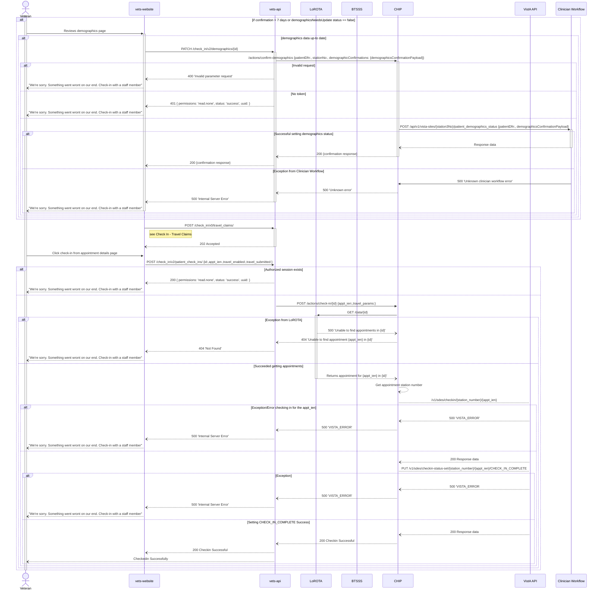
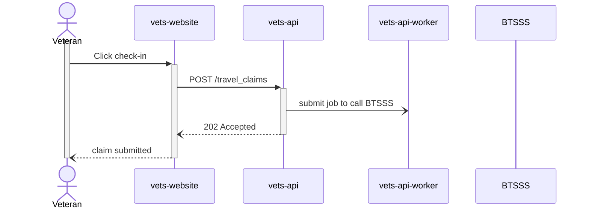
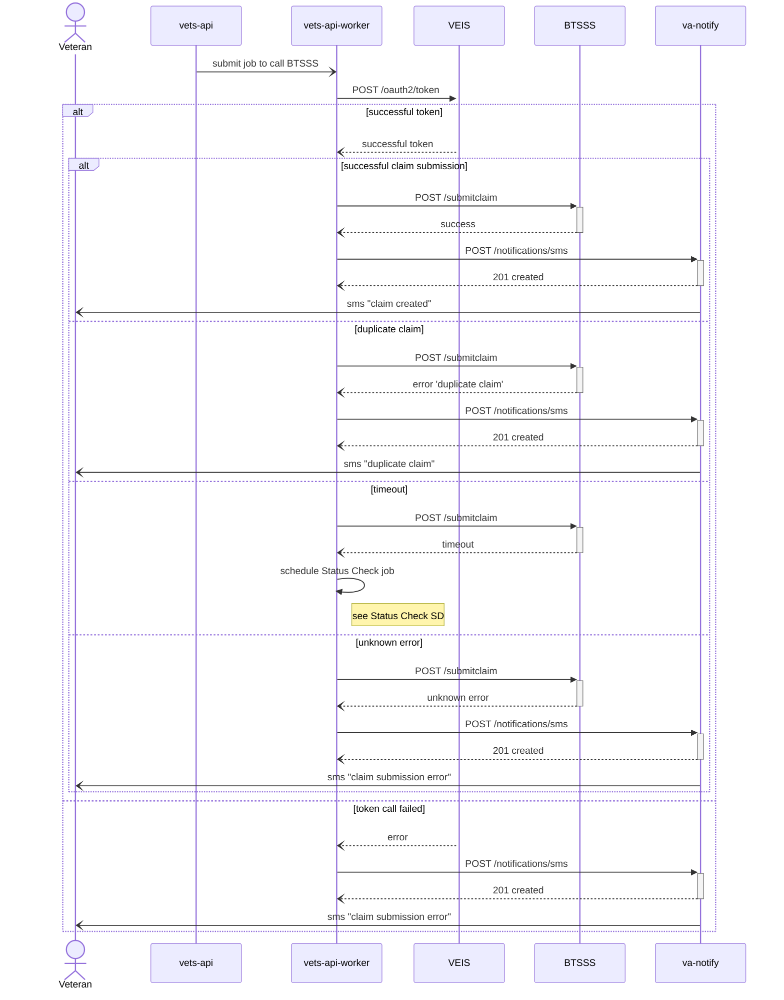
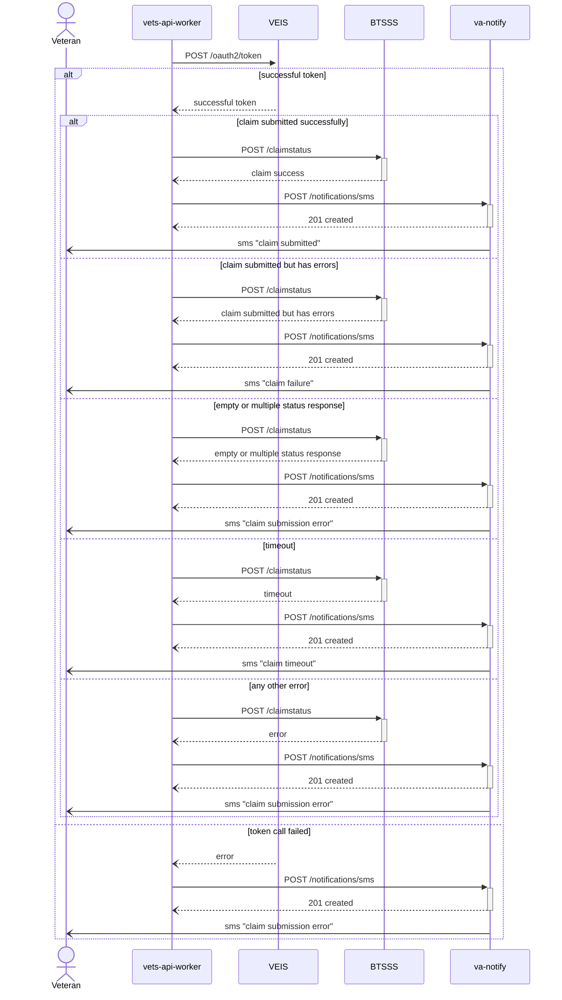

## Check In Sequence Diagrams

### Initiate Check-in
The check-in flow can be initiated in 2 ways: 
* veterans send the text "check in" to the designated number
* VEText initiates the process 45 minutes before the appointment

In both cases, VEText calls the initiate check-in CHIP function. CHIP retrieves the relevant data from VistA stations through Vista API, puts the data in LoROTA, sets the status, generates a shortened URL, and returns the URL to the Veteran.

**System of Record**: VistA

**VistA References**:
- https://vivian.worldvista.org/vivian-data/8994/8994-4529.html "SDES SET APPT CHECK-IN STEP"
- https://vivian.worldvista.org/dox/Routine_SDESCKNSTEP.html 
- https://vivian.worldvista.org/vivian-data/8994/8994-3521.html "SDEC GETREGA"

#### Clinician Workflow: Get Demographics Status

CHIP's request to Clinician Workflow for demographics status kicks off its own series of requests to VistA stations via Vista API.

### Start Check-in
Once they click on the link, they are redirected to the website, which checks if their session exists. If not, they are redirected to the low auth page.

### Authentication
This is the flow when Veterans submit their last4/last name to complete the LoROTA low auth flow. If successfully authenticated, LoROTA returns the stored data from DynamoDB. The data includes patient's demographic update status. If any of the demographic data requires updates, they are shown those demographic pages to confirm that their data is correct.

### Check In
When Veterans confirm and check-in to their appointment, a call is made to CHIP which sets the check-in status to `E-CHECKIN COMPLETE` in VistA. If the Veteran confirms their demographics information, the status is set in Clinician Workflow.

### Check In - Travel Claims
This diagram shows the sequence of submitting travel claims to BTSSS as part of check-in steps, as well as checking the status of the claim through BTSSS in case of timeouts.

#### Claim Submission - Initiation
When the veterans submit the travel claim, website makes a call to vets-api controller, which in turns submits a worker (sidekiq) job to call the BTSSS API. The actual travel claim submission to BTSSS happens asynchronously, and veterans are notified via va-notify when BTSSS receives the submission.

#### Claim Submission to BTSSS
To submit the claim to BTSSS service, we first need to get the auth token through VEIS. If there's any error getting the token, we send an error text to Veterans so they are aware and can submit/follow up on their claim through other means. Upon receiving the token, we call BTSSS to submit the claim. If BTSSS returns any error, we send an error notification to the Veteran via va-notify. If the claim is submitted successfully, BTSSS returns a claim number, which is then sent to the Veteran via va-notify.

#### Timeout handling for BTSSS claim submission
In case we get a timeout when calling BTSSS claim ingest API, we schedule another job to be run in 5 minutes. This job calls the BTSSS status endpoint to check the status of the claim, and sends a text notification to the veteran based on the status received.

