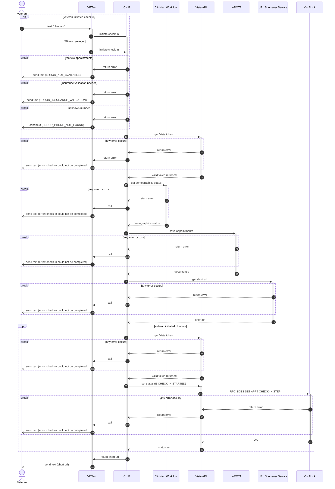
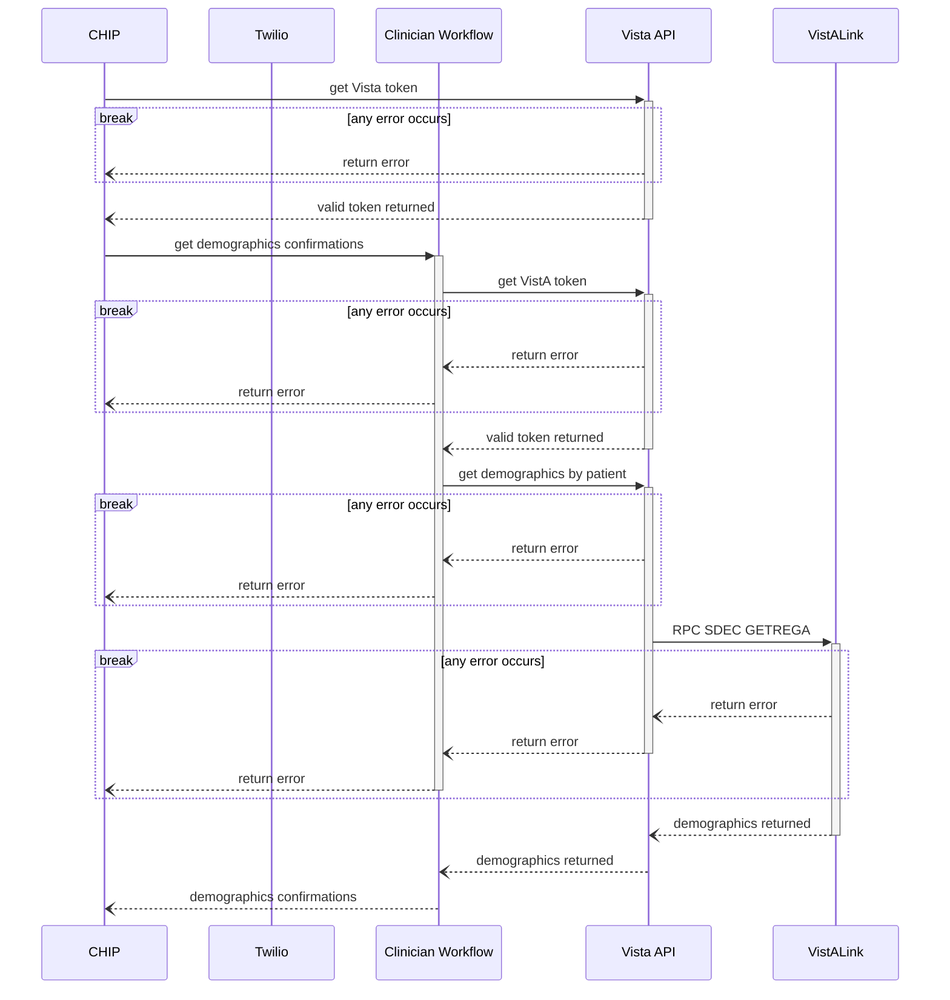
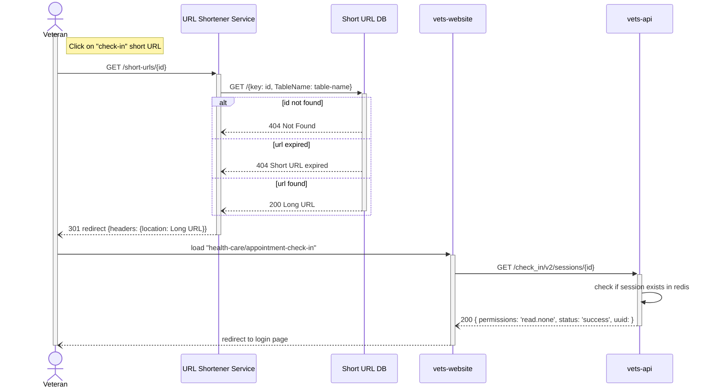
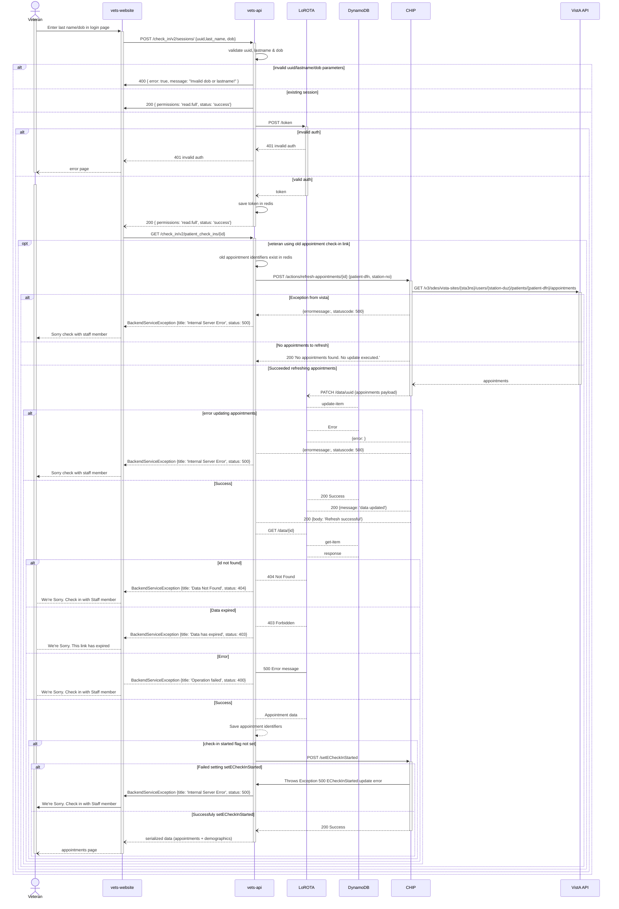
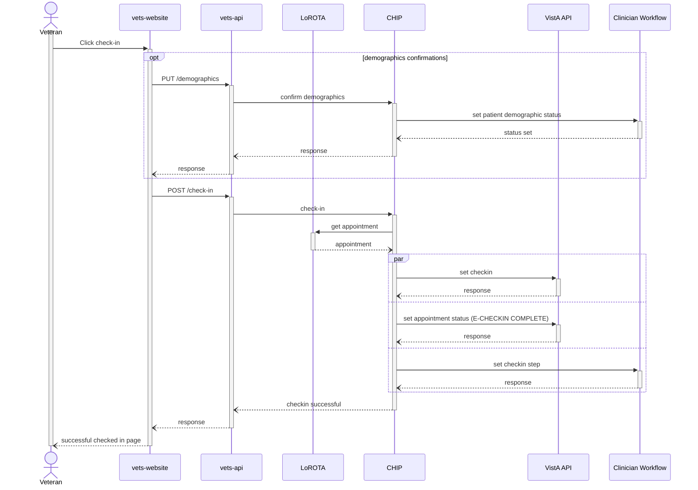

## Check In Sequence Diagrams

### Initiate Check-in
The check-in flow can be initiated in 2 ways: 
* veterans send the text "check in" to the designated number
* VEText initiates the process 45 minutes before the appointment

In both cases, VEText calls the initiate check-in CHIP function. CHIP retrieves the relevant data from VistA stations through Vista API, puts the data in LoROTA, sets the status, generates a shortened URL, and returns the URL to the Veteran.

**System of Record**: VistA

**VistA References**:
- https://vivian.worldvista.org/vivian-data/8994/8994-4529.html "SDES SET APPT CHECK-IN STEP"
- https://vivian.worldvista.org/dox/Routine_SDESCKNSTEP.html 
- https://vivian.worldvista.org/vivian-data/8994/8994-3521.html "SDEC GETREGA"

(Zoom-In on CW Portion so we can clean up above)

### Start Check-in
Once they click on the link, they are redirected to the website, which checks if their session exists. If not, they are redirected to the low auth page.

### Authentication
This is the flow when Veterans submit their last4/last name to complete the LoROTA low auth flow. If successfully authenticated, LoROTA returns the stored data from DynamoDB. The data includes patient's demographic update status. If any of the demographic data requires updates, they are shown those demographic pages to confirm that their data is correct.

### Check In
When Veterans confirm and check-in to their appointment, a call is made to CHIP which sets the check-in status to `E-CHECKIN COMPLETE` in VistA. If the Veteran confirms their demographics information, the status is set in Clinician Workflow.

