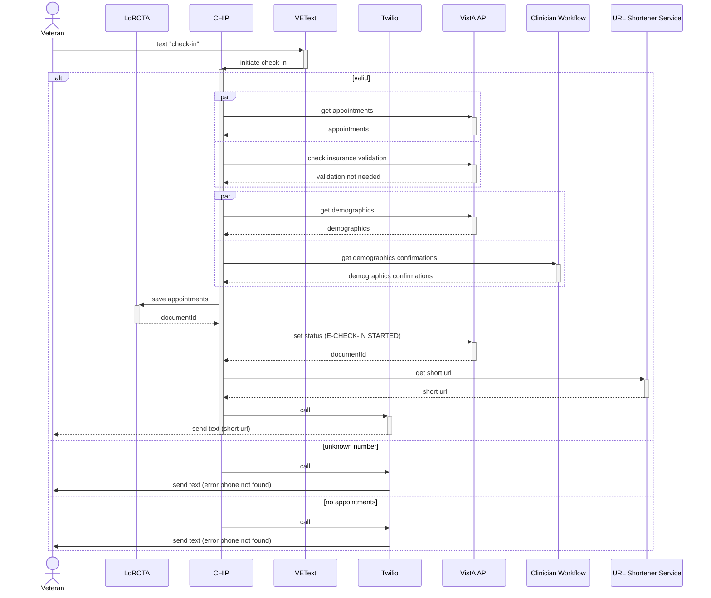
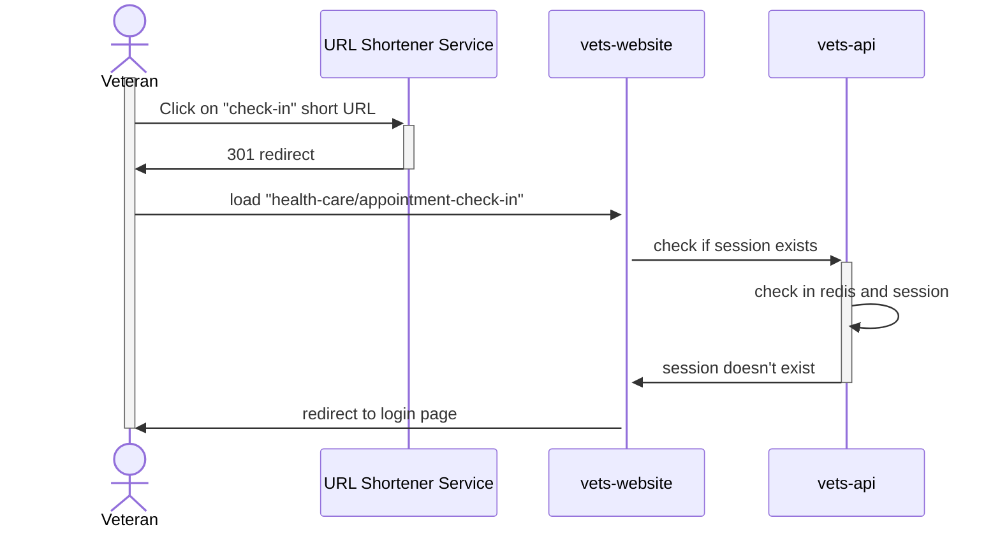
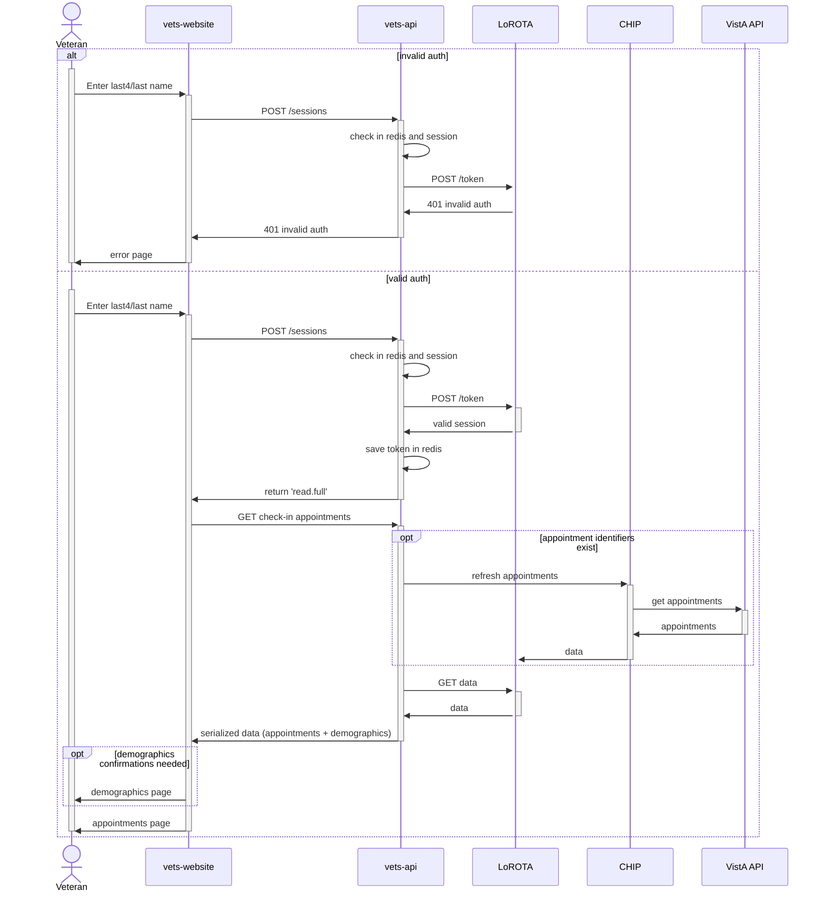

## Check In Sequence Diagrams

### Initiate Check-in
When Veterans send the text "check in" to the designated number, VEText receives the text and intiates the check-in process. CHIP retrieves the relevant data through VistA APIs, puts the data in LoROTA, sets the status and generates and sends the shortened URL back to the Veteran.

### Start Check-in
Once they click on the link, they are redirected to the website, which checks if their session exists. If not, they are redirected to the low auth page.

### Authentication
This is the flow when Veterans submit their last4/last name to complete the LoROTA low auth flow. If successfully authenticated, LoROTA returns the stored data from DynamoDB. The data includes patient's demographic update status. If any of the demographic data requires updates, they are shown those demographic pages to confirm that their data is correct.

### Check In
