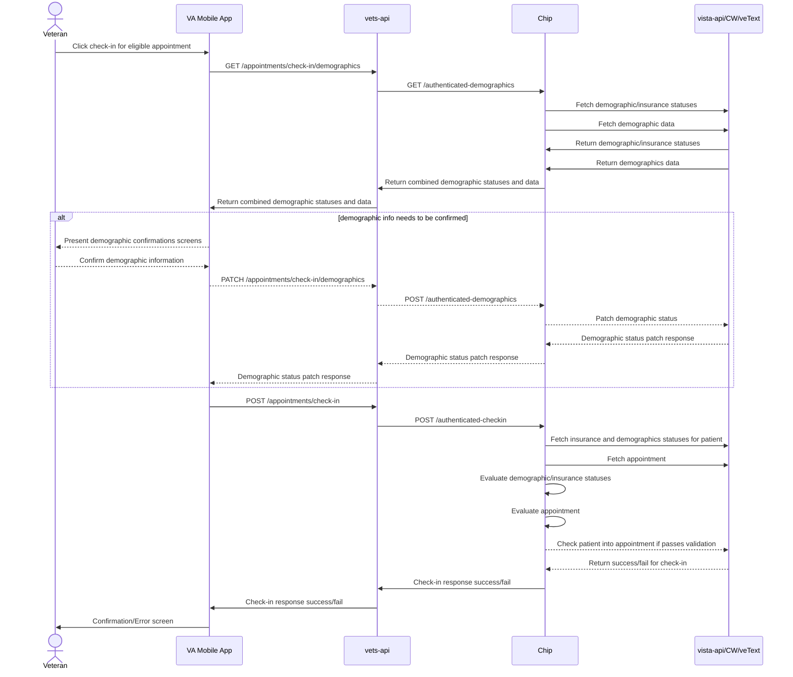

## Full Auth Check In Sequence Diagrams

### Check-in

For apps that rely on fully authenticated veteran session (like VA's flagship mobile app), online check-in has a different user flow than a low-auth (LoROTA) scenario. In a full-auth scenario, currently the list of appointments and their elgibility for online check-in is determined by the app (through VAOS). For appointments that are determined to be eligible for online check-in, a call is made to the vets-api CHIP library to start and complete the check-in, including checking for any demographics data that needs to be updated. The CHIP vets-api library provides a convenient interface of the underlying CHIP functions which interact with VistA to set the statuses. 

