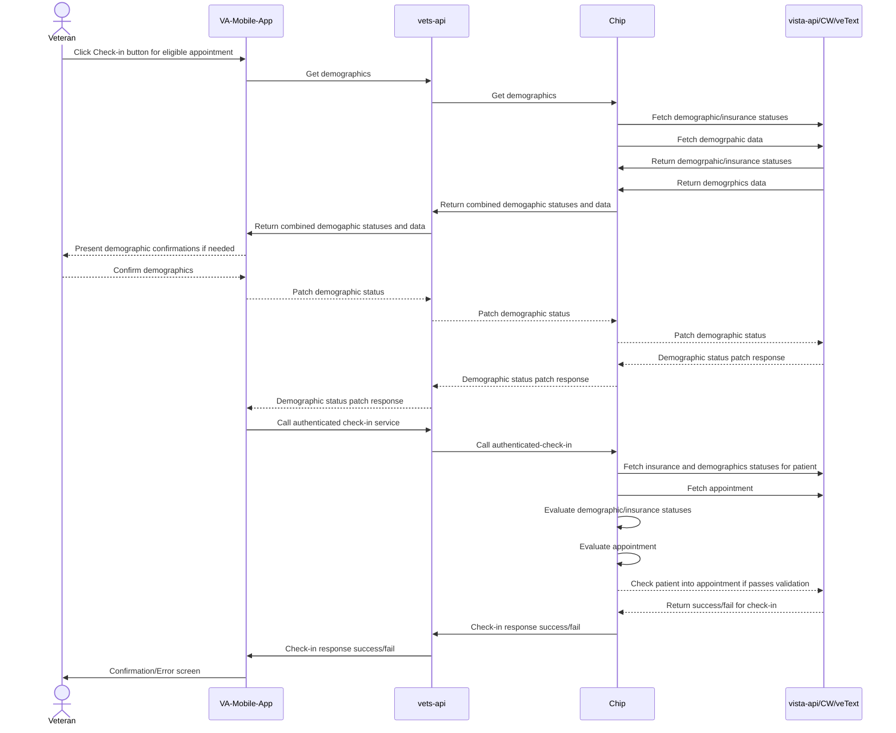

## Full Auth Check In Sequence Diagrams

### Check-in

```mermaid
sequenceDiagram
    actor vet as Veteran
    participant vam as VA-Mobile-App
    participant va as vets-api
    participant chip as Chip
    participant vista as vista-api/CW/veText

    vet->>vam: Click Check-in button for eligible appointment
    vam->>va: Get demographics
    va->>chip: Get demographics
    chip->>vista: Fetch demographic/insurance statuses
    chip->>vista: Fetch demogrpahic data
    vista->>chip: Return demogrpahic/insurance statuses
    vista->>chip: Return demogrphics data
    chip->>va: Return combined demogaphic statuses and data
    va->>vam: Return combined demogaphic statuses and data
    vam-->>vet: Present demographic confirmations if needed
    vet-->>vam: Confirm demographics
    vam-->>va: Patch demographic status
    va-->>chip: Patch demographic status
    chip-->>vista: Patch demographic status
    vista-->>chip: Demographic status patch response
    chip-->>va: Demographic status patch response
    va-->>vam: Demographic status patch response
    vam->>va: Call authenticated check-in service
    va->>chip: Call authenticated-check-in
    chip->>vista: Fetch insurance and demographics statuses for patient
    chip->>vista: Fetch appointment
    chip->>chip: Evaluate demographic/insurance statuses
    chip->>chip: Evaluate appointment
    chip-->>vista: Check patient into appointment if passes validation
    vista-->>chip: Return success/fail for check-in
    chip->>va: Check-in response success/fail
    va->>vam: Check-in response success/fail
    vam->>vet: Confirmation/Error screen
```

