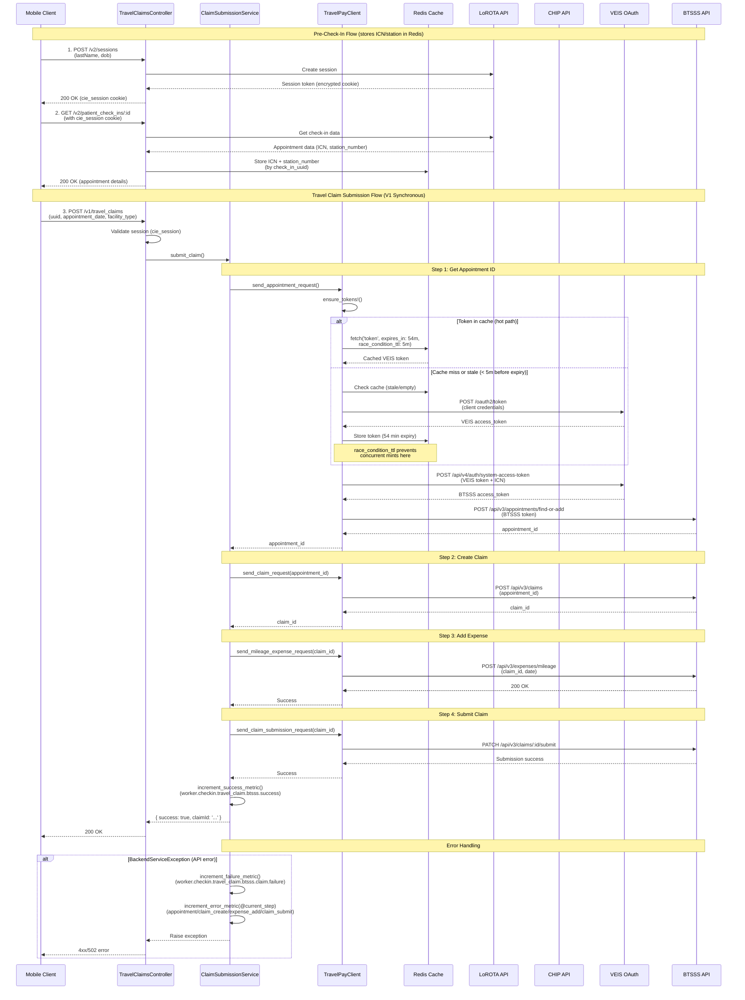

# Travel Claim Submission Flow

This diagram shows the complete flow from pre-check-in through travel claim submission.

## Flow Diagram

## Key Components

### Pre-Check-In (Steps 1-2)
- Creates authenticated session with LoROTA
- Retrieves and stores patient ICN and station number in Redis
- Required before travel claim can be submitted

### Travel Claim Submission (Step 3)
Synchronous 4-step process:
1. **Get Appointment**: Find or create appointment in BTSSS
2. **Create Claim**: Initialize claim for the appointment
3. **Add Expense**: Add mileage expense to claim
4. **Submit Claim**: Submit claim for processing

### Token Caching
- VEIS token cached in Redis with 54-minute expiration
- `race_condition_ttl: 5.minutes` prevents thundering herd during token refresh
- Cold start: 2-4 concurrent mints acceptable
- After warm-up: Only 1 mint per 54-minute cycle

### Metrics Tracked
- **Success**: `worker.checkin.travel_claim.btsss.success`
- **General Failure**: `worker.checkin.travel_claim.btsss.claim.failure`
- **Step-specific errors**:
  - `worker.checkin.travel_claim.btsss.appointment.error`
  - `worker.checkin.travel_claim.btsss.claim_create.error`
  - `worker.checkin.travel_claim.btsss.expense_add.error`
  - `worker.checkin.travel_claim.btsss.claim_submit.error`
- **Duplicate Claims**: `worker.checkin.travel_claim.btsss.duplicate`
