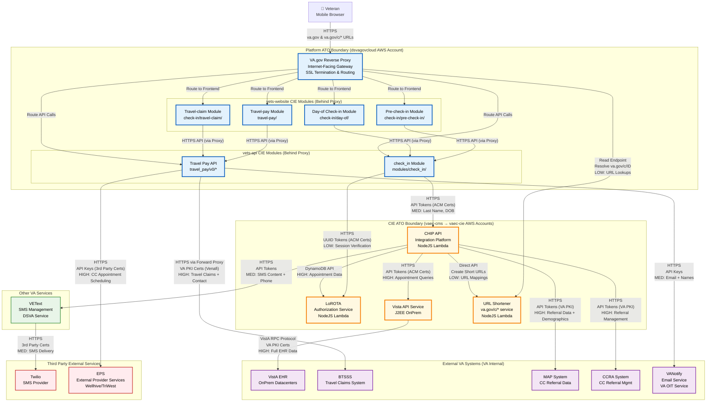

## ATO Boundary Security Architecture

```mermaid
graph TB
    %% Define styles for different security zones
    classDef platformATO fill:#e3f2fd,stroke:#1565c0,stroke-width:3px,color:#000
    classDef cieATO fill:#fff8e1,stroke:#f57c00,stroke-width:3px,color:#000
    classDef vaExternal fill:#f3e5f5,stroke:#7b1fa2,stroke-width:2px,color:#000
    classDef vaServices fill:#e8f5e8,stroke:#388e3c,stroke-width:2px,color:#000
    classDef thirdParty fill:#ffebee,stroke:#c62828,stroke-width:2px,color:#000
    classDef phiHigh fill:#ffcdd2,stroke:#d32f2f,stroke-width:2px
    classDef piiMedium fill:#fff3e0,stroke:#f57c00,stroke-width:1px
    classDef dataLow fill:#e8f5e8,stroke:#388e3c,stroke-width:1px

    %% Veteran Entry Point (External to all ATO boundaries)
    VETERAN[👤 Veteran<br/>Mobile Browser]

    %% Platform ATO Boundary (dsvagovcloud)
    subgraph "Platform ATO Boundary (dsvagovcloud AWS Account)"
        REVERSEPROXY[VA.gov Reverse Proxy<br/>Internet-Facing Gateway<br/>SSL Termination & Routing]

        subgraph "vets-website CIE Modules (Behind Proxy)"
            DAYOF[Day-of Check-in Module<br/>check-in/day-of/]
            PRECHECK[Pre-check-in Module<br/>check-in/pre-check-in/]
            TRAVELCLAIM[Travel-claim Module<br/>check-in/travel-claim/]
            TRAVELPAY[Travel-pay Module<br/>travel-pay/]
        end

        subgraph "vets-api CIE Modules (Behind Proxy)"
            CHECKINMOD[check_in Module<br/>modules/check_in/]
            TRAVELPAYAPI[Travel Pay API<br/>travel_pay/v0/*]
        end

        %% Reverse proxy routing
        REVERSEPROXY -->|"Route to Frontend"| DAYOF
        REVERSEPROXY -->|"Route to Frontend"| PRECHECK
        REVERSEPROXY -->|"Route to Frontend"| TRAVELCLAIM
        REVERSEPROXY -->|"Route to Frontend"| TRAVELPAY
        REVERSEPROXY -->|"Route API Calls"| CHECKINMOD
        REVERSEPROXY -->|"Route API Calls"| TRAVELPAYAPI

        %% Internal Platform connections
        DAYOF -->|"HTTPS API (via Proxy)"| CHECKINMOD
        PRECHECK -->|"HTTPS API (via Proxy)"| CHECKINMOD
        TRAVELCLAIM -->|"HTTPS API (via Proxy)"| TRAVELPAYAPI
        TRAVELPAY -->|"HTTPS API (via Proxy)"| TRAVELPAYAPI
    end

    %% Veteran traffic flow (External to Platform ATO)
    VETERAN -->|"HTTPS<br/>va.gov & va.gov/c/* URLs"| REVERSEPROXY

    %% CIE ATO Boundary (vaec-cms/vaec-cie)
    subgraph "CIE ATO Boundary (vaec-cms → vaec-cie AWS Accounts)"
        CHIP[CHIP API<br/>Integration Platform<br/>NodeJS Lambda]
        LOR[LoROTA<br/>Authorization Service<br/>NodeJS Lambda]
        VIS[Vista API Service<br/>J2EE OnPrem]
        URLSHORT[URL Shortener<br/>va.gov/c/* service<br/>NodeJS Lambda]

        CHIP -->|"DynamoDB API<br/>HIGH: Appointment Data"| LOR
    end

    %% External VA Systems
    subgraph "External VA Systems (VA Internal)"
        VISTA[VistA EHR<br/>OnPrem Datacenters]
        BTSSS[BTSSS<br/>Travel Claims System]
        MAP[MAP System<br/>CC Referral Data]
        CCRA[CCRA System<br/>CC Referral Mgmt]
        VANOTIFY[VANotify<br/>Email Service<br/>VA OIT Service]
    end

    %% Other VA Services
    subgraph "Other VA Services"
        VETEXT[VEText<br/>SMS Management<br/>DSVA Service]
    end

    %% Third Party External
    subgraph "Third Party External Services"
        TWILIO[Twilio<br/>SMS Provider]
        EPS[EPS<br/>External Provider Services<br/>Wellhive/TriWest]
    end

    %% ATO Boundary Crossings with Security Details
    CHECKINMOD -->|"HTTPS<br/>API Tokens (ACM Certs)<br/>MED: Last Name, DOB"| CHIP
    CHECKINMOD -->|"HTTPS<br/>UUID Tokens (ACM Certs)<br/>LOW: Session Verification"| LOR
    TRAVELPAYAPI -->|"HTTPS via Forward Proxy<br/>VA PKI Certs (Venafi)<br/>HIGH: Travel Claims + Contact"| BTSSS
    TRAVELPAYAPI -->|"HTTPS<br/>API Keys<br/>MED: Email + Names"| VANOTIFY
    TRAVELPAYAPI -->|"HTTPS<br/>API Keys (3rd Party Certs)<br/>HIGH: CC Appointment Scheduling"| EPS

    %% CIE to External VA Systems
    CHIP -->|"HTTPS<br/>API Tokens (ACM Certs)<br/>HIGH: Appointment Queries"| VIS
    CHIP -->|"HTTPS<br/>API Tokens<br/>MED: SMS Content + Phone"| VETEXT
    CHIP -->|"HTTPS<br/>API Tokens (VA PKI)<br/>HIGH: Referral Data + Demographics"| MAP
    CHIP -->|"HTTPS<br/>API Tokens (VA PKI)<br/>HIGH: Referral Management"| CCRA

    %% CHIP to URL Shortener
    CHIP -->|"Direct API<br/>Create Short URLs<br/>LOW: URL Mappings"| URLSHORT

    %% Reverse Proxy to URL Shortener
    REVERSEPROXY -->|"Read Endpoint<br/>Resolve va.gov/c/ID<br/>LOW: URL Lookups"| URLSHORT

    %% External to External
    VIS -->|"VistA RPC Protocol<br/>VA PKI Certs<br/>HIGH: Full EHR Data"| VISTA
    VETEXT -->|"HTTPS<br/>3rd Party Certs<br/>MED: SMS Delivery"| TWILIO


    %% Apply styles
    class VETERAN fill:#f0f8ff,stroke:#4682b4,stroke-width:2px,color:#000
    class DAYOF,PRECHECK,TRAVELCLAIM,TRAVELPAY,CHECKINMOD,CHIPLIB,TRAVELPAYAPI,REVERSEPROXY platformATO
    class CHIP,LOR,VIS,URLSHORT cieATO
    class VISTA,BTSSS,MAP,CCRA,VANOTIFY vaExternal
    class VETEXT vaServices
    class TWILIO,EPS thirdParty
```
