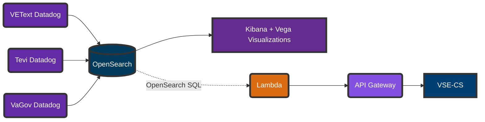

## CIE Cross Product Path Analysis Design Doc

Author(s): **Adrian Rollett**

Last Updated: **March 7, 2023**

Status: **Draft** | In Review | Approved

Approvers:

* Stephen Barrs
* Patrick Bateman
* Shawn Adams

## Overview

### Problem statement

The data needed to answer questions like the following are siloed in disparate stores, greatly increasing the complexity of improving services for Veterans & Staff.

- Of all Veterans who sent a check-in SMS last Tuesday, how many eventually succeeded in checking in?
- On average, how long does it take from the time an SMS is received until a check-in link is sent?
- As a MSA, how might I know what actions a Veteran has already taken before coming to me for help?

### Objective

Provide a data storage & analysis service for tracing Veteran journeys across different products (VEText, CHIP, vets-website), meeting the following requirements:

- Aggregate relevant data from disparate systems
- Provide data visualization tools for synthesized data, ideally including [funnel charts](https://en.wikipedia.org/wiki/Funnel_chart) and [Sankey diagrams](https://en.wikipedia.org/wiki/Sankey_diagram).
- Facilitate real-time data analysis & visualization
- Allow scaling to millions of data points per day
- Provide an API for retrieving high-level Veteran interactions by ICN & date

This document is intended to facilitate review & approval of the project solution by VA technical staff & stakeholders & provide clear implementation guidance to project engineers.

### High Level Design

#### Narrative

In a nutshell, the proposed solution is to [forward logs](https://www.datadoghq.com/blog/route-logs-with-datadog-log-forwarding/) from Datadog instances to [OpenSearch](https://opensearch.org) hosted on AWS GovCloud. Once ingested, the data can be rewritten from event-centric log events to entity-centric data using [index transforms](https://opensearch.org/docs/latest/im-plugin/index-transforms/index/). This will facilitate searching and visualizations of various interactions, both Veteran-based and transaction-based. Finally, these data may be queried by external systems such as VSE-CS with a relatively light-weight middleware hosted on AWS lambda and fronted with API Gateway.

#### Diagram

## Specifics

### Detailed Design

### Code Location

### Debugging

### Caveats

TBD

### Security Concerns

| Concern | Resolution |
|-------- | ---------- |

### Privacy Concerns

### Open Questions and Risks

- Datadog Log Forwarding Release timeline - slated for late Q1/early Q2, but could slip
- 

### Work Estimates

| Scope       | Estimate       |
| ----------- | -------------- |

### Alternatives

### Future Work

* Provide API 

## Revision History

| Date        | Revisions made | Author         |
| ----------- | -------------- | -------------- |
| Mar 7, 2023 | Initial Draft  | Adrian Rollett |
