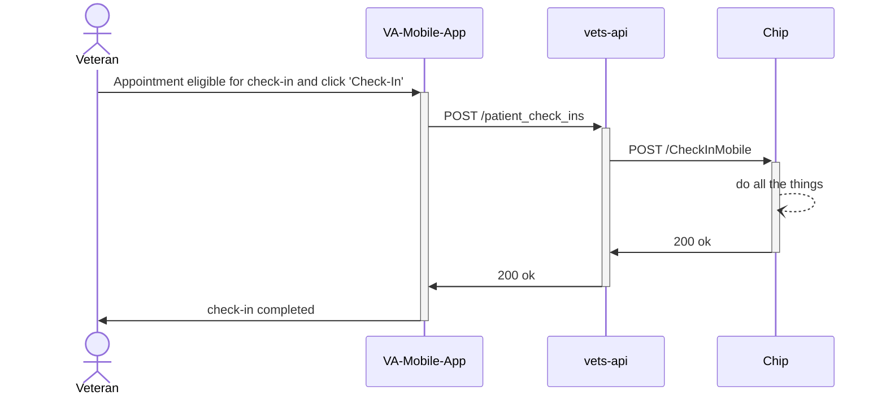

# Fully Authenticated Check-In Support

## Summary

Allow some of our authenticated applications (e.g. Mobile app, Health Apartment, VAOS) to use the PCI API to pre-check-in and check-in a Veteran for their appointment.

We should avoid using LoROTA as that was designed as an alternative to requiring veterans to fully authenticate. This will require engineering to updated chip, vets-api and possibly LoROTA. At a minimum CIE team will have to write LoROTA-less versions of the lambdas that allow veterans complete pre-check-in and check-in tasks. In addition it may require a new module within vets-api to provide all neccessary endpoints for fully authenticated applications to check-in to an appointment. LoROTA probably can and should be avoided as that system was designed to enable e-check-in with a minimal amount of authentication.

### Tentative Integration

https://app.mural.co/t/departmentofveteransaffairs9999/r/1675718737504?folderUuid=7ad264a1-d550-4bc6-a7b3-27fac23c9e08

FPO diagram:

## Questions:

How will the app communicate that check in has been started?
- Through a process of answering questions
- Automatically when it decides to show the check in button for an appointment
  - Problem: could assume too much

How will we know if their demographics have been updated?

Can we see their appointment payload? (VAOS)

Do they know which appointments have e-check-in enabled?
- Check in enabled boolean probably not provided(Stephen)

How can we have security confidence that the patient is checking into only their appointments?

## Internal questions:

Should we create a new vets-api module for fully authed applications(suggestions from Stephen)?

Where do we update CW? Assume it’s the same as e-check-in

What does CHIP currently do?

## What needs to happen to be able to check-in
- Appointment needs to be at a clinic with e-check-in enabled
- Appointment must be within check-in window
- Patient must of current insurance info (our business rule)
- Patient must have confirmed demographics in the past 7 days (our business rule)
- Set eCheckInStarted (happens in initiateCheckIn now), setCheckIn, and eCheckInComplete in vista
- Log success 
