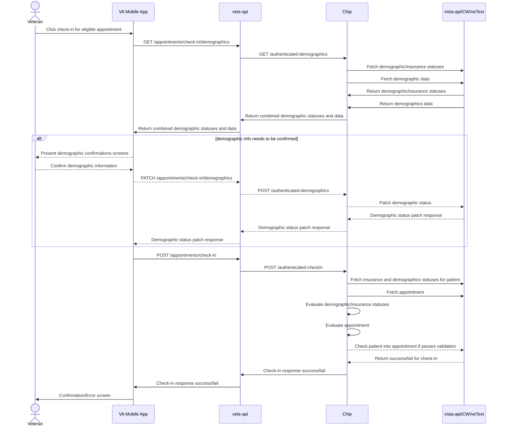

# Fully Authenticated Check-In Support

## Summary

Allow some of our authenticated applications (e.g. Mobile app, Health Apartment, VAOS) to use the PCI API to pre-check-in and check-in a Veteran for their appointment.

This will require engineering to update chip, vets-api and possibly LoROTA. At a minimum CIE team will have to write LoROTA-less versions of the lambdas that allow veterans complete pre-check-in and check-in tasks. In addition it may require a new module within vets-api to provide all neccessary endpoints for fully authenticated applications to check-in to an appointment. LoROTA probably can and should be avoided as that system was designed to enable e-check-in with a minimal amount of authentication.

### Tentative Integration

https://app.mural.co/t/departmentofveteransaffairs9999/r/1675718737504?folderUuid=7ad264a1-d550-4bc6-a7b3-27fac23c9e08

FPO diagram:


## Proposed sequence
The proposed sequence above outlines four new vets-api endpoints.
1. A demographics endpoint, GET fetches statuses(including insruance status) and data, PATCH updates the statuses.
1. An endpoint for check-in. On the chip side this fetches statuses for demographics, insurance, and appointment to validate. Returns success/fail with fail codes.

## Questions:

- In the VAOS payload is locationId the same as station number?
    - The answer to this is yes but the values have a mapping to station values that are not recognizeable to us. There is a doc underway to document the vaos-service appointment. [See thread in slack](https://dsva.slack.com/archives/C023EFZPX4K/p1685984766871989?thread_ts=1685639670.578339&cid=C023EFZPX4K)
- Can VAOS add the ECheckinAllowed field to the appointment?
    - Yes this will be added 
- How can we have security confidence that the patient is checking into only their appointments?
    - The mobile app with only send appointmentIen and stationNo, vetsAPI will provide the DFN from the user object to insure that patients can only attempt to check-in to their appointments. 
- [LP] Currently, the mobile app gets their appointment info from VAOS; to test in a Staging environment, the Mobile App team has to get the VAOS team to create appointments for them in the Vista instance that VAOS uses; we need to determine if this is the same Vista instance that the CIE team uses for the Staging tool; if it is not, I'm not sure how we are going to test in Staging
    - Shane is working to connect the systems with BJ. [See thread](https://dsva.slack.com/archives/CMNQT72LX/p1686149475340469?thread_ts=1685982069.819559&cid=CMNQT72LX)
- Should the API start enforcing the bussiness rules around check-in? Currently the frontend, does the checks to determine some of the elligability for checking-in a patient i.e. demographics confirmations. With more applications wanting to do check-in, should those business rules move into the API side?
    - Yes we should probably enforce business rules at the API level to avoid conflicting rules accross multiple applications and for added security.

## Internal questions:
- Should we create a new vets-api module for fully authed applications(suggestions from Stephen)?
- Where do we update CW? Assume it’s the same as e-check-in
- How do we map from an [appointmentId from VAOS](https://department-of-veterans-affairs.github.io/va-mobile-app/api/#operation/getAppointments) to appointmentIen?
    - See [this thread](https://dsva.slack.com/archives/C023EFZPX4K/p1685639670578339), there is in progress work to add IEN and documentation to vaos appointments.
- Currently, CHIP calls [vista-api checkin endpoint](https://github.com/department-of-veterans-affairs/chip/blob/master/src/checkIn/index.js#L79) to check-in for an appointment, which needs the station Number and appointment Ien. Can we get the station number from VAOS appointment response?
    - Also see [this thread](https://dsva.slack.com/archives/C023EFZPX4K/p1685639670578339)
- Where do we get the demographics data from?
    - We can fetch demographics the same way we do today but we can do it conditionally.

## What needs to happen to be able to check-in
- Appointment needs to be at a clinic with e-check-in enabled
- Appointment must be within check-in window
- Patient must of current insurance info (our business rule)
- Patient must have confirmed demographics in the past 7 days (our business rule)
- Set eCheckInStarted (happens in initiateCheckIn now), setCheckIn, and eCheckInComplete in vista
- Log success 


## VAOS example payload
```
{
  "data": [
    {
      "id": "71083",
      "identifier": [
        {
          "system": "http://med.va.gov/fhir/urn/vaos/vvs/id",
          "value": "5b5085c9-93c3-4db0-9966-898aeae4956f"
        }
      ],
      "kind": "telehealth",
      "status": "booked",
      "patientIcn": "[REDACTED]",
      "locationId": "983",
      "practitioners": [
        {
          "identifier": [
            {
              "system": "dfn-983",
              "value": "520647592"
            }
          ],
          "name": {
            "family": "Killingsworth",
            "given": [
              "Rachel"
            ]
          },
          "practiceName": "Cheyenne VA Medical Center"
        }
      ],
      "start": "2022-01-03T16:30:00Z",
      "end": "2022-01-03T16:50:00Z",
      "minutesDuration": 20,
      "cancellable": true,
      "patientInstruction": "",
      "telehealth": {
        "url": "https://dev.care.va.gov/vvc-app/?join=1&media=1&escalate=1&conference=VAC000417967@dev.care.va.gov&pin=231674&aid=5b5085c9-93c3-4db0-9966-898aeae4956f#",
        "group": true,
        "vvsKind": "ADHOC"
      },
      "extension": {
        "ccLocation": {
          "address": {}
        },
        "vistaStatus": []
      }
    },
    {
      "id": "71084",
      "identifier": [
        {
          "system": "http://med.va.gov/fhir/urn/vaos/vvs/id",
          "value": "d86a6b5b-b8c4-4f65-b927-813dab3bd292"
        }
      ],
      "kind": "telehealth",
      "status": "booked",
      "patientIcn": "[REDACTED]",
      "locationId": "983",
      "practitioners": [
        {
          "identifier": [
            {
              "system": "dfn-983",
              "value": "520647592"
            }
          ],
          "name": {
            "family": "Killingsworth",
            "given": [
              "Rachel"
            ]
          },
          "practiceName": "Cheyenne VA Medical Center"
        }
      ],
      "start": "2022-01-03T23:35:00Z",
      "end": "2022-01-03T23:55:00Z",
      "minutesDuration": 20,
      "cancellable": true,
      "patientInstruction": "",
      "telehealth": {
        "url": "https://dev.care.va.gov/vvc-app/?join=1&media=1&escalate=1&conference=VAC000417968@dev.care.va.gov&pin=428900&aid=d86a6b5b-b8c4-4f65-b927-813dab3bd292#",
        "group": true,
        "vvsKind": "ADHOC"
      },
      "extension": {
        "ccLocation": {
          "address": {}
        },
        "vistaStatus": []
      }
    }
  ]
}
```
## Mobile side data tasks
- find the staion number. This could be the location ID or be related to it. There is an on-going VAOS task to document this. [slack ref.](https://dsva.slack.com/archives/C023EFZPX4K/p1685985637341189?thread_ts=1685639670.578339&cid=C023EFZPX4K)
- get the patient DFN for the given station number. [slack ref.](https://dsva.slack.com/archives/CMNQT72LX/p1686071593550999?thread_ts=1685982069.819559&cid=CMNQT72LX)
    - avoid the staff apps endpoint, look for ways in vets-api to do this that already exist.
- the mobile team will also need a list of appointment IENs. Those are being added to the VAOS payload now. [slack ref.](https://dsva.slack.com/archives/C023EFZPX4K/p1685985637341189?thread_ts=1685639670.578339&cid=C023EFZPX4K)

