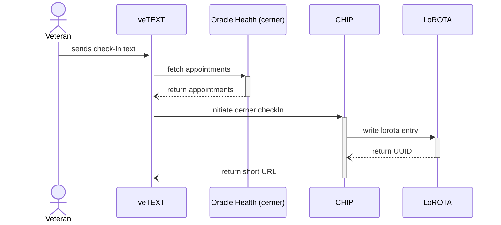
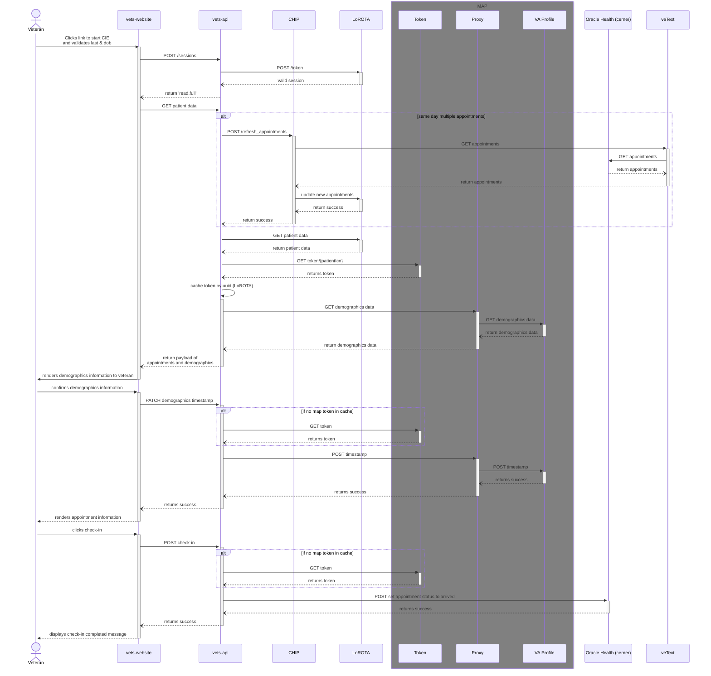

# CIE Oracle Health (cerner) integration
<aside>
🚧 WIP

</aside>

## Goals
We would like to support checking into appointments in Oracle Health (cerner) in a similar fashion to how we support checking-in to Vista appointments. A sub goal/dependancy of this work is to move to fetching demographic information directly from the Profile service. As well as updating the confirmation timestamp. The VA Profile integration would be for both Oracle Health (cerner) and Vista appointments.
## Overview
There are a couple of differences between Oracle Health (cerner) and Vista. The main differience is that for Vista appointments we set statuses as the veteran completes check-in related activies `setCheckInStarted` -> `setCheckInComplete`. For Oracle Health (cerner) these statuses will not be used. The only update for Oracle Health (cerner) is setting the appointment status to `arrived` after a patient confirms demographics and completes check-in in the application. Oracle Health (cerner) also does not have Demographics and demographics status per station like Vista does. Our solution for this is to move to interface directly with the VA Profile service for both Oracle Health (cerner) and Vista. 

We will also be dealing with a different appointment object shape. As a result we will build a new initateCheckIn endpoint for veTEXT to use for Oracle Health (cerner) appointments. This will include a new cernerService utility layer to mange the sanitation of appointment data and saving to LoRota for Oracle Health (cerner) appointments.

For appointment refresh, we are going to need a new endpoint from veTEXT and update LoRota.

## Scope
- MVP only for day-of check-in
- Veteran initiated day-of checkin workflow using check-in text
- Telehealth appointments out of scope

## Assumptions
- VA Profile endpoint can be accessed using MAP token via Mobile Profile Service (proxy service) from vets-api using low-risk authentication
- Staffs will verify patient's insurance after they mark their appointments as ARRIVED in cerner (as there is no programmatic way to verify insurance for cerner patient data)
  
## Design Decisions
- Implement new endpoint in CHIP to initate check-in for cerner appointments 
- CHIP modifies the received cerner appointment payload to comply with existing vista appointment data in LoROTA

## Design
### Initiate Cerner Checkin

### Veteran clicks link returned from VeText

## Questions / Open Items
(answers added from Stephen in [slack thread](https://dsva.slack.com/archives/C02G6AB3ZRS/p1705426133031669))
- Does the BTSSS endpoint work for OH stations? - CLOSED
    - (from Mark & Blaise) - Mark: Yes I am told BTSSS already works for OH. They are using DAS to get the  appointment data based on the facility. Blaise: Yes, that is correct. We pull EHRM appointments through Cerner associated to the facility 
- How do we connect to Oracle Health (cerner) via MAP token to set the arrived status? - OPEN
    - Plan to use a MAP service that is being built now. That will use the same MAP token. If for some reason that does not work we will need VeText to provide an endpoint to set the appointment status. Edit:  I actually cant remember where we landed for this connection, but both MAP and potentially VeText can provide this
    - Which OH API do we need to use for connecting OH via MAP?  Do we need to check with Brad?  Is there any docs available to know more about the API? - OPEN
- Who is our POC for the Oracle Health (cerner) MAP service? - CLOSED
    - @Brad Crosby can answer questions about this service. 
- Can we connect to Profile for data and setting timestamp via MAP token? (Stephen is asking) - OPEN
    - This appears to be the best way. @Kay and I are confirming what onboarding we need to do with MAP.   we will also need to work with VA Profile to get an application ID that will be used in the call to MAP. 
- Will we still need to update demographics timestamps in Vista if we are setting the single timestamp in VA Profile? - OPEN
    - For VistA appointments, I think so, based on VSE CS currently looking at those timestamps.  This one probably needs some more thought and understanding to be sure. 
- What does a Oracle Health (cerner) appointment payload look like? (veTEXT will provide a sample) - OPEN
    - [veTEXT ticket](https://github.com/department-of-veterans-affairs/vetext/issues/2275) for the work 
- How will the staffs know about patient workflow status when cie application shows contact staff message incase of check-in failure or invalid contact information? - CLOSED
    - Staff at OH will not know about any of the statuses that are currently set by PCI and viewed by staff in VSE CS. OH staff will not use VSE CS.  If the Veteran is not able to complete check in they should be directed to check in with the clerk. 
- Are all cerner appointments echeckin enabled by default or do we need to enable/disable echeck-in for sites/clinics? - OPEN
    - I think where this landed is that we only need to be able to enable/disable based on appointment type (video, in-person, telephone :point_left: not real statuses, for example use only) @Kay can you confirm this please?
    - If eligibility going to be by appointment type, is vetext going to filter them or does it have to be handled by chip? - OPEN
- Decision from business if insurance verification required for cerner appointments - CLOSED
    - There is currently not a way to programmatically determine if a Veteran needs to confirm/update their insurance information at OH sites so Veterans will need to that directly with the clerk.
 
## MAP / VA Profile API Questions
- What is the Mobile Proxy Service endpoint to call with MAP to access veteran's VA profile?
- Based on VA Profile share point doc, Demographics endpoint doesn’t seem to be sending relevant information but contact-information endpoint seem to be sending some data to confirm from CIE app
  - API - GET /contact-information/{oid}/{idWithOaid},
    - There is a sample string (organizational id in oid variable in the document; Is it going to be constant or is that going to change for each consumer? Do we need to request one?
    - idWithAaid seem to be following some format for sending patientICN; Would be great to see more information on what other data required to build this data
- contact-information endpoint gives contact information like residential contact address & telephone numbers; Which API do we need to use for getting next of kin & emergency contact information?
- Service level general questions
  - Does the API have only staging & prod environments?
  - Swagger doc shows an URL with qa prefix (for staging); What is the prod URL? Is there any difference in calling these API in staging vs prod?
  - How can we create/request test data to play with the MAP & VA Profile API?
