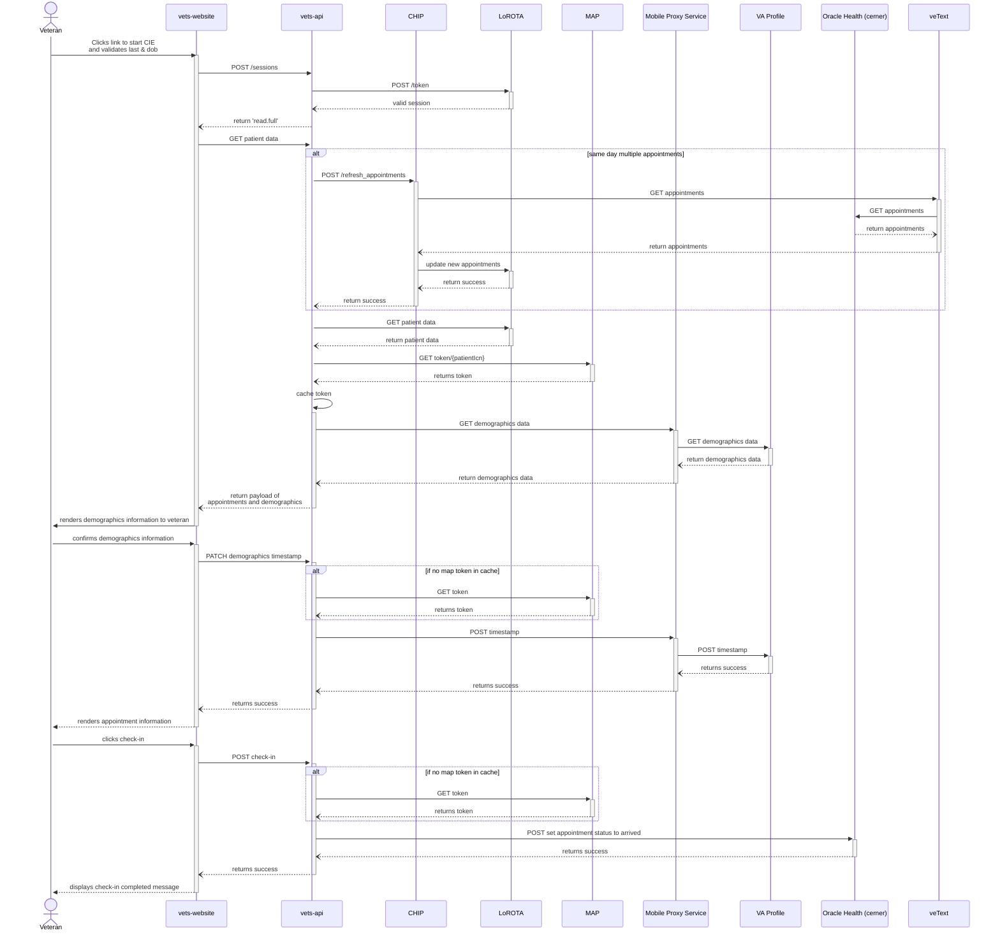

# CIE Oracle Health (cerner) integration
<aside>
🚧 WIP

</aside>

## Goals
We would like to support checking into appointments in Oracle Health (cerner) in a similar fashion to how we support checking-in to Vista appointments. A sub goal/dependancy of this work is to move to fetching demographic information directly from the Profile service. As well as updating the confirmation timestamp. The VA Profile integration would be for both Oracle Health (cerner) and Vista appointments.
## Overview
There are a couple of differences between Oracle Health (cerner) and Vista. The main differience is that for Vista appointments we set statuses along the way `setCheckInStarted` -> `setCheckInComplete`. For Oracle Health (cerner) we will only be updating the status once, and that is setting the appointment status to `arrived` after a patient confirms demographics. Oracle Health (cerner) also does not have Demographics and demographics status per station like Vista does. Our solution for this is to move to interface directly with the VA Profile service for both Oracle Health (cerner) and Vista. 

We will also be dealing with a different appointment object shape. As a result we will build a new initateCheckIn endpoint for veTEXT to use for Oracle Health (cerner) appointments. This will include a new cernerService utility layer to mange the sanitation of appointment data and saving to LoRota for Oracle Health (cerner) appointments.

For appointment refresh, we are going to need a new endpoint from veTEXT and update LoRota.

## Scope
- MVP only for day-of check-in
- Veteran initiated day-of checkin workflow using check-in text
- Telehealth appointments out of scope

## Assumptions
- VA Profile endpoint can be accessed using MAP token via Mobile Profile Service (proxy service) from vets-api using low-risk authentication 
  
## Design Decisions
- Implement new endpoint in CHIP to initate check-in for cerner appointments 
- CHIP modifies the received cerner appointment payload to comply with existing vista appointment data in LoROTA

## Design
### Initiate Cerner Checkin

### Veteran clicks link returned from VeText

## Questions / Open Items
- How do we connect to Oracle Health (cerner) via MAP token to set the arrived status?
- Who is our POC for the Oracle Health (cerner) MAP service?
- Can we connect to Profile for data and setting timestamp via MAP token? (Stephen is asking)
- Will we still need to update demographics timestamps in Vista if we are setting the single timestamp in VA Profile?
- What does a Oracle Health (cerner) appointment payload look like? (Shane will provide a sample)
- How will the staffs know about patient workflow status when cie application shows contact staff message incase of check-in failure or invalid contact information?
- Are all cerner appointments echeckin enabled by default or do we need to enable/disable echeck-in for sites/clinics?
- Decision from business if insurance verification required for cerner appointments
