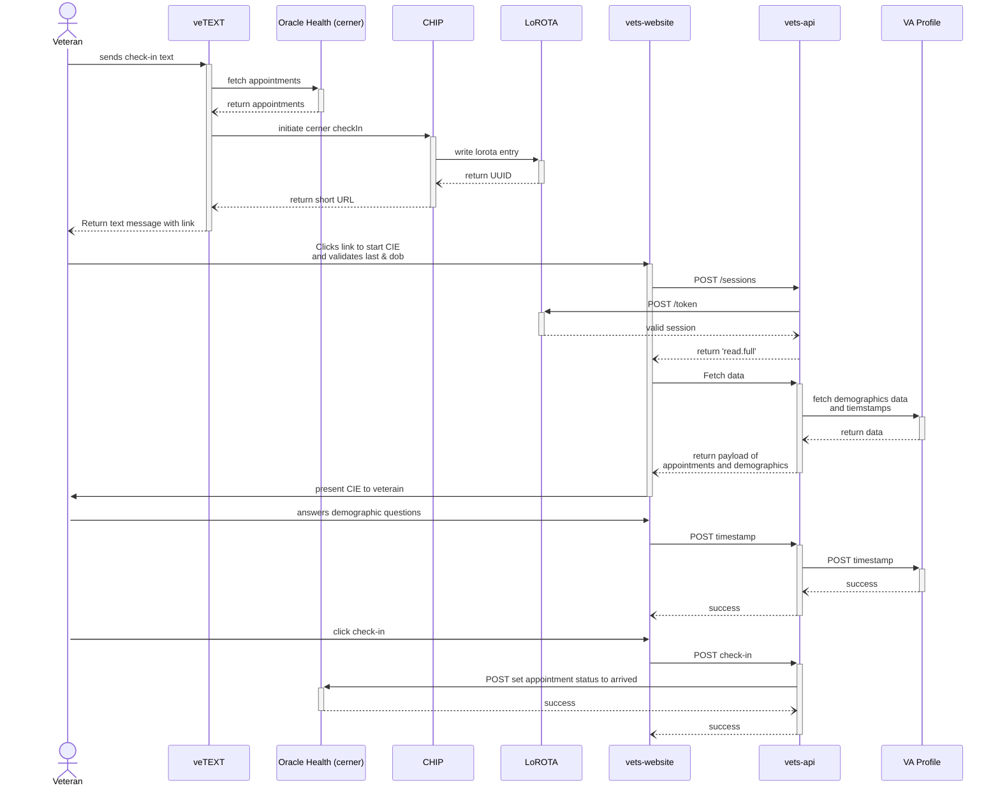

# CIE Oracle Health (cerner) integration
<aside>
🚧 WIP

</aside>

## Goals
We would like to support checking into appointments in Oracle Health (cerner) in a similar fashion to how we support checking-in to Vista appointments. A sub goal/dependancy of this work is to move to fetching demographic information directly from the Profile service. As well as updating the last updated timestamp. The VA Profile integration would be for both Oracle Health (cerner) and Vista appointments.
## Overview
There are a couple of differences between Oracle Health (cerner) and Vista. The main differience is that for Vista appointments we set statuses along the way `setCheckInStarted` -> `setCheckInComplete`. For Oracle Health (cerner) we will only be updating the status once, and that is setting the appointment status to `arrived` after a patient confirms demographics. Oracle Health (cerner) also does not have Demographics and demographics status per station like Vista does. Our solution for this is to move to interface directly with the VA Profile service for both Oracle Health (cerner) and Vista. 

We will also be dealing with a different appointment object shape. As a result we will build a new initateCheckIn endpoint for veTEXT to use for Oracle Health (cerner) appointments. This will include a new cernerService utility layer to mange the sanitation of appointment data and saving to LoRota for Oracle Health (cerner) appointments.
## Design

## Questions
- How do we connect to Oracle Health (cerner) via MAP token to set the arrived status?
- Who is our POC for the Oracle Health (cerner) MAP service?
- Can we connect to Profile for data and setting timestamp via MAP token? (Stephen is asking)
- Will we still need to update demographics timestamps in Vista if we are setting the single timestamp in VA Profile?
- What does a Oracle Health (cerner) appointment payload look like? (Shane will provide a sample)
