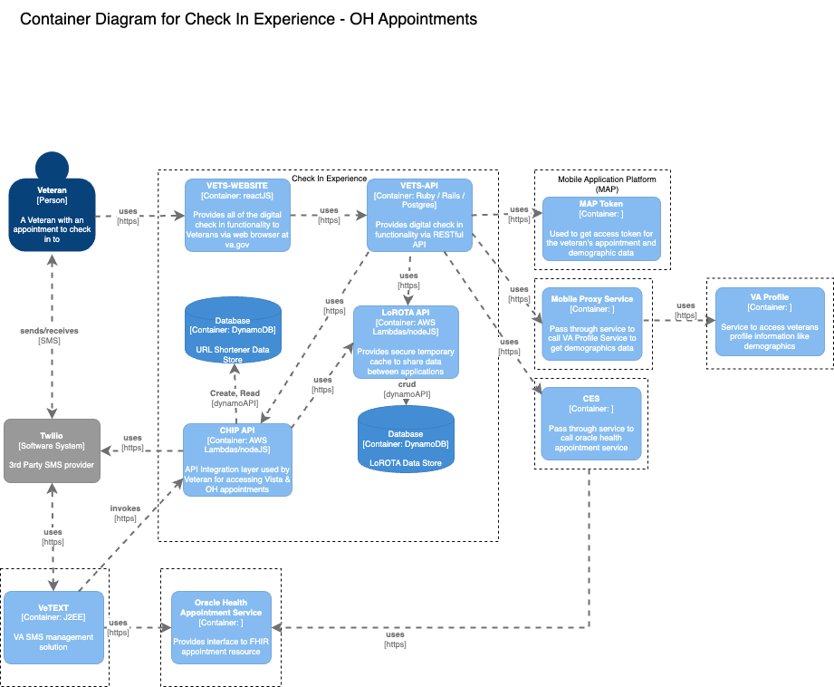
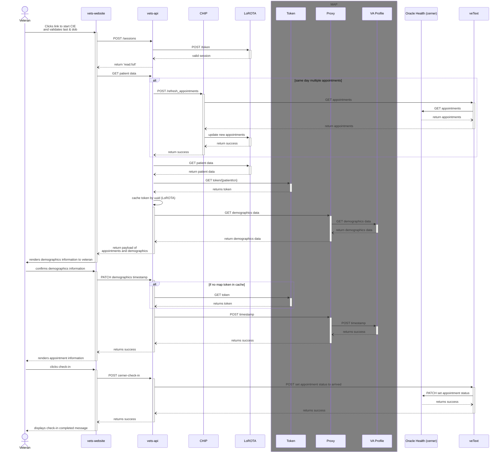

# CIE Oracle Health (cerner) check-in integration
<aside>
🚧 WIP

</aside>

## Goals
We would like to support checking into appointments in Oracle Health (cerner) in a similar fashion to how we support checking-in to Vista appointments. A sub goal/dependancy of this work is to move to fetching demographic information directly from the Profile service. As well as updating the confirmation timestamp. The VA Profile integration would be for both Oracle Health (cerner) and Vista appointments.
## Overview
There are a couple of differences between Oracle Health (cerner) and Vista. The main differience is that for Vista appointments we set statuses as the veteran completes check-in related activies `setCheckInStarted` -> `setCheckInComplete`. For Oracle Health (cerner) these statuses will not be used. The only update for Oracle Health (cerner) is setting the appointment status to `arrived` after a patient confirms demographics and completes check-in in the application. Oracle Health (cerner) also does not have Demographics and demographics status per station like Vista does. Our solution for this is to move to interface directly with the VA Profile service for both Oracle Health (cerner) and Vista. 

We will also be dealing with a different appointment object shape. As a result we will build a new initateCheckIn endpoint for veTEXT to use for Oracle Health (cerner) appointments. This will include a new cernerService utility layer to mange the sanitation of appointment data and saving to LoRota for Oracle Health (cerner) appointments.

For appointment refresh, we are going to need a new endpoint from veTEXT and update LoRota.

## Scope
- MVP only for day-of check-in
- Veteran initiated day-of checkin workflow using check-in text
- Telehealth appointments out of scope

## Assumptions
- VA Profile endpoint can be accessed using MAP token via Mobile Profile Service (proxy service) from vets-api using low-risk authentication
- Staffs will verify patient's insurance after they mark their appointments as ARRIVED in cerner (as there is no programmatic way to verify insurance for cerner patient data)
  
## Design Decisions
- Implement new endpoint in CHIP to initate check-in for cerner appointments 
- CHIP modifies the received cerner appointment payload to comply with existing vista appointment data in LoROTA

## Design
## Container Diagram


### Initiate Cerner Checkin


### Veteran clicks link returned from VeText
#### Option 1 : Cerner Check-in using MAP Token via CES

#### Option 2 : Cerner Check-in using VeText

## Integration
### Oracle Healthcare Integration

MAP OAuth Secure Token Service used to generate access token to handle authentication for accessing OH API. ``client_id`` generated for PCI application to call VA Profile API can be used for generating token to access OH API as well. Generate ``client_assertion`` parameter for MAP token endpoint using ``patient_icn`` & create jwt access token using MAP token endpoint to access OH API.

For marking the patient healthcare record in Oracle as ``ARRIVED``, vets-api needs to call VPG wrapper service which in turn calls [OH appointments API](https://fhir.cerner.com/millennium/r4/base/workflow/appointment/#patch-operations) to set the patient's appointment status

```
PATCH https://staff.apps.va.gov/vpg/v1/patients/{icn}/appointments/{appointment-id}
x-vamf-jwt: <jwt token from MAP token endpoint>
Content-Type: application/json-patch+json
Content-Length: <length>

[
  {
    "op": "replace",
    "path": "/status",
    "value": "arrived"
  }
]
```

### VA Profile 

We're going to use the Mobile Profile Service (link to [SRVDD](https://coderepo.mobilehealth.va.gov/projects/VETS/repos/mobile-profile-service/browse/docs/SRVDD.md?at=refs%2Fheads%2Fmain_v2)) to get the profile data for the Veteran. The Mobile Profile Service acts as a proxy service for profile data include health benefits and contact information that we (Patient Check-In) need to display as part of the check-in scenarios. It is authenticated using the same VAMF token that we get through the MAP STS token.

Steps:
1. Get the VAMF token by calling the `/token` endpoint of Secure Token Service:
   ```
   > POST /sts/oauth/v1/token HTTP/2
   > Host: veteran.apps-staging.va.gov
   > content-type: application/x-www-form-urlencoded
   > accept: application/json
   > user-agent: Vets.gov Agent
   > content-length: 867
   
   grant_type=client_credentials&client_id={client_id}&client_assertion_type=urn%3Aietf%3Aparams%3Aoauth%3Aclient-assertion-type%3Ajwt-bearer&client_assertion={client_assertion}
   
   < HTTP/2 200 
   
   {
	   "access_token": ...,
	   "token_type": "Bearer",
	   "expires_in": 900
   }
   ```

    This should return an access token scoped to the patient's ICN.
   
2. Call the Mobile Proxy Service with the token in `x-vamf-jwt` header and the consumer name in `x-consumer-username` header:
   ```
   > POST /profile/v2/patients/{icn}/profile-service/profile/v3/2.16.840.1.113883.4.349/{icn}%5ENI%5E200M%5EUSVHA HTTP/2
   
   > x-vamf-jwt: ...
   > x-consumer-username: MAPTEST
   > user-agent: Vets.gov Agent
   > content-type: application/json
   
   | {
   |   "bios": [
   |     {
   |       "bioPath": "healthBenefit"
   |     },
   | 		    {
   |       "bioPath": "contactInformation"
   |     }
   |   ]
   | }
   
   < HTTP/2 200
   {
     "profile": {
       "contactInformation": {
         "addresses": [
           {
             "sourceSystem": "JEHR",
             "addressType": "Domestic",
             "addressPOU": "CORRESPONDENCE",
             "badAddress": false,
             "addressLine1": "301 ABC St 1100B",
             "cityName": "San Francisco",
             "state": {
               "stateName": "California",
               "stateCode": "CA"
             },
             "zipCode5": "94105",
             "zipCode4": "1234",
             "county": {
               "countyName": "San Francisco County",
               "countyCode": "06075"
             },
             "country": {
               "countryName": "United States",
               "countryCodeFIPS": "US",
               "countryCodeISO2": "US",
               "countryCodeISO3": "USA"
             }
           },
           {
             "addressType": "Domestic",
             "addressPOU": "RESIDENCE",
             "badAddress": false,
             "addressLine1": "123 Avenue C",
             "cityName": "Brooklyn",
             "state": {
               "stateName": "New York",
               "stateCode": "NY"
             },
             "zipCode5": "11218",
             "county": {
               "countyName": "Kings County",
               "countyCode": "36047"
             },
             "country": {
               "countryName": "United States",
               "countryCodeFIPS": "US",
               "countryCodeISO2": "US",
               "countryCodeISO3": "USA"
             }
           }
         ],
         "telephones": [
           {
             "internationalIndicator": false,
             "phoneType": "HOME",
             "countryCode": "1",
             "areaCode": "123",
             "phoneNumber": "5551213"
           },
           {
             "phoneType": "MOBILE",
             "countryCode": "1",
             "areaCode": "123",
             "phoneNumber": "2342345",
             "classification": {
               "classificationCode": 3,
               "classificationName": "INVALID"
             }
           }
         ],
         "emails": [
           {
             "emailAddressText": "m.abc@def.com"
           }
         ]
       },
       "healthBenefit": {
         "identity": {
           "sensitivityInformation": {
             "sensitivityFlag": false
           }
         },
         "associatedPersons": [
           {
             "contactType": "Emergency Contact",
             "givenName": "EMERGENCY",
             "familyName": "CONTACT",
             "relationship": "UNRELATED FRIEND"
           },
           {
             "contactType": "Primary Next of Kin",
             "givenName": "JAMES",
             "familyName": "JOHNSON",
             "relationship": "EXTENDED FAMILY MEMBER",
             "addressLine1": "123 SESAME STREET",
             "addressLine2": "APT A",
             "city": "CHEYENNE",
             "state": "WY",
             "zipCode": "82001",
             "primaryPhone": "(307)555-1234",
             "alternatePhone": "(307)555-4444"
           },
           {
             "contactType": "Designee",
             "givenName": "MARY",
             "familyName": "JOHNSON",
             "relationship": "EXTENDED FAMILY MEMBER",
             "addressLine1": "123 SESAME STREET",
             "addressLine2": "APT A",
             "city": "CHEYENNE",
             "state": "WY",
             "zipCode": "82001",
             "primaryPhone": "(307)555-1234",
             "alternatePhone": "(307)555-4444"
           }
         ]
       }
     }
   }  
   ```
     This will return the profile data include emergency contact, next of kin and contact information for the patient.


## Questions / Open Items
(answers added from Stephen in [slack thread](https://dsva.slack.com/archives/C02G6AB3ZRS/p1705426133031669))
- Does the BTSSS endpoint work for OH stations? - CLOSED
    - (from Mark & Blaise) - Mark: Yes I am told BTSSS already works for OH. They are using DAS to get the  appointment data based on the facility. Blaise: Yes, that is correct. We pull EHRM appointments through Cerner associated to the facility 
- How do we connect to Oracle Health (cerner) via MAP token to set the arrived status? - OPEN
    - Plan to use a MAP service that is being built now. That will use the same MAP token. If for some reason that does not work we will need VeText to provide an endpoint to set the appointment status. Edit:  I actually cant remember where we landed for this connection, but both MAP and potentially VeText can provide this
    - Which OH API do we need to use for connecting OH via MAP?  Do we need to check with Brad?  Is there any docs available to know more about the API? - OPEN
- Who is our POC for the Oracle Health (cerner) MAP service? - CLOSED
    - @Brad Crosby can answer questions about this service. 
- Can we connect to Profile for data and setting timestamp via MAP token? (Stephen is asking) - OPEN
    - This appears to be the best way. @Kay and I are confirming what onboarding we need to do with MAP.   we will also need to work with VA Profile to get an application ID that will be used in the call to MAP. 
- Will we still need to update demographics timestamps in Vista if we are setting the single timestamp in VA Profile? - OPEN
    - For VistA appointments, I think so, based on VSE CS currently looking at those timestamps.  This one probably needs some more thought and understanding to be sure. 
- What does a Oracle Health (cerner) appointment payload look like? (veTEXT will provide a sample) - OPEN
    - [veTEXT ticket](https://github.com/department-of-veterans-affairs/vetext/issues/2275) for the work 
- How will the staffs know about patient workflow status when cie application shows contact staff message incase of check-in failure or invalid contact information? - CLOSED
    - Staff at OH will not know about any of the statuses that are currently set by PCI and viewed by staff in VSE CS. OH staff will not use VSE CS.  If the Veteran is not able to complete check in they should be directed to check in with the clerk. 
- Are all cerner appointments echeckin enabled by default or do we need to enable/disable echeck-in for sites/clinics? - OPEN
    - I think where this landed is that we only need to be able to enable/disable based on appointment type (video, in-person, telephone :point_left: not real statuses, for example use only) @Kay can you confirm this please?
    - If eligibility going to be by appointment type, is vetext going to filter them or does it have to be handled by chip? - OPEN
- Decision from business if insurance verification required for cerner appointments - CLOSED
    - There is currently not a way to programmatically determine if a Veteran needs to confirm/update their insurance information at OH sites so Veterans will need to that directly with the clerk.
 
## API Questions
- **Mobile Proxy Service**
  - ~~What is the Mobile Proxy Service endpoint to call with MAP to access veteran's VA profile?~~ (answered, see above for integration with mobile proxy service)
  - ~~What is the test client id to use for getting VA Profile data in staging until we get client id specific to check-in-experience application (CIE) for accessing VA Profile?~~
    - Currently, we have a client id for CIE to access appointment data from VAOS; Would like to see if any test client id available to access data in staging until we receive an ID for accessing VA profile
    - response from Chan:
      > Mobile-profile-service:  https://coderepo.mobilehealth.va.gov/projects/VETS/repos/mobile-profile-service/browse/docs/SRVDD.md, but in your case, you will be using mobile-profile-v2 where it acts as a pass through.  You still will need to pass in the ID (for now, use “MAPTEST”) until VA Profile onboard you with the MAPPCI ID.  For mobile-profile-service v2 stagger: https://staff.apps-staging.va.gov/profile/v2
- **VA Profile Service**
  - Based on VA Profile share point doc, Demographics endpoint doesn’t seem to be sending relevant information but contact-information endpoint seem to be sending some data to confirm from CIE app
    - API - ```GET /contact-information/{oid}/{idWithOaid}```,
      - There is a sample string (organizational id in oid variable in the document; Is it going to be constant or is that going to change for each consumer? Do we need to request one?
      - ```idWithOaid``` seem to be following some format for sending patientICN; Would be great to see more information on how to build this data
  - ```contact-information``` API gives contact information like residential contact address & telephone numbers; Which API do we need to use for getting next of kin & emergency contact information?
- **Oracle Health (OH) Service**
  - Is there sample data that's refreshed daily or we can use as well? So after we auth and we're hooked into CES, one of the first things we'd love to be able to do is set an appointment status (to checked-in, but other statuses' would be fine). Based on the docs for patch that should be fairly easy as long as everything is operating as expected! Also, will we need to be on the va VPN to test (i.e. deployed to a staging env) to test, or is there a way to test locally and hit your services?
    - Response from Michael:
    > We don't have a separate test data set as all of the test patients are already present in the Cerner B1930 environment. We're able to create and manage appointments as necessary for those test patients though, so testing this should be easy enough (assuming I'm understanding your use cases correctly). You will need to be either on CAG or Rescue VPN to access the environment though- all of the OCC services (including CES) are deployed
  - Regarding the CES API calling using MAP token, do we need to request a seperate application ID for PCI to call MAP token endpoint? Currently we have an application ID in MAP for calling VAOS & requested one for calling VA Profile. And addition to the application ID question, for accessing VA Profile we were asked to use MAPTEST until we get an application ID for PCI in staging env.  Can this be used for CES/OH as well?
  - Response from Micheal:
  > General application tracking IDs aren't required to use MAP services, that's a requirement of the VA Profile team so we pass it along when we make requests to their services on an application's behalf. The MAP OAuth client ID/secret that we issue you to authenticate to the services, though, can be used both (Profile and CES) (edited) 

- **Service level general questions**
  - Does the API have only staging & prod environments?
  - Swagger doc shows an URL with qa prefix (for staging); What is the prod URL? Is there any difference in calling these API in staging vs prod?
  - How can we create/request test data to play with the MAP, VA Profile & OH Services?
