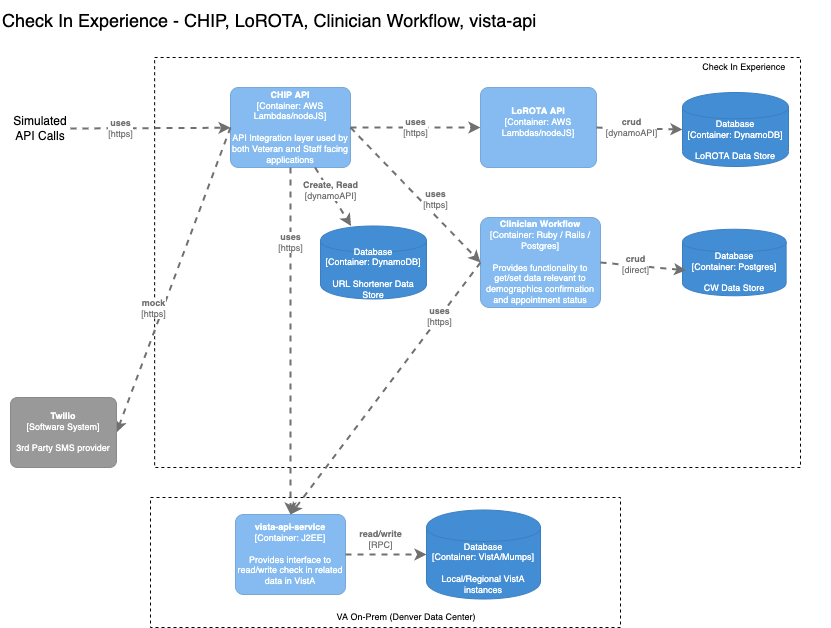

## CHIP/LoROTA/Clinician Workflow/Vista-api performance testing

### Test Environment

CHIP and LoROTA lambdas run from VAEC AWS account. Clincian Workflow runs as an ECS service, also in VAEC account. VistA api is run on on-prem instances.

### Load Estimates
CHIP and LoROTA endpoints are called by VEText during initiation of check-in and pre check-in scenarios, as well as vets-api during these scenarios.

### Tools
We're currently looking into both [locust](https://locust.io/) and [K6](https://k6.io/open-source) for scripting and load generation. We will finalize the tool based on the ease of script creation, ease of setup/install in VAEC cloud and the ability to generate the desired load profile.

### Load Profile

| endpoint            | requests per min |
|---------------------|------------------|
| initiateCheckIn     | 147              |
| refreshAppointments | 147              |
| checkIn             | 147              |
| initiatePreCheckin  | 604              |
| refreshPreCheckin   | 604              |

### Test Data Generation
Shane has created a node script to generate test appointments in VistA: https://github.com/shanemelliott/createAppts

### Monitoring

We will use DataDog to monitor system performance and resource utilization during the load test execution. We will also monitor CloudWatch resources as well as error logs.

Clinician Workflow:

CHIP (nonprod): https://tevi.ddog-gov.com/dashboard/hcd-qby-eqm/technical-dashboard---chip-nonprod

LoROTA:

VistA API dashboard (Dev): https://tevi.ddog-gov.com/dashboard/cim-s7k-5s5/vista-api-dev

VistA API dashboard (Staging):
