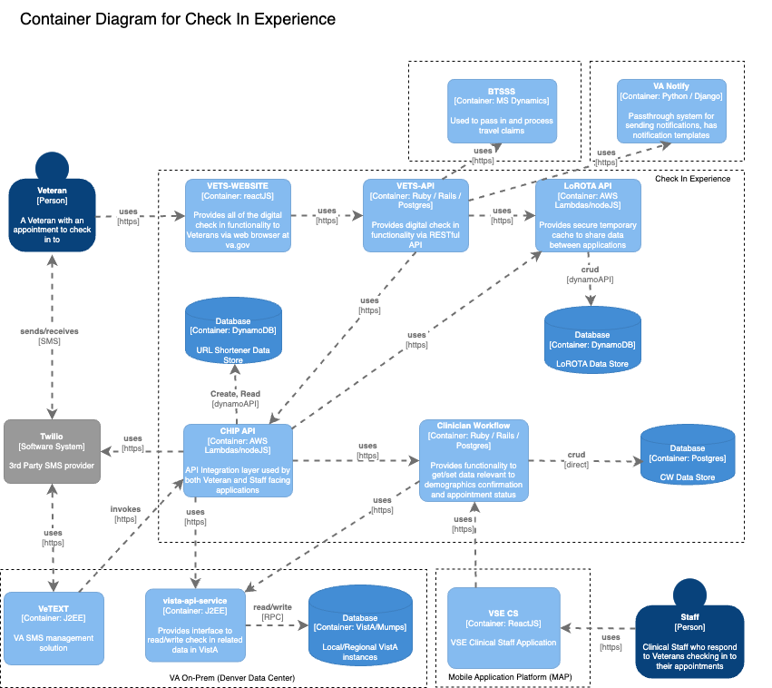
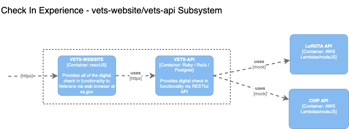
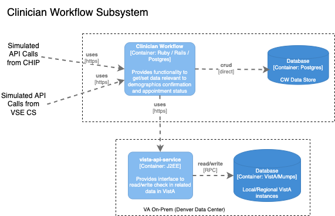
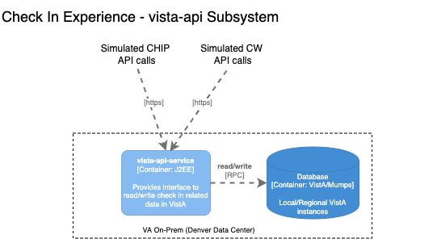

# Check In Experience Performance Testing

<aside>
👉🏽 This document is WIP
</aside>

## Table of Contents
1. [Purpose](#1-purpose)
2. [Introduction](#2-introduction)
3. [Test Methodology](#3-test-methodology)
    1. [Load Estimates](#load-estimates)
    2. [User Scenarios](#user-scenarios)
    3. [Subsystems](#sub-systems)
        1. [vets-website/vets-api](#vets-websitevets-api)
        2. [LoROTA](#lorota)
        3. [CHIP](#chip)
        4. [Clinician Workflow](#clinician-workflow)
        5. [VistA API](#vista-api)
        6. [CHIP, LoROTA, Clinician Workflow, vista-api](#chip-lorota-clinician-workflow-and-vista-api)
    4. [Test Environment](#test-environment)
    5. [Test Data Setup](#test-data-setup)
    6. [Monitoring](#monitoring)

## 1. Purpose

The purpose of this document is to provide an overview of the approach to test the performance of Check-in and Pre Check-in Experience. Our current target is the upcoming rollout to VISN8 with facilities in FL, PR, and Virgin Islands, scheduled for May 2, 2022.

## 2. Introduction

*TODO*
## 3. Test Methodology

### Load Estimates

Mobile Check-in will be enabled in the health care stations in a staggered manner. The table below shows weekly deployment schedule and the actual appointments in those stations for the week of 4/22/2022.

  
Deployment Schedule and Appointments

|                                  | **May 2** | **May 9** | **May 16** | **May 23** | **May 31** | **June 6** | **June 13** | **June 20** | **June 27** | **July 5** | **July 11** | **July 18** | **July 25** | **Aug 1** | **Aug 8** | **Aug 15** | **Aug 22** |
|----------------------------------|-----------|-----------|------------|------------|------------|------------|-------------|-------------|-------------|------------|-------------|-------------|-------------|-----------|-----------|------------|------------|
| Station ID's (STA3N )            | 516       | 508       | 502        | 504        | 501        | 358        | 436         | 589         | 437         | 537        | 506         | 596         | 558         | 512       | 460       | 526        | 402        |
|                                  | 546       | 509       | 520        | 519        | 600        | 459        | 442         | 657         | 438         | 550        | 515         | 603         | 565         | 517       | 503       | 528        | 405        |
|                                  | 548       | 521       | 564        | 549        | 605        | 570        | 554         |             | 568         | 556        | 538         | 614         | 590         | 540       | 529       | 561        | 518        |
|                                  | 573       | 534       | 580        | 671        | 644        | 593        | 575         |             | 618         | 578        | 539         | 621         | 637         | 581       | 542       | 620        | 523        |
|                                  | 672       | 544       | 586        | 674        | 649        | 612        | 623         |             | 636         | 585        | 541         | 626         | 652         | 613       | 562       | 630        | 608        |
|                                  | 673       | 557       | 598        | 740        | 664        | 640        | 635         |             | 656         | 607        | 552         |             | 658         | 688       | 595       | 632        | 631        |
|                                  | 675       | 619       | 629        | 756        | 678        | 654        | 660         |             |             | 676        | 553         |             | 659         |           | 642       |            | 650        |
|                                  |           | 679       | 667        |            | 691        | 662        | 666         |             |             | 695        | 583         |             |             |           | 646       |            | 689        |
|                                  |           |           |            |            |            |            |             |             |             |            | 610         |             |             |           | 693       |            |            |
|                                  |           |           |            |            |            |            |             |             |             |            | 655         |             |             |           |           |            |            |
|                                  |           |           |            |            |            |            |             |             |             |            | 757         |             |             |           |           |            |            |
| Total stations                   | 7         | 8         | 8          | 7          | 8          | 8          | 8           | 2           | 6           | 8          | 11          | 5           | 7           | 6         | 9         | 6          | 8          |
| Total sites                      | 126       | 95        | 101        | 94         | 126        | 97         | 135         | 81          | 109         | 71         | 130         | 76          | 71          | 62        | 81        | 106        | 85         |
| Total Daily Average Appts (est.) | 29,956    | 19,072    | 17,666     | 18,656     | 22,280     | 16,041     | 13,360      | 11,370      | 14,242      | 15,591     | 24,089      | 12,580      | 18,841      | 8,909     | 12,493    | 14,213     | 12,717     |

The cumulative total number of daily appointments at the end of the rollout for all stations is **282,076**.

Check-in scenario: Assuming that these are equally distributed throughout the business day (8 - 5), the hourly load is 35,260 check-ins per hour.

Pre check-in scenario: The pre check-in process is run in the morning with VEText calling the CHIP initiate-pre-checkin lambda. TBD the load profile for pre check-in components.

Questions:
- What % of these appointments will be eligible for mobile check-in?
- What estimated % of these appointments will result in a pre check-in link being sent out?
- Do we also need to include the reminders that are sent out 2nd or 3rd time (3 days or 1 day before the appointment)?
- How does VEText invoke the CHIP lambda to initiate pre-checkin? Is this multi-threaded, how many threads and can that be staggered?

### User Scenarios
Check-in: This scenario is invoked by the Veteran when they arrive at the facility for their appointment and send a text to initiate the check-in process. See sequence diagrams for check-in [here](../architecture-diagrams/sequenceDiagram_checkInExp.md).

Pre check-in: This sceanrio is initiated by VEText which calls the initiate pre check-in lambda, which ultimates sends a text to the Veteran to start the pre check-in process. See sequence diagrams for pre check-in [here](../architecture-diagrams/sequenceDiagram_preCheckInExp.md)

### Sub Systems

Check-in system comprises of various sub-systems that are shown in the container diagram below.

We're going to load test the individual sub-systems in addition to the end to end load testing.

#### vets-website/vets-api

This subsystem comprises of user facing va.gov website (vets-website) and vets-api. These components are supported and deployed by the VA platform team. vets-website is a React.js app which is hosted in S3. vets-api is a Rails application and hosts the modules/engines that support various VA functionality built by different teams. It is deployed *TODO: add deployment methodology* in US GovCloud.

The goal of testing this subsystem is to ensure that vets-website front-end and vets-api backend can handle increased load due to check-in traffic.

For more details on vets-website and vets-api performance test approach, see [vets-website/vets-api performance test approach](./website-api-perf-testing.md)

#### LoROTA

#### CHIP

#### Clinician Workflow

For more details on clinician workflow performance test approach, see [clinician workflow performance test approach](./clinician-workflow-perf-testing.md)

#### VistA API

VistA api comprises of a J2EE application running on WildFly application server, deployed on Linux hosts in VA on-prem data center. This application provides API endpoints to interact with VistA systems.

The goal of testing this subsystem is to ensure that the resources allocated to vista-api can support the projected load.

For more details on vets-website and vista-api performance test approach, see [vista-api performance test approach](./vista-api-perf-testing.md)

#### CHIP, LoROTA, Clinician Workflow and vista-api

LoROTA is a set of lambdas that provide api endpoints for low risk token authentication. Currently, this is primary used by vets-api and CHIP to get and set the token or data associated with a patient (Veteran with a healthcare appointment).

CHIP is a set of lambdas that provide various endpoints to vets-api (or other consumers) to interact with downstream services like VistA and Clinician Workflow.

The goal of these tests is to validate the performance of a combined subsystem with CHIP, LoROTA, Clinician Workflow and vista-api.

For more details on CHIP performance test approach, see [CHIP/LoROTA/CW/VistA API performance test approach](./chip-lorota-cw-vista-api-perf-testing.md)

### Test Environment

We will be running these tests in Staging Environment.

*TODO: Environment diagrams showing differences in Staging and Production environments for different components.*

### Test Data Setup

### Monitoring
