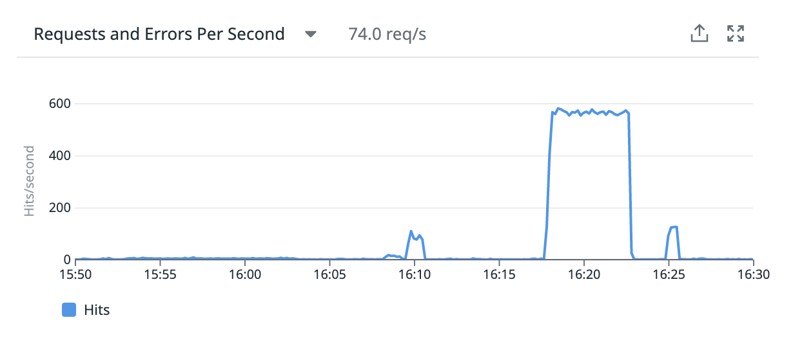
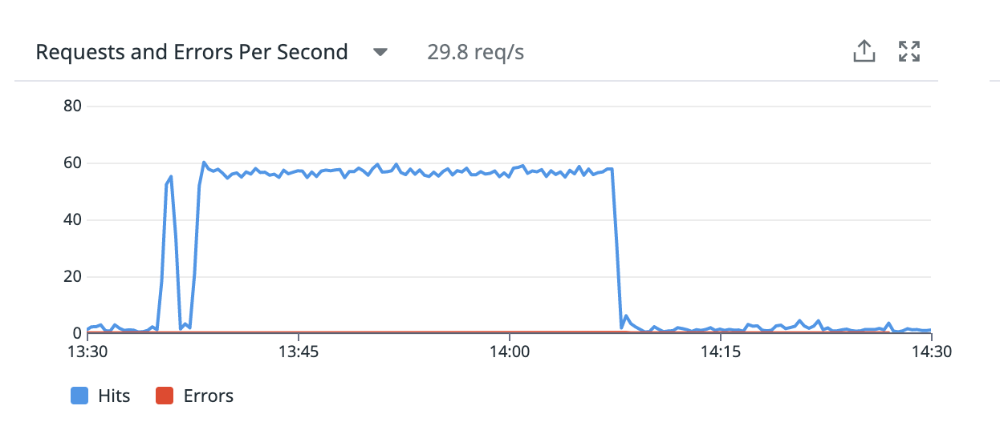
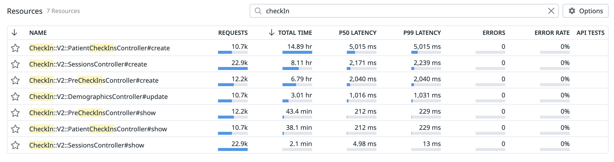

### Background
As of 2023 Q1, VFS Platform team handling vets-api backend server migration to AWS Kubernetes for better resource management. To ensure that EKS infrastructure can handle the heavy volume of concurrent users in production, the platform team planned to run load tests in the staging environment and monitor the service performance.  vets-api being a monolith, it is recommended to execute all available endpoint load test scripts from the docker container in an isolated manner simultaneously.  The goal is to make sure the new EKS infrastructure can handle the current production load and scales the application based on the incoming load.

### VFS Teams Responsibility
- Implement load test script for VFS product use-case either using Locust or K6 
- Provide docker CLI command to execute load test script for the platform team

### Check-in-Experience (CIE) Team Effort on Load Testing Support
- **Docker CLI Command**
    - Previously load test scripts ([K6](https://github.com/department-of-veterans-affairs/devops/tree/40651_check-in_load_test_scripts/loadtest/check_in/k6)/[check-in-locust-script](https://github.com/department-of-veterans-affairs/devops/tree/40651_check-in_load_test_scripts/loadtest/check_in/check-in)/[pre-check-in-locust-script](https://github.com/department-of-veterans-affairs/devops/tree/40651_check-in_load_test_scripts/loadtest/check_in/pre-checkin)) were executed directly in the host machine to push the appropriate load to vets-api check-in endpoints. 
    - To support the platform team in running the load test scripts from docker containers, CIE team has to provide the docker command with a load option in CLI. 
    - Docker Command to execute K6 Script (with hard-coded load) 
    ```
    docker run --rm -i grafana/k6 run - <script.js
    ```
    - Docker Command to execute Locust Script (dynamic load from CLI)
    ```
    docker run --rm -v $PWD:/loadtest -i locustio/locust:2.14.2 -u 5 -r 5 -t 60s --headless --only-summary -f /loadtest/locustfile.py
    ```
- **Execute Load Test Script**
The platform team had a specific timeline scheduled for running the load test to measure the server performance.  VFS team is required to push load based on product-specific use-case for ensuring the server performance from the user perspective.
  - **Issues faced during load test execution**
    - CIE load test script was failing with DOB account credentials
      - Modified the script to support current account credentials accepted by the application
    - CIE load test only targets vets-api and cuts down the traffic to dependency services (like CHIP, LoROTA, Vista) using ``check_in_experience_mock_enabled`` feature.  As part of EKS infrastructure migration, [vets-api-mockdata](       http://sentry.vfs.va.gov/organizations/vsp/issues/194151/?environment=staging&project=3&query=is%3Aunresolved) was not available in staging POD.  Reporting to the platform team, they pushed the [changes](https://github.com/department-of-veterans-affairs/vsp-infra-application-manifests/pull/1663) to set mockData flag in staging for enabling the mock feature.  
    - Previously, CIE team used ``tevi-dev-load-testing`` EC2 instance with dedicated IP ``10.247.104.*`` for pushing load.  Recently, when the same EC2 instance was used to push load, it started sending load from random IPs in the range of ``10.247.*`` or ``192.168.*.*``
      - Modified rack_attack [safelist](https://github.com/department-of-veterans-affairs/vets-api/commit/271008d7775e77adc8eb3826af5e0e413abab160) configuration to prevent vets-api throttling the load from tevi-dev-load-testing EC2 instance  
      - Instead of having predefined set of IPs safelisted, modified [rack_attack](https://github.com/department-of-veterans-affairs/vets-api/commit/754a6041d39a5589740fcf8bc3f97d9e4e6dd6ba) config to avoid throttling in test environments for CIE endpoints

### Service Performance Monitoring
CIE vets-api endpoints were load tested for requests per mins as mentioned below,
- 100 Requests per Minute for 10 mins


- 500 Requests per Minute for 30 mins



By comparing the latency observed in production from [here](https://vagov.ddog-gov.com/dashboard/zps-5fk-azw/check-in-vets-api?from_ts=1679357276960&to_ts=1679443676960&live=true) for CIE endpoints, there is no impact noticed in CIE endpoints from user's perspective with EKS migration.  Also, CIE APIs succeeded in responding with 200 status code without any exception from server with increase in traffic.
