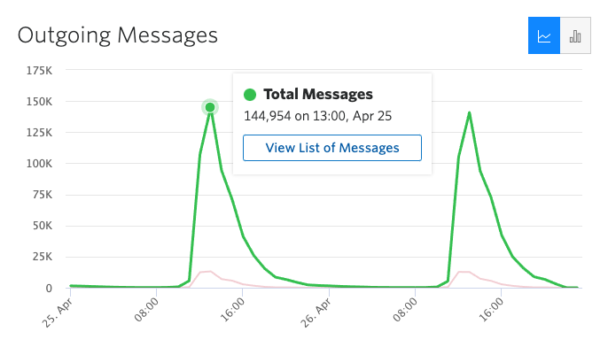

## vista-api performance testing

### Test Environment

To test the vista-api performance, we'll be running these load tests in Staging environment. Currently there is 1 Linux host in Staging environment that runs the vista-api application server, as compared to 4 hosts in Production environment (DNS round robin).

### Load Estimates
Both CHIP lambdas and Clinician Workflow call vista-api endpoints to get appointments, verify insurance, get demographics data or to set the status related to check-in or pre check-in etc.

Based on the data on appointments for the week of 4/22, we estimate a load of about 35k check-ins per hour assuming all stations have mobile check-in enabled and all appointments go through mobile check-in. See [Load Estimates](readme.md#load-estimates) for more details.

Based on the outgoing twilio messages and assuming the same load for mobile pre check-in reminders, we have an upper range of about 145k pre check-in hourly reminders.

The load testing effort will comprise of running multiple tests at different loads. One of the reasons is that currently, staging environment is just 1 host as compared to 4 in production. We hope to scale down the test load from production estimates and be able to load test the vista-api instance as well as it's connection to underlying VistA systems to get meaningful results from this effort.

### Tools
We're currently looking into both [locust](https://locust.io/) and [K6](https://k6.io/open-source) for scripting and load generation. We will finalize the tool based on the ease of script creation, ease of setup/install in VAEC cloud and the ability to generate the desired load profile.

### Load Profile
Based on the current load estimates (see [above](#load-estimates)), here's the combined load profile for vista-apis. Note that this doesn't include the load from Clinician Workflow to vista-apis, and future work will be needed to include that in the load tests.

| **endpoint**           | ** 1/4th rps** |
|------------------------|----------------|
| /token                 | 50             |
| /getAppointments       | 2              |
| /insurance-verify      | 2              |
| /demographics          | 23             |
| /checkin-status-set    | 25             |
| /appts-by-patient      | 23             |
| /checkin               | 2              |
| /appts-by-clinic       | 5              |
| /has-grid              | 0.5            |
| /insurance-verify (v2) | 0.25           |
| /demographics (v2).    | 0.25           |

### Test Data Generation
Shane has created a node script to generate test appointments in VistA: https://github.com/shanemelliott/createAppts

### Monitoring

We will use DataDog to monitor system performance and resource utilization during the load test execution.

VistA API dashboard (Dev): https://tevi.ddog-gov.com/dashboard/cim-s7k-5s5/vista-api-dev

VistA API dashboard (Staging):

VistA API dashboard (Prod): https://tevi.ddog-gov.com/dashboard/pa4-jzg-492/vista-api
