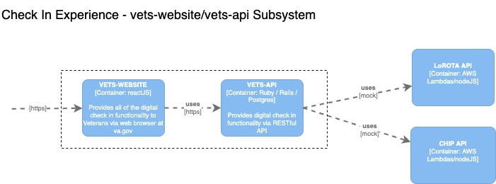

## vets-api performance testing

### Test Environment

We'll be running these load tests in Staging environment and working with platform team to monitor the resources. Currently, there is no plan to run these tests in production but we'll evaluate the decision after the staging tests.

### Load Estimates
Based on the data on appointments for the week of 4/22, we estimate a load of about 35k check-ins per hour assuming all stations have mobile check-in enabled and all appointments go through mobile check-in. See [Load Estimates](readme.md#load-estimates) for more details.

Based on the outgoing twilio messages and assuming the same load for mobile pre check-in reminders, we have an upper range of about 145k pre check-in hourly reminders.

We'll start with a lower load and ramp up the load based on the system performance. 

### Tools
We're currently looking into both [locust](https://locust.io/) and [K6](https://k6.io/open-source) for scripting and load generation. We will finalize the tool based on the ease of script creation, ease of setup/install in VAEC cloud and the ability to generate the desired load profile.

### Load Profile
Based on the current load estimates (see [above](#load-estimates)), here's the combined load profile for vista-apis. Note that this doesn't include the load from Clinician Workflow to vista-apis, and future work will be needed to include that in the load tests.

| **endpoint**          | **requests per min** |
|-----------------------|----------------------|
| get /sessions         | 3005                 |
| post /sessions        | 3005                 |
| get /patient_checkin  | 588                  |
| post /patient_checkin | 588                  |
| get /pre_checkin      | 2417                 |
| post /pre_checkin     | 2417                 |

### Test Data Generation
Calls to vets-api check-in endpoints use only a UUID which can be randomly generated since the downstream calls will be mocked.

### Monitoring

We will use DataDog and Grafana to monitor system performance and resource utilization during the load test execution.

- [DataDog Dashboard](https://app.datadoghq.com/apm/services/vets-api/operations/rack.request/resources?env=staging&resources=qson%3A%28data%3A%28visible%3A%21t%2Chits%3A%28selected%3Atotal%29%2Cerrors%3A%28selected%3Atotal%29%2Clatency%3A%28selected%3Ap99%29%2CtopN%3A%215%29%2Cversion%3A%210%29&summary=qson%3A%28data%3A%28visible%3A%21t%2Cerrors%3A%28selected%3Acount%29%2Chits%3A%28selected%3Acount%29%2Clatency%3A%28selected%3Alatency%2Cslot%3A%28agg%3A75%29%2Cdistribution%3A%28isLogScale%3A%21f%29%29%2Csublayer%3A%28slot%3A%28layers%3Aservice%29%2Cselected%3Apercentage%29%29%2Cversion%3A%211%29&start=1652385636369&end=1652389236369&paused=false)
- [Grafana/Prometheus](https://grafana.vfs.va.gov/d/000000017/vets-api?orgId=1&var-data_source=Prometheus%20(Staging))
