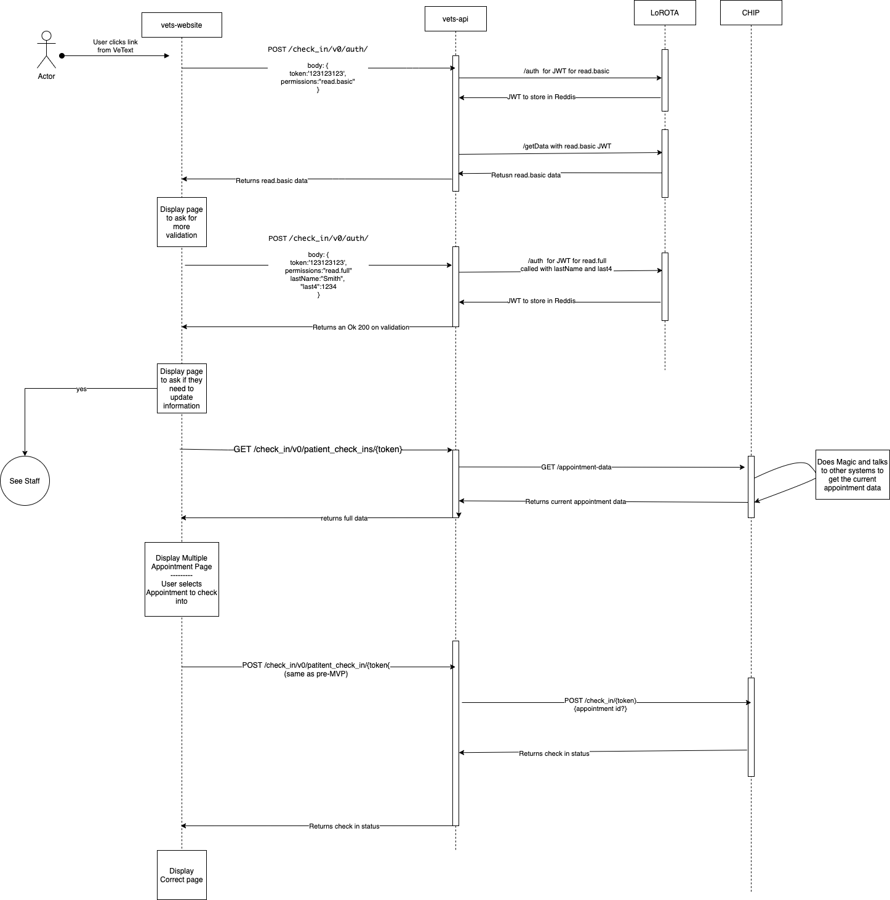

# Swimlane diagram

## Diagram

]

## Notes

- This flow picks up once the user clicks a generated link from VeText.
- Some of the specifics of the endpoints are approximations, ex: the GET /appoinment-data endpoint does not exist in the real system, but some endpoints that gets the appointment should/needs to exist

## Outstanding Questions

- Is a LoROTA token tied to an appointment, or day, or a sub-set of appointments?
- How are we getting the appointment status to display appointments in the past?
