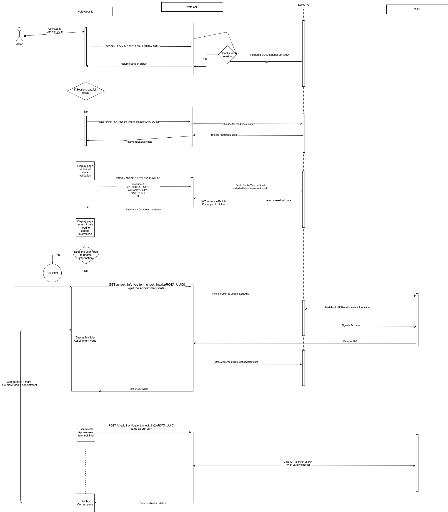

# Swimlane diagram

## Diagram

]

## Notes

- For the vet-api, the endpoints need refactored to include RESTful endpoints for validation and check-in
- This flow picks up once the user clicks a generated link from VeText.

## Notes from Engineering team

Problem to be solved with regard to supporting multiple appointments in Check In Experience:
The appointment data in Lorota is written when the initial SMS is sent to the Veteran. If that data is not updated throughout the day, the appointment status and any newly scheduled appointments will not show up in the UX for the Veteran.

### High Level idea of how we will solve this issue

When needed, vets-api will invoke a new CHIP endpoint that triggers CHIP to fetch the latest appointment data and update the existing Lorota data. vets-api then fetches the latest data from Lorota and displays to Veteran.

### Assumptions

Veteran validation lasts all day
Lorota data can be modified by the application that originally Posted it. This is controlled with scoped tokens.

### Workflow

Veteran sees poster in clinic and sends SMS to Check In to an appointment
CHIP validates phone number, adds appointment and any other needed data to Lorota and returns an SMS with a link to Check In
Veteran Clicks link, validates with lastName and lastFour and sees list of all appointments for today.
Veteran clicks `Check in now` on an appointment and successfully completes workflow
vets-api calls CHIP `/check-in` endpoint  
Confirmation page is displayed to Veteran including a link back to appointment list
When the appointment list page is accessed again (link on confirmation page, link in the original SMS or browser refreshed):
vets-api calls a CHIP endpoint to trigger CHIP to update the data
CHIP gets the latest data from VistA and updates the current Lorota entry.
vets-api calls Lorota to get updated data and returns to vets-website for display to Veteran
If the Veteran sends a new SMS, an entirely new Lorota entry/UUID and URL will be generated.  

### Additional Notes

CHIP will validate appointment is eligible for check in and add a status to Lorota POST data.
Validity check should be done as close to data as possible and in one place so future consumers can all use same validation
If `Check in now` button is tapped after the valid time has expired, CHIP will update Lorota data and return appropriate error message to vets-api so Veteran can be notified and UX updated

### Concerns

There are a lot of backend calls made when the appointment list page is refreshed, prompting performance concerns as we scale out.  
To mitigate this we will be defining what metrics we need to track to know performance is an issue, and what threshold would indicate an issue is occurring.
We will also identify optimization opportunities early in the engineering process so they can be considered as part of any implementation/architectural decisions.

### Questions

Would Veterans like to see the valid times they can check in to an appointment in the UX?
How many chances does the Veteran get to validate? Ask Security team.  
When will Lorota delete the data? Overnight scheduled job?
Veterans may want to see the list of appointments they checked in to on a day, after the final appointment check in valid time has expired.
