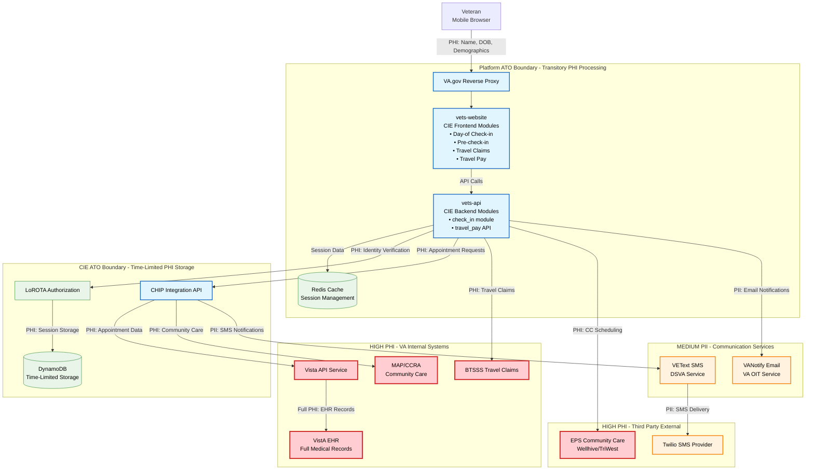

## PHI/PII Data Flow Architecture

## Data Classification Matrix

### 🔴 PHI - Protected Health Information (HIPAA Covered)

| Data Type | Collection Point | Processing Location | Storage Duration | Transmission Scope |
|-----------|------------------|-------------------|------------------|-------------------|
| **Last Name** | vets-website | Platform (transient) | Redis: Session only | LoROTA verification |
| **Date of Birth** | vets-website | Platform (transient) | Redis: Session only | LoROTA verification |
| **Appointment Details** | VistA (source) | CIE (processing) | LoROTA: Time-limited | Veterans (display) |
| **Travel Claim Data** | vets-website | Platform → BTSSS | BTSSS: Permanent | BTSSS processing |
| **Community Care Data** | MAP/CCRA | CIE → EPS | EPS: Per contract | External providers |

### 🟡 PII - Personally Identifiable Information

| Data Type | Collection Point | Processing Location | Storage Duration | Transmission Scope |
|-----------|------------------|-------------------|------------------|-------------------|
| **Phone Numbers** | VistA/Demographics | VEText → Twilio | Twilio: Per contract | SMS delivery |
| **Email Addresses** | Platform/User | VANotify | VA service contract | Email delivery |
| **First/Last Names** | VistA/Platform | Multiple systems | Varies by system | Notifications/verification |
| **Demographics** | VistA (source) | CIE (processing) | LoROTA: Time-limited | Veterans (verification) |
| **Contact Information** | VistA (source) | CIE (processing), Platform (transit only) | LoROTA: Time-limited | Veterans (confirmation) |
| **Emergency Contacts** | VistA (source) | CIE (processing), Platform (transit only) | LoROTA: Time-limited | Veterans (confirmation) |
| **Next of Kin** | VistA (source) | CIE (processing), Platform (transit only) | LoROTA: Time-limited | Veterans (confirmation) |
| **ICN (Veteran ID)** | VA Profile | MAP/CCRA/EPS | Varies by system | System integration |

### 🔵 System Identifiers - Non-PII Operational Data

| Data Type | Collection Point | Processing Location | Storage Duration | Transmission Scope |
|-----------|------------------|-------------------|------------------|-------------------|
| **UUID Session Tokens** | LoROTA | Platform/CIE | Time-limited | Session management |
| **Appointment IDs** | VistA | All systems | Operational | System integration |
| **Status Codes** | Multiple | All systems | Operational | Status tracking |
| **Feature Flags** | Platform | All systems | Configuration | System behavior |

## Data Retention & Disposal Policies

### Platform ATO Boundary
- **Redis Session Cache**: Automatic expiration based on session timeout
- **API Transit Data**: Immediate disposal after transmission
- **Logs**: Standard Platform retention policy (consult Platform team)
- **No Persistent PHI Storage**: All PHI is transitory processing only

### CIE ATO Boundary
- **LoROTA DynamoDB**: Time-limited storage with automatic expiration
- **CHIP Processing**: No persistent storage - integration layer only
- **Logs**: CIE-specific retention policy (consult CIE DevOps team)
- **Session Management**: Automatic cleanup based on business rules

### External Systems
- **VistA**: Permanent EHR storage per VA medical record policies
- **BTSSS**: Financial record retention per VA travel claim policies
- **Third-Party Systems**: Per contractual data processing agreements
