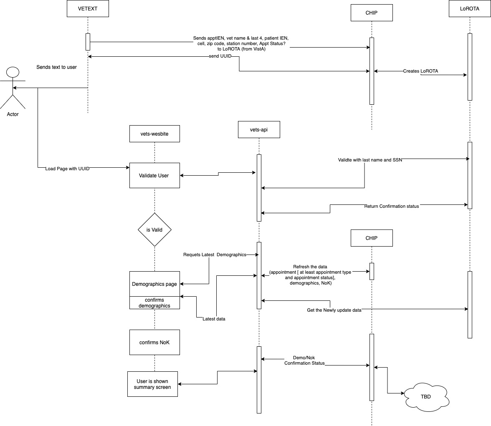

# Pre-check-in Notes

## Architecture

## Defined MVP

1. Confirmation/Invalidate of users Demographics and Next of Kin
2. Do not show the Demographics/NoK on the day of check in
3. Show the Staff that there is a update needed.
<!-- 
--------RANDOM NOTES BELOW THIS LINE--------

[]: # Language: markdown
[]: # Path: pre-check-in/README.md

## Big Questions and Hopefully answers

> Where is the data coming from and how does it interact with authentication?

We have settled doing a blended auth experience

A user starts off in LowAuth state, and if they need to edit their profile, then they log in through autheication s

Question:

- For the low auth flow, where are the demographics coming from ? Since its only low auth, the FE/BE doesn't have access to a user's demographics.
- When creating the shorterned url, CHIP should put in the demographics, from VA Profile to confirm in LoROTA. The FE/BE should be able to pull out the demographics from the LoROTA response.

-

So on this page <https://preview.uxpin.com/349cb3520e4ad95ebfb3e7b5dc0a40a2e582ac64#/pages/143334662/simulate/sitemap>, pre log, we are showing data from LoROTA, that was put in LoROTA by CHIP from Vets360/VA Profile.

Any changes that happen

The re-usable component from profile team pulls in the data from the signed in user which pulls it from _____ to populate and update their information

We are displaying demographics

## FE Notes

## BE Notes

- vet360 id === va profile Id
- MPI  to get the vets360 Id to get the ID
- Updating, we have to use to VA profile, can not write to Vista (not supposed to)
  - unless we are doing a full pre-registration flow, where we can write to Vista
- get data out of VistA, if not correct, then write to VA Profile
- Not read from VA Profile, make sure we are getting local data
- Do not want to auth to get the data
- only auth when they need to write
- data on the screen should show the Vista stuff
- side effect of srcubbing the data
- Unkwnen: when the does the va profile udpates
- if confrimed, we are not writing to VA profile, since we are not authed
- time stamp of when confirmed/updated is most valuable
- options to write
  - va profile
  - write to vista
  - save to CHIP
  - write a timestamp in a new field in vista, put that woudl be appoitnment not paitnet specific
  -
  -

  Find a VA Profile PoC to ask
  - How to use the API to update the demographics
    - phone
    - address
    - email
  - Can the reusuable component be used with data that is supplied from NOT VA Profile

  - No edit NoK

  MVP: no edit plo;

  MVP FE:

  - No Edit of anything
  - Posting confirm/not confirm to CHIP
  - not showing confirm page for day of

- Aoppointment cancelled -->
