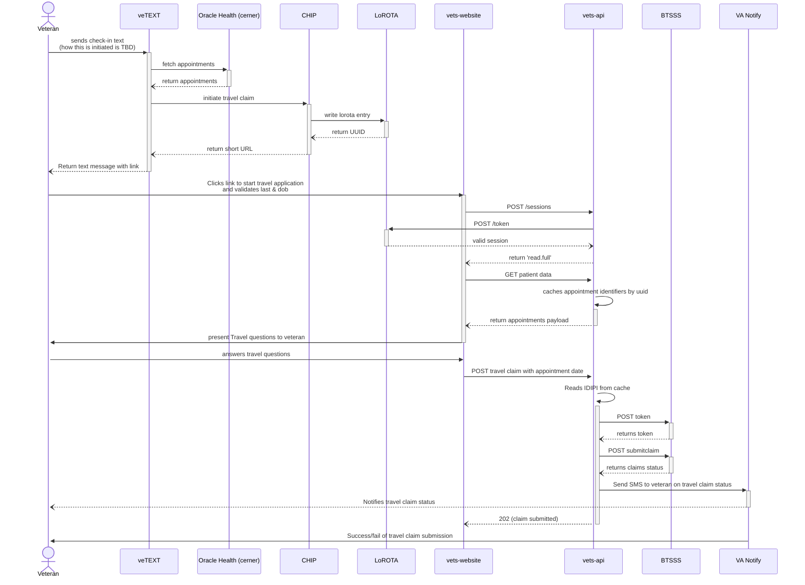

# Travel claim application for OH appointments
<aside>
🚧 WIP

</aside>

## Goal
Allow patients at Oracle Health facilities to file a mileage only travel claim with a personal device on the day of their appointment. This wouild be similar to what we offer Vista patients during day-of check-in. 
## Overview
To achieve this goal we will create a new application that just submits mileage only travel claims. 
## Scope
Initially this will only be for Oracle Health appointments, but this could get extended to cover Vista appointments and be used for things like post appointment messages in the future.
## Design
We are still working on how the initiation for this flow will happen. It could be a proactive text to the patient with a short link to the app, it could be patient initiated with a text. The diagram below shows a patient initiated flow. All of the parts will be in play from a technical point of view no matter which direction we go on initiation.

