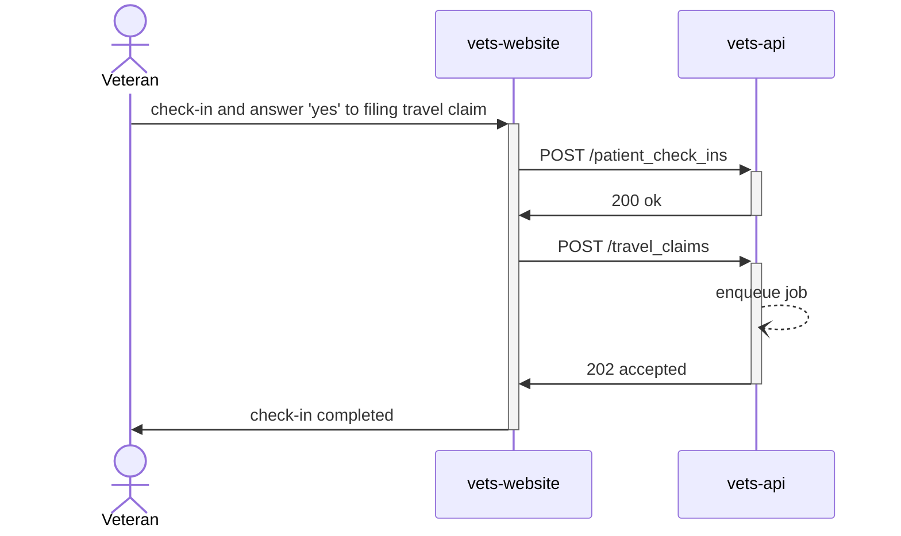

## Travel Claims Submission - Async


Here are the implementation details of Travel Claim submissions using background processing, rather than synchronous calls. This allows us to show the check-in status to the veterans as soon as check-in is completed (~2 seconds average response time), rather than waiting 15-40 seconds for the claim submission call. The travel claim will be submitted in the background, and Veterans will be notified of the status of filing via a text message.

The async implementation requires us to enqueue a job in [Sidekiq](https://sidekiq.org/) and respond to the website with a `HTTP 202 Accepted`. This indicates that we have enqueued the request, but no processing has been done.



Sidekiq is a popular job processing framework, and a Sidekiq worker will pick up the next queued request and process it asynchronously. This worker will call VEIS to get an auth token, call the BTSSS claim ingestion endpoint to submit the travel claim, and then send a text message to the veteran using VANotify. VANotify allows us to setup templates for the different text messages, and call the endpoint with ICN and other data values that are populated in the templates. It then looks up the Veteran's phone number and sends the text with the formatted message.
  
```mermaid
  sequenceDiagram
    participant vaw as vets-api-worker
    participant veis as VEIS
    participant bt as BTSSS
    participant van as va-notify
    actor vet as Veteran

    vaw->>+veis: POST /oauth2/token
    activate vaw
    veis->>-vaw: token
    alt successful claim submission
        vaw->>+bt: POST /submitclaim
        bt->>-vaw: success
        vaw->>+van: POST /notifications/sms
        van->>-vaw: 201 created
        van-)vet: sms "claim created"
    else duplicate claim
        vaw->>+bt: POST /submitclaim
        bt->>-vaw: error 'duplicate claim'
        vaw->>+van: POST /notifications/sms
        van->>-vaw: 201 created
        van-)vet: sms "duplicate claim"
    else unknown error
        vaw->>+bt: POST /submitclaim
        bt->>-vaw: unknown error
        vaw->>+van: POST /notifications/sms
        van->>-vaw: 201 created
        van-)vet: sms "unknown error"
    end
    deactivate vaw
  ```
