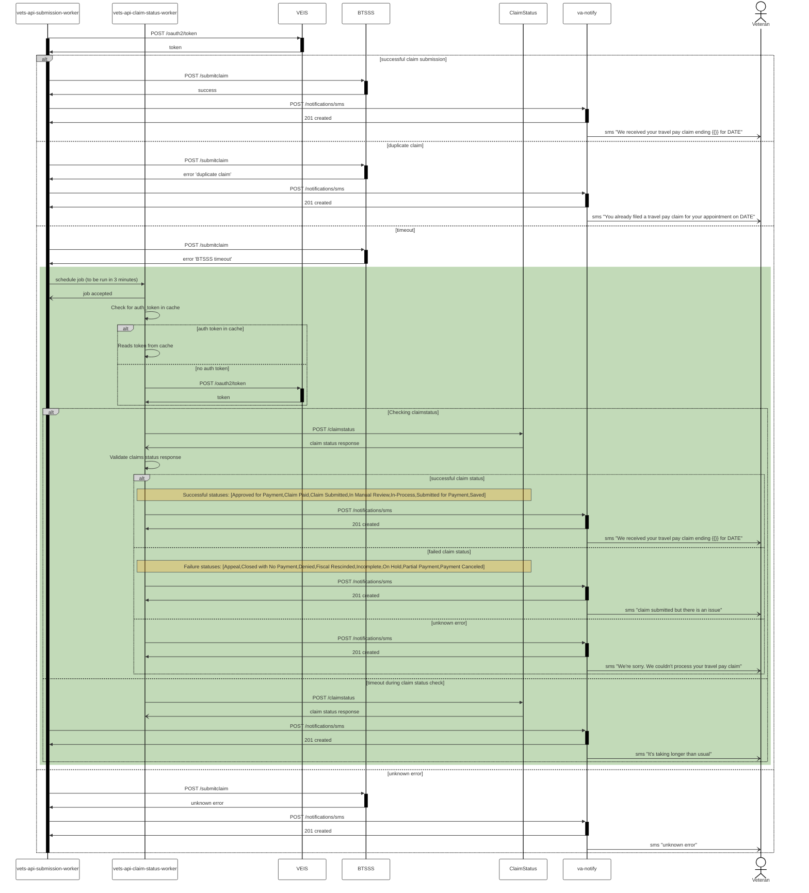

## Overview

To streamline the process for veterans and reduce wait times at the Travel Office, eCheck-in application was enhanced to support travel reimbursement claims submission during medical appointment check-in. vets-api back-end server was integrated with BTSSS `submitclaim` API for processing claims and notify veterans with success or failure messages based on the submission status.

Recently, with increased traffic, BTSSS `submitclaim` API exhibited high latency to process the claim & response time was taking more than 3 minutes. There is a possibility that the claim may be successfully submitted but response time could be prolonged. With the current implementation, veterans receive an error message saying `“We’re sorry.  We couldn’t process your travel pay claim.  File your claim online within 30 days”` irrespective of API failing to process the claim or taking longer to respond. 

To better facilitate timeout handling, BTSSS team provided claim_status API for eCheck-in application to verify the claim status before sending a text message to the veteran.

## Sequence Diagram



## GetClaimStatus API Request/Response

### Request Payload

```json
{
  "clientNumber": "string",
  "vetId": "string",
  "vetIdType": "string",
  "startRangeDate": "2024-05-30T18:44:22.732Z",
  "endRangeDate": "2024-05-30T18:44:22.732Z"
}
```

### Response Payload
```json
[
  {
    "aptDateTime": "2024-05-30T18:44:22.733Z",
    "aptId": "string",
    "aptSourceSystem": "string",
    "aptSourceSystemId": "string",
    "claimNum": "string",
    "claimStatus": "string",
    "claimLastModDateTime": "2024-05-30T18:44:22.733Z",
    "facilityStationNum": "string"
  }
]
```
### **Questions**

1. Calling `claim_status` endpoint with patient data that failed to `submit_claim` because of `Appointment found for the appointment date has associated claim at the same facility`, we are getting `Claim Submitted` successful response
    1. **Question:** What if `submit_claim` API takes a longer time to process the claim that has an appointment already having an associated claim in the same facility, and we get Claim Submitted status from `claim_status` API, there is a possibility we could send a wrong message to the veteran that `We received your travel pay claim ending with claim number` instead of “`you already filed a travel pay claim for your appointment on <date>`”. It could be a bad experience for the veteran thinking that both of the claims were processed for the appointments in the same facility.
2. `claim_status` API returns an empty response for `submit_claim` API error scenario like `failing to create mileage expense`, `Appointment not found`
    1. **Question:** Can we continue to send `We're sorry. We couldn't process your travel pay claim. File your claim online within 30 days?`
