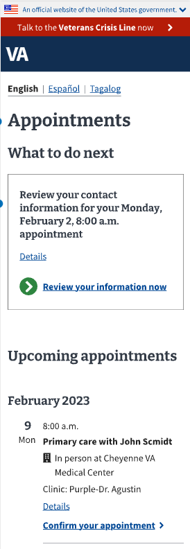
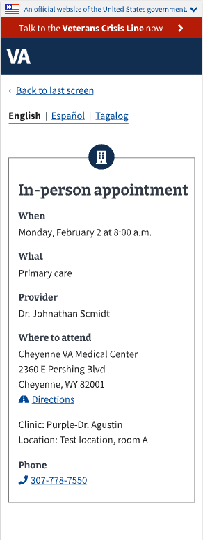
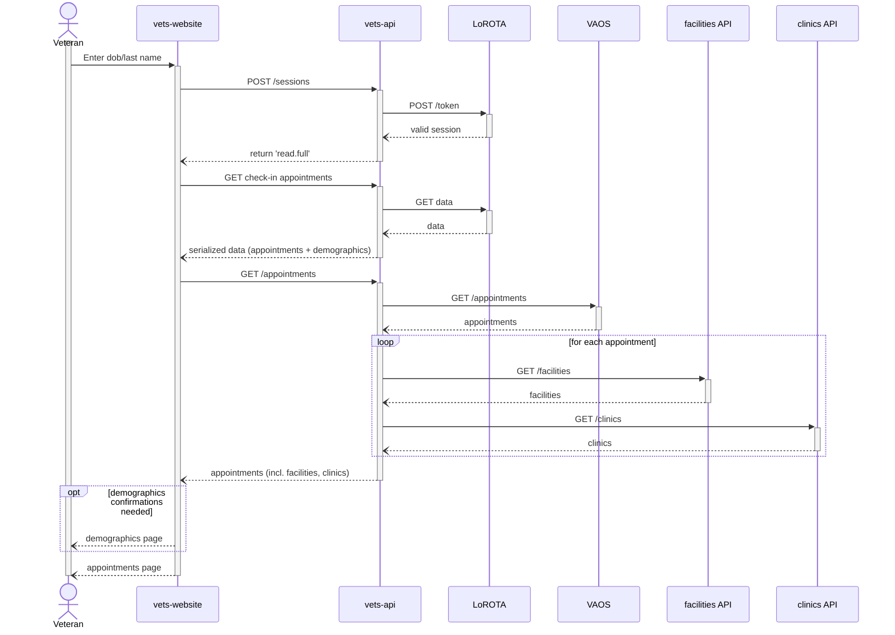

# Unified Check-in Upcoming Appointments - Technical Design

<aside>
🚧 WIP

</aside>

## Goals

This is a technical design document for implementing upcoming appointments in Patient Check-in project as a part of [Unified Check-in project](https://github.com/department-of-veterans-affairs/va.gov-team/blob/master/products/health-care/checkin/product/Initiatives/unified-check-in-experience.md). The goal of the project is to provide a unified view of check-in and pre check-in workflows to reduce confusion among veterans. As part of the [Priority 1 initiatives](https://github.com/department-of-veterans-affairs/va.gov-team/blob/master/products/health-care/checkin/product/Initiatives/unified-check-in-experience.md#priority-1-new-landing-page--accompanying-content-changes-in-progress), the upcoming appointments view displays the appointments that are scheduled for the veteran for future. This view is shown during both the check-in and pre check-in workflows.

## Ubiquitous Language

**Check-in** *The process for Veterans to “check in” for their appointment once they arrive at the facility that confirms to the staff that the patient has arrived and are ready to be seen by the provider.*

**Pre Check-in** *The process for Veterans to answer certain pre-visit questions, like confirming their contact information, emergency contact and Next of Kin information. This saves them time on the day of their appointment when checking in.*

**VAOS** *VA online scheduling service*

**MAP** *Mobile Application Platform*

**Clinic**

**Facility**

**Provider**

## Overview

The core functionality provided by this feature consists of showing upcoming appointments to the Veterans when they login to check-in or pre check-in for their appointments (as shown in the wireframes below). Please refer to Unified check-in and pre check-in [user flows](https://www.sketch.com/s/0e890de3-2530-4ee0-986e-cf0314334aec/p/0F9F62F0-68A0-4C8B-9105-A92D0A6448DB/canvas) and [wireframes](https://www.sketch.com/s/0e890de3-2530-4ee0-986e-cf0314334aec/p/868762F3-8E8F-4E23-B0DA-34C1783F0A03/canvas).

| Appointments List Page | Appointments Details Page |
| :---: | :---: |
|  | 

## Design

### Integration

### Container Diagram

### Sequence Diagram

### Resources

`GET /appointments` - returns a list of upcoming appointments for the patient

`GET /appointments/{appointment_id}` - returns the details of the specific appointment for the patient

## References

[1] [Unified Check-in Initiative Brief](https://github.com/department-of-veterans-affairs/va.gov-team/blob/master/products/health-care/checkin/product/Initiatives/unified-check-in-experience.md)
