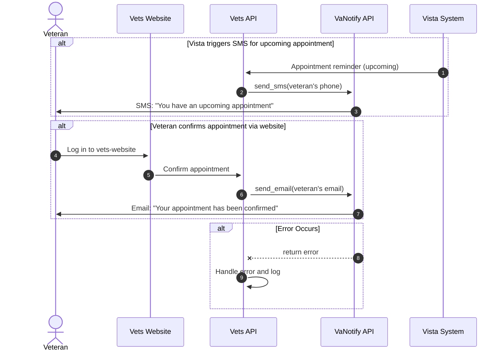

Check-in, travel, and pre-check-in connection to:

- vanotify
- vetext
- map

These services have or are verifying they respond properly, however we also checked on our end to see what happens when errors result from these services

### Checklist

#### Start

* [x] Do you know when your application shipped to production?
  * If not, use Github to determine, roughly, when your application shipped to users.
* [x] Did your application use the same APIs when it shipped as it does today?
  * If not, then you'll need to consider the path user data took through both the current architecture and the previous architecture. You will need to account for potential failures in all paths since your application shipped.

#### Monitoring

* [x] Do you monitor the API that you submit to via Datadog? 
  * If not, [set up monitoring in Datadog](#set-up-monitoring-in-datadog).
* [x] Does your Datadog monitoring use the appropriate tagging?
  * If not, [implement tagging standards](https://depo-platform-documentation.scrollhelp.site/developer-docs/monitor-tagging-standards). Adding the [dependency tag](https://depo-platform-documentation.scrollhelp.site/developer-docs/monitor-tagging-standards#MonitorTaggingStandards-Recommended:dependency) is highly recommended!
* [x] Do errors detected by Datadog go into a Slack notifications channel?
  * If not, start directing errors in Datadog to a dedicated Slack channel. See [#veteran-facing-forms-notifications](https://dsva.slack.com/archives/C063SM22J3H) for an example.
* [x] Does more than one person look at the Slack notifications channel containing errors on a daily basis? 
  * If not, then follow this [guide on managing errors](https://github.com/department-of-veterans-affairs/va.gov-team-sensitive/blob/master/platform/practices/zero-silent-failures/managing-errors.md)
* [x] Do the team members monitoring the Slack channel have a system for acknowledging and responding to the errors that appear there? 
  * If not, then follow this [guide on managing errors](https://github.com/department-of-veterans-affairs/va.gov-team-sensitive/blob/master/platform/practices/zero-silent-failures/managing-errors.md)

#### Reporting errors

* [x] Have you filed issues for errors that are appearing in Datadog / Slack?
  * If not, then start filing Github issues for new categories of errors following [this guidance](#file-silent-errors-issues-in-github)
* [x] Do all fatal errors thrown in your application end up visible to the end user either in the user interface or via email?
  * If not, then file Github issues to capture error categories following [this guidance](#file-silent-errors-issues-in-github)

#### Documentation

* [x] Do you have a diagram of the submission path that user data your application accepts takes to reach a system of record? 
  * If not, then [create a user data flow diagram](#how-to-create-a-user-data-flow-diagram) that captures this information. 
* [x] Do you understand how the error is handled when each system in the submission path fails, is down for maintenance, or is completely down?
  * If not, then create documentation that captures how errors in each system are handled. Detail which systems retry a submission and what happens when those retries exhaust. Show this in your diagram.
* [x] Has the owner of the system of record receiving the user's data indicated in writing that their system notifies or resolves 100% of fatal errors once in their custody? - YES, see sharepoint CIE
  * If not, work with OCTO to meet with the owner of the system and get their agreement in writing.
  * Please document the outcome of this conversation in your product's documentation in Github.

#### User experience

* [x] Do you capture all of the potential points of failure and make those errors known to the user via email notification and/or through the application on VA.gov or the mobile application?
  * If not, don't worry. Few teams are doing this and we'll be providing resources to help you do this in your application. Proceed to [create a user data flow diagram](#how-to-create-a-user-data-flow-diagram). That diagram will help us to help you and your team to create this user experience.

vanotify diagram

