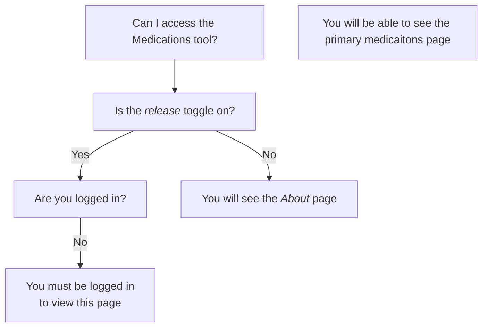
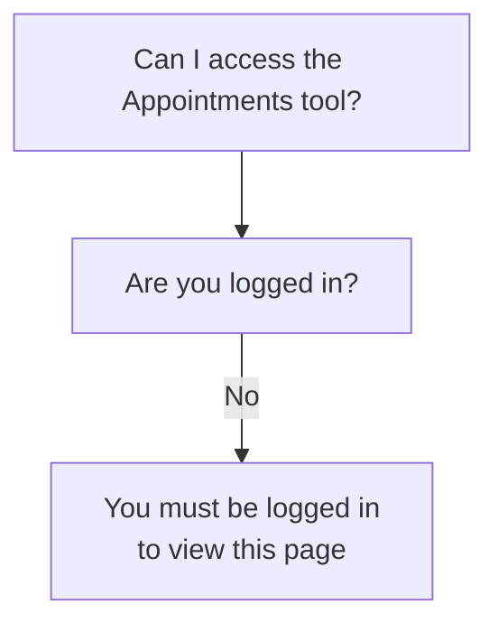

# How MHV on VA.gov manages access to and visibility of tools

This is an attempt to diagram whether various pages/tools/apps under `/my-health/` are viewable or not, or if some features/sections are viewable or now.

## Notes/Context

- "ID-verified" relates to the Level of Assurance (LOA) for that account. LOA3 indicates a user's account is verified/proved by identification
- The presence of one of more facilities in a person's account can indicate if that person has health benefits or has been seen at a VA facility
- In certain situations, non-veterans may be seen at VA health facilities, e.g. when that is the closest medical center in an emergency
- The MHV API currently requires an MHV account identifier to be able to look up a person's data in MHV systems. This identifier may exist regardlesss of how a person logs in.

## MHV Landing Page

Rules that can affect if a veteran can see all or some parts of the MHV-on-VA.gov landing page.

## Medications

WIP 

## Appointmen

WIP

