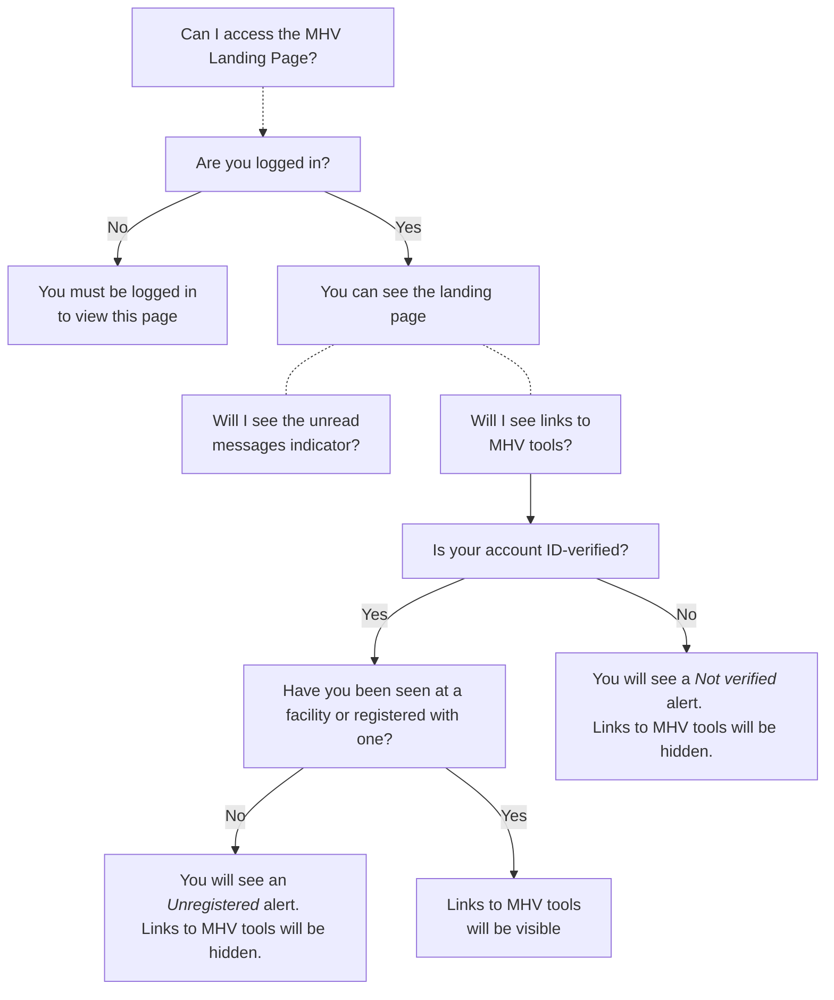
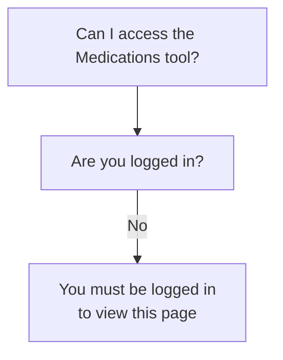
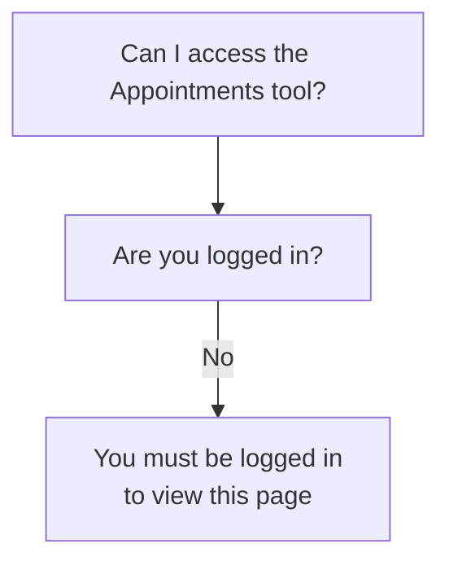

# How MHV on VA.gov manages access to and visibility of tools

This is an attempt to diagram whether various pages/tools/apps under `/my-health/` are viewable or not, or if some features/sections are viewable or now.

## MHV Landing Page

Rules that can affect if a veteran can see all or some parts of this tool.

## Medications

WIP 

## Appointmen

WIP

