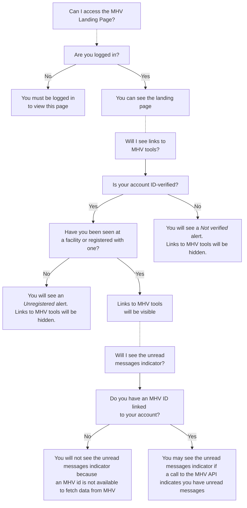
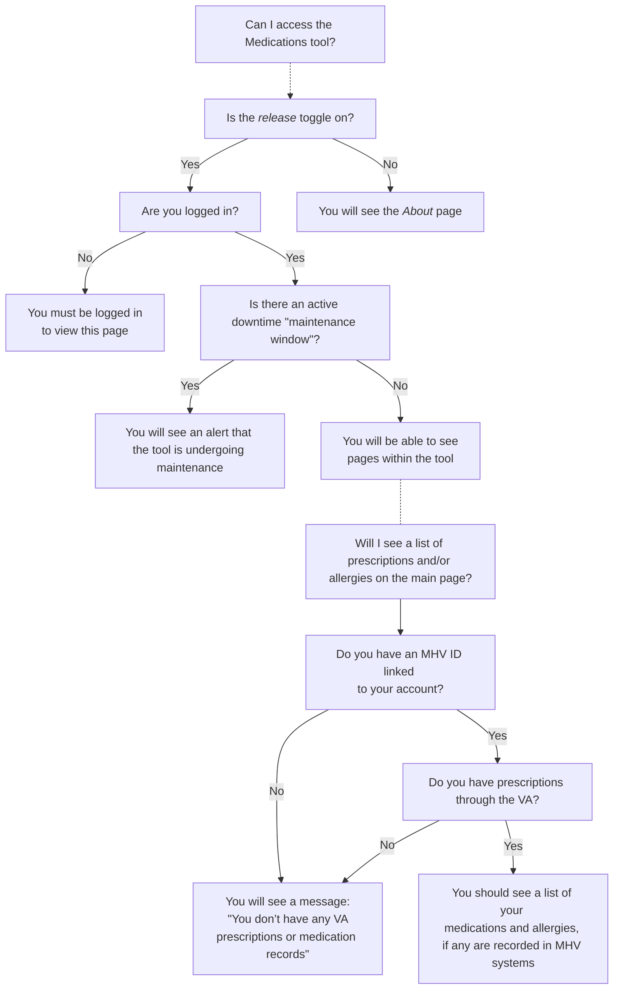
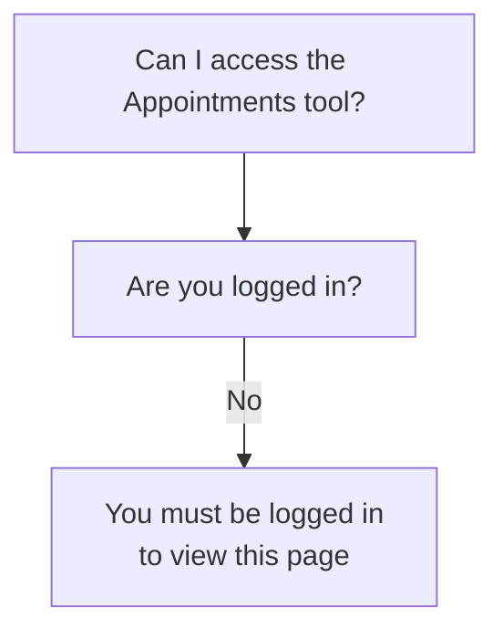

# How MHV on VA.gov manages access to and visibility of tools

This is an attempt to diagram whether various pages/tools/apps under `/my-health/` are viewable or not, or if some features/sections are viewable or now.

## General Notes/Context

- "ID-verified" relates to the Level of Assurance (LOA) for that account. LOA3 indicates a user's account is verified/proved by identification
- The presence of one of more facilities in a person's account can indicate if that person has health benefits or has been seen at a VA facility
- In certain situations, non-veterans may be seen at VA health facilities, e.g. when that is the closest medical center in an emergency
- The MHV API currently requires an MHV account identifier to be able to look up a person's data in MHV systems. This identifier may exist regardlesss of how a person logs in.

## MHV Landing Page

Rules that can affect if a veteran can see all or some parts of the MHV-on-VA.gov landing page.

### Notes

- The facilities check was the original test of whether someone may have used medical services through the VA.
- The unread messages indicator looks at `mhvAccountState`, an indicator of whether the user has an active MHV identfier linked to their login/profile
  - An MHV identifier used to be tied to an MHV login, but work has been undertaken to decouple the MHV id from and MHV login

## Medications

WIP: While mapping this out, I didn't find a check for an active MHV identifier

### Notes 

- Much of the access logic lives in `src/applications/mhv/medications/containers/App.jsx`
- `isAuthenticatedWithSSOe` is called in a few places. The app's `Alert` component accepts an `ssoe` prop, but doesn't use it currently
- Calls to MHV API appear to be made regardless of `mhvAccountState`
    
## Appointments

WIP

## Technical Details

- [Search for `mhvAccountState`](https://github.com/search?q=repo%3Adepartment-of-veterans-affairs%2Fvets-website%20mhvAccountState&type=code) in `vets-website` frontend
- [Definition of `mhv_account_state`](https://github.com/department-of-veterans-affairs/vets-api/blob/ccafd3850e16a303874b0159150622fdbd5cff18/app/models/user.rb#L245-L251) in `vets-api` backend. In short, does the user have one or more active mhv ids in the MPI profile?
