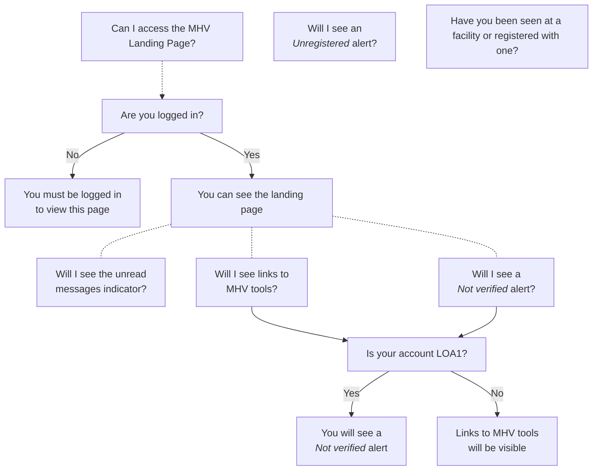
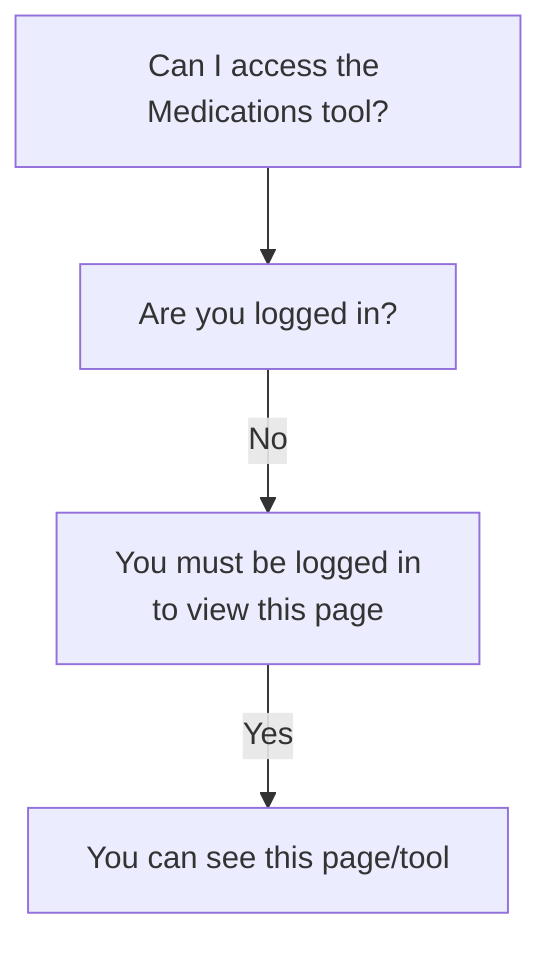
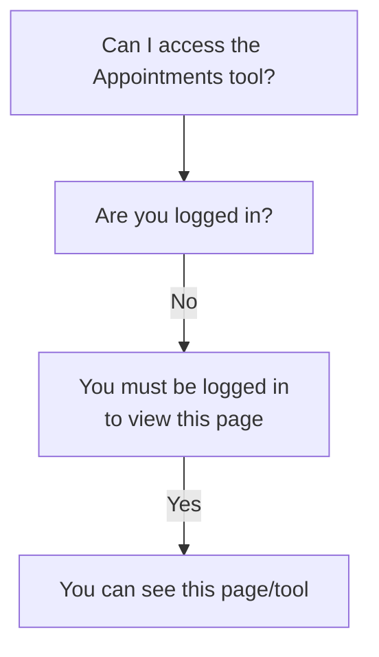

# How MHV on VA.gov manages access to and visibility of tools

```mermaid
graph TD

MHVLanding.AccessQ[Can I access the MHV Landing Page?]
MHVLanding.LoggedInQ[Are you logged in?]
MHVLanding.AuthReq[You must be logged in <br>to view this page]
MHVLanding.Viewable[You can see the landing page]
MHVLanding.MessagesDotQ[Will I see the unread <br>messages indicator?]
MHVLanding.ToolLinksQ[Will I see links to <br>MHV tools?]
MHVLanding.UnverifiedQ[Will I see a <br><i>Not verified</i> alert?]
MHVLanding.UnregisteredQ[Will I see an <br><i>Unregistered</i> alert?]
MHVLanding.FacilitiesQ[Have you been seen at a facility or registered with one?]
MHVLanding.LOA1Q[Is your account LOA1?]
MHVLanding.ShowUnverified[You will see a <br><i>Not verified</i> alert]
MHVLanding.ToolLinksVisible[Links to MHV tools <br>will be visible]

MHVLanding.AccessQ -.-> MHVLanding.LoggedInQ
MHVLanding.LoggedInQ -->|No| MHVLanding.AuthReq
MHVLanding.LoggedInQ -->|Yes| MHVLanding.Viewable
MHVLanding.Viewable -.- MHVLanding.MessagesDotQ
MHVLanding.Viewable -.- MHVLanding.UnverifiedQ
MHVLanding.Viewable -.- MHVLanding.ToolLinksQ
MHVLanding.ToolLinksQ --> MHVLanding.LOA1Q
MHVLanding.UnverifiedQ --> MHVLanding.LOA1Q
MHVLanding.LOA1Q -->|Yes| MHVLanding.ShowUnverified
MHVLanding.LOA1Q -->|No| MHVLanding.ToolLinksVisible
```

```mermaid
graph TD

Meds.Access[Can I access the Medications tool?]
Meds.LoggedIn[Are you logged in?]
Meds.AuthReq[You must be logged in <br>to view this page]
Meds.Viewable[You can see this page/tool]

Meds.Access --> Meds.LoggedIn
Meds.LoggedIn -->|No| Meds.AuthReq
Meds.AuthReq -->|Yes| Meds.Viewable
```

```mermaid
graph TD

Appts.Access[Can I access the Appointments tool?]
Appts.LoggedIn[Are you logged in?]
Appts.AuthReq[You must be logged in <br>to view this page]
Appts.Viewable[You can see this page/tool]

Appts.Access --> Appts.LoggedIn
Appts.LoggedIn -->|No| Appts.AuthReq
Appts.AuthReq -->|Yes| Appts.Viewable
```
