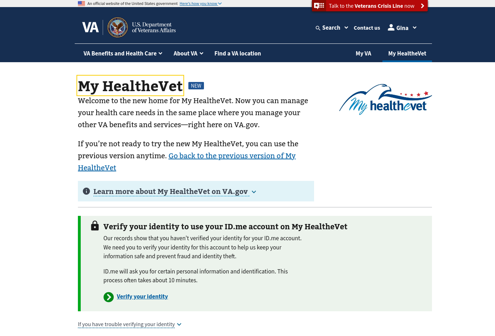

# MHV-on-VA.gov -- Authorization -- user access rules

As each of the VA.gov Health Tools were developed by independent teams, the authorization rules for each have been implemented in a slightly different way. This technical document was created in order to understand the current authorization rules each Health Tool uses to gate access into its pages and API data.


## Table of Contents

* [VA.gov Health Tools links](#vagov-health-tools-links)
* [What are the current authorization rules for VA.gov Health Tool applications?](#what-are-the-current-authorization-rules-for-vagov-health-tool-applications)
  - [MHV Landing Page](#mhv-landing-page)
  - [Appointments](#appointments)
  - [Messages](#messages)
  - [Medications](#medications)
  - [Medical Records](#medical-records)
  - [Medical Supplies](#medical-supplies)
  - [Other Health Tools](#other-health-tools)
* [Questions and Redux Selector Answers](#questions-and-redux-selector-answers)
  - [Is signed in? Is identity-verified?](#is-signed-in-is-identity-verified)
  - [Is registered at a VHA treatment facility?](#is-registered-at-a-vha-treatment-facility)
  - [Is registered at a facility?](#is-registered-at-a-facility)
  - [Is healthcare enrolled? Has preferred facility?](#is-healthcare-enrolled-has-preferred-facility)
* [Route Guard](#route-guard)
* [Identity-proofing, Identity-verification](#identity-proofing-identity-verification)
* [Recommendations](#recommendations)
* [References](#references)


## VA.gov Health Tools links

The MHV Landing Page will be the entry point into VA.gov Health Tools. Hostnames are omitted from VA.gov Health Tool links so that they will resolve to the operating environment (e.g. - `staging.va.gov`).

Links are defined, here: `vets-website/src/applications/mhv-landing-page/constants.js`

<details>
<summary>MHV Landing Page URLs</summary>

- Appointments
  - href: `/my-health/appointments/schedule/type-of-care`
  - href: `/my-health/appointments/`
- Messages
  - href: `/my-health/secure-messages/inbox/`
- Medications
  - href: `/my-health/medications/refill`
  - href: `/my-heatlh/medications`
- Medical Records
  - href: `/my-health/medical-records/download-all`
  - href: `/my-health/medical-records/labs-and-tests`
- Payments - link to external system
- Medical supplies (ROES/DLC)
  - href: `/health-care/order-hearing-aid-batteries-and-accessories`
  - href: `/health-care/order-cpap-supplies/`
  - href: `/health-care/order-prosthetic-socks/`
- After-visit summary (AVS)
  - href: `/my-health/medical-records/summaries-and-notes/visit-summary`
- 10-10EZR (VES)
  - href: `/my-health/update-benefits-information-form-10-10ezr`

</details>


## What are the current authorization rules for VA.gov Health Tool applications?

### MHV Landing Page

<details>
<summary>App details</summary>

href: `/my-health`

front-end app: `vets-website/src/applications/mhv-landing-page`

manifest:

```json
{
  "appName": "My HealtheVet on VA.gov",
  "entryName": "mhv-landing-page",
  "rootUrl": "/my-health"
}
```

mocks: `yarn mock-api --responses src/applications/mhv-landing-page/mocks/api/index.js`

</details>

The `<RequiredLoginView />` component (within `containers/App.jsx`) handles unauthenticated users. If the user is authenticated, the `<LandingPage />` component is rendered.

If the authenticated user is not identity-verified, the platform-provided `<IdentityNotVerified />` component is displayed.



If the authenticated user is not a registered VA Patient (e.g. - the user has no associated treatment facilities), the `<UnregisteredAlert />` component is displayed.


If the user is identity-verified and registered, the Landing Page is displayed.


### Appointments

<details>
<summary>App details</summary>

href: `/my-health/appointments`

front-end app: `vets-website/src/applications/vaos`

manifest:

```json
{
  "appName": "VA Online Scheduling",
  "entryName": "vaos",
  "rootUrl": "/my-health/appointments"
}
```

mocks: `yarn mock-api --responses src/applications/vaos/services/mocks/index.js`
</details>

Routes within this app are handled by an `<EnrolledRoute />` component.

- If the user has authenticated with an identity-verified account, and is registered at one or more patient facilities, then the passed-in `<RouteComponent />` is displayed (i.e. - the Appointments app is rendered.)

- If the authenticated, identity-verified user is not registered at a patient facility, the `<NoRegistrationMessage />` is displayed.

<details>
<summary>Code</summary>

```jsx
// src/applications/vaos/components/EnrolledRoute.jsx
export default function EnrolledRoute({ component: RouteComponent, ...rest }) {
  const user = useSelector(selectUser);
  const sites = useSelector(selectPatientFacilities);
  const hasRegisteredSystems = sites?.length > 0;
  useDatadogRum();
  return (
    <RequiredLoginView
      serviceRequired={[
        backendServices.USER_PROFILE,
        backendServices.FACILITIES,
      ]}
      user={user}
      verify={!environment.isLocalhost()}  // state.user.profile.verified
    >
      <Route {...rest}>
        {!hasRegisteredSystems && <NoRegistrationMessage />}
        {hasRegisteredSystems && <RouteComponent />}
      </Route>
    </RequiredLoginView>
  );
}
```

```jsx
// src/applications/vaos/components/NoRegistrationMessage.jsx
export default function NoRegistrationMessage() {
  return (
    <FullWidthLayout>
      <InfoAlert
        status="error"
        headline="We’re sorry. We can’t find any VA medical facility registrations for you"
      >
        <p>
          To schedule an appointment online or to request Community Care
          assistance, you need to be:
        </p>
        <ol>
          <li>
            Enrolled in VA health care, <strong>and</strong>
          </li>
          <li>
            Registered with at least 1 VA medical center that accepts VA online
            scheduling
          </li>
        </ol>
        <p>
          To register with a facility, or if you think this message is an error,
          contact{' '}
          <a href="/find-locations">your local VA health care facility’s</a>{' '}
          registration office.
        </p>
      </InfoAlert>
    </FullWidthLayout>
  );
}
```

</details>


### Messages

<details>
<summary>App details</summary>

href: `/my-health/secure-messages/inbox/`

front-end app: `vets-website/src/applications/mhv-secure-messaging`

manifest:

```json
{
  "appName": "MHV Secure Messaging",
  "entryName": "mhv-secure-messaging",
  "rootUrl": "/my-health/secure-messages"
}
```

mocks: `yarn mock-api --responses src/applications/mhv-secure-messaging/api/mocks/index.js`

</details>

The `<App />` component is where conditional rendering based on user authorization occurs in this application.

The `<RequiredLoginView />` component handles unauthenticated users.

If the `vets-api` backend authorizes the use of the messaging service to this authenticated user, the secure messaging tool is displayed.

If the authenticated user is not authorized by the `vets-api` backend, the browser window is redirected to the [`/health-care/secure-messaging`](https://www.va.gov/health-care/secure-messaging) static page.

<details>
<summary>Code</summary>

```jsx
// src/applications/mhv-secure-messaging/containers/App.jsx
const App = () => {
  const dispatch = useDispatch();
  const user = useSelector(selectUser);
  const userServices = user.profile.services;

   return (
    <RequiredLoginView
      user={user}
      serviceRequired={[backendServices.MESSAGING]}
    >
      {user.login.currentlyLoggedIn &&
      !userServices.includes(backendServices.MESSAGING) ? (
        window.location.replace('/health-care/secure-messaging')
      ) : (
        <>
          <MhvSecondaryNav />
          <div className="vads-l-grid-container">
            <SmBreadcrumbs />
            <div
              className="secure-messaging-container vads-u-display--flex vads-u-flex-direction--column medium-screen:vads-u-flex-direction--row"
            >
              <Navigation />
              <ScrollToTop />
              <Switch>
                <AuthorizedRoutes />
              </Switch>
            </div>
          </div>
        </>
      )}
    </RequiredLoginView>
  );
};
```

</details>

The `/v0/user` path, served by `vets-api`, provides identity-verified account status, and user's authorization status for the messaging service.

<details>
<summary>Code</summary>

`src/applications/mhv-secure-messaging/tests/e2e/fixtures/userResponse/user.json`

```json
{
  "data": {
    "id": "",
    "type": "users_scaffolds",
    "attributes": {
      "services": [
        "facilities",
        "form-save-in-progress",
        "form-prefill",
        "mhv-accounts",
        "form526",
        "user-profile",
        "identity-proofed",
        "messaging",
        "vet360",
        "evss_common_client",
        "user-profile",
        "vet360"
      ],
      "account": {
        "accountUuid": "c049d895-ecdf-40a4-ac0f-7947a06ea0c2"
      },
```

</details>

The `MHVMessagingPolicy` in `vets-api` allows access to the messaging service if the `SM::Client` can create a session by providing the current user's `mhv_correlation_id`.

<details>
<summary>Code</summary>

```rb
# vets-api/app/policies/mhv_messaging_policy.rb
MHVMessagingPolicy = Struct.new(:user, :mhv_messaging) do
  def access?
    return false unless user.mhv_correlation_id

    client = SM::Client.new(session: { user_id: user.mhv_correlation_id })
    validate_client(client)
  end

  private

  def validate_client(client)
    if client.session.expired?
      client.authenticate
      !client.session.expired?
    else
      true
    end
  rescue
    false
  end
end
```

</details>


### Medications

#### href: `/my-health/medications/refill`

<details>
<summary>App details</summary>

front-end app: `vets-website/src/applications/mhv-medications`

manifest:

```json
{
  "appName": "MHV Medications",
  "entryName": "medications",
  "rootUrl": "/my-health/medications",
}
```

mocks: `yarn mock-api --responses src/applications/mhv-medications/mocks/api/index.js`

feature toggle: `FEATURE_FLAG_NAMES.mhvMedicationsDisplayRefillContent`

</details>

The `<RefillPrescriptions />` component dispatches `getRefillablePrescriptionsList()` and `getAllergiesList()` actions.

If there is an error retrieving data from the backend, the `<ApiErrorNotification />` and `<CernerFacilityAlert />` components are displayed.

<details>
<summary>Code</summary>

```jsx
// src/applications/mhv-medications/components/shared/ApiErrorNotification.jsx
const ApiErrorNotification = ({ errorType, content, children }) => {
  return (
    <va-alert status="error" setFocus aria-live="polite" role="alert" uswds>
      <h2
        className="vads-u-margin--0 vads-u-font-size--h3"
        data-testid="no-medications-list"
      >
        {`We can’t ${errorType} your ${content} right now`}
      </h2>
      <p>We’re sorry. There’s a problem with our system. Check back later.</p>
      {!children ? (
        <>
          <p>
            <strong>If you need to request a refill now,</strong> call your VA
            pharmacy. You can find the pharmacy phone number on your
            prescription label or on your VA health facility’s webpage.
          </p>
          <a href="/find-locations/?page=1&facilityType=health">
            Find your VA health facility
          </a>
        </>
      ) : (
        children
      )}
    </va-alert>
  );
};
```

</details>


The `MHVPrescriptionsPolicy` is that user has Premium or Advanced MHV account and `user.va_patient?`


#### href: `/my-heatlh/medications`

`<Prescriptions />` dispatches `getPrescriptionsPaginatedSortedList()`.

If there was an error when retrieving data from vets-api, the `<ApiErrorNotification />` component is displayed.


If the user has associated Cerner facilities, the `<CernerFacilityAlert />` is displayed.

The `MHVPrescriptionsPolicy` is that user has Premium or Advanced MHV account and `user.va_patient?`


### Medical Records

<details>
<summary>App details</summary>

front-end app: `vets-website/src/applications/mhv-medical-records`

manifest:

```json
{
  "appName": "MHV Medical Records",
  "entryName": "medical-records",
  "rootUrl": "/my-health/medical-records"
}
```

</details>

The `/my-health/medical-records/download-all` path renders the `<DownloadRecordsPage />` component. The user is redirected to the [`/health-care/get-medical-records/`](https://www.va.gov/health-care/get-medical-records) static page if the feature is disabled.

The `<DownloadRecordsPage />` component checks if objects under `state.mr` are defined, and if not, the `getBlueButtonReportData()` action is dispatched. If medical records state is set, then pdf and txt representations of the user's BlueButton report are generated and served. If any alerting conditions are added to `state.mr.alerts`, they are sorted chronologically, and displayed.

The `MHVMedicalRecordsPolicy` for `/v1/medical_records/` api paths requires that a user have a Premium MHV account type, and that `user.va_patient?` is true.

The `MedicalRecords::Client` needs the user's `mhv_correlation_id` and `icn` to retrieve data from the system of record.

The `PHRMgr::Client` needs the user's `icn` to retrieve data from the system of record.

---

The `/my-health/medical-records/labs-and-tests` path is handled the `<FeatureFlagRoute />` component, which renders `<LabsAndTests />` when enabled, and renders `null` when disabled.

<details>
<summary>Code</summary>

```jsx
// src/applications/mhv-medical-records/routes.jsx
<FeatureFlagRoute
  exact
  path="/labs-and-tests"
  key="LabsAndTests"
  featureFlag={FEATURE_FLAG_NAMES.mhvMedicalRecordsDisplayLabsAndTests}
>
  <LabsAndTests />
</FeatureFlagRoute>
```

```jsx
const FeatureFlagRoute = ({ featureFlag, children, ...rest }) => {
  const displayRoute = useSelector(state => state.featureToggles[featureFlag]);
  return displayRoute ? (
    <Route {...rest}>
      <App>{children}</App>
    </Route>
  ) : null;
};
```

</details>


The same vets-api policy as above is used for gating access to Labs and Tests data.


### Medical Supplies

The MHV Landing Page, instead of linking directly into this application, links to static pages for this tool.

<details>
<summary>App details</summary>

href: `/health-care/order-hearing-aid-or-CPAP-supplies-form`

front-end app: `src/applications/health-care-supply-reordering`

manifest:

```json
{
  "appName": "Order hearing aid or CPAP supplies",
  "entryName": "health-care-supply-reordering",
  "rootUrl": "/health-care/order-hearing-aid-or-CPAP-supplies-form",
}
```

mocks: `yarn mock-api --responses src/applications/health-care-supply-reordering/mocks/index.js`

</details>

---

[Slack discussion](https://dsva.slack.com/archives/C0581MN69TJ/p1717512744362889)

If the user is not a registered patient, the following message is displayed:

```jsx
// vets-website/src/applications/health-care-supply-reordering/components/ErrorMessage.jsx
case 'MDOT_INVALID':
  content = (
    <va-alert status="warning">
      <h3 slot="headline">We can’t find your records in our system</h3>
      <div className="vads-u-display--flex vads-u-flex-direction--column">
        <span>
          You can’t order {supplyDescription} at this time because we can’t
          find your records in our system or we’re missing some information
          needed for you to order.
        </span>

        <span className="vads-u-margin-top--1">
          If you think this is incorrect, call your health care provider to
          update your record.{' '}
          <a
            href="https://www.va.gov/find-locations/"
            target="_blank"
            rel="noopener noreferrer"
          >
            Find contact information for your local medical center.
          </a>
        </span>
      </div>
    </va-alert>
  );
```

vets-api calls MDOT backend service with `user.icn` in headers. ICN is only available for identity-verified user accounts, which implies the user must have LOA3 status. [[slack](https://dsva.slack.com/archives/C0581MN69TJ/p1717524675919419?thread_ts=1717512744.362889&cid=C0581MN69TJ)]


### Other Health Tools

- Payments - links to external system
- After-visit summary (AVS): `<Avs />` calls `getAvs()`, `AvsController` verifies user has a valid user session, calls backend service with Station # and Appointment IEN
- 10-10EZR (VES): `<App />` and `<IntroductionPage />` check if the user is signed in and account is LOA3, dispatches `fetchEnrollmentStatus()`. `<SaveInProgressInfo />` checks if user has a valid enrollment status (enrolled/pending), has a preferred facility.


## Questions and Redux Selector Answers

state | selector | question
--- | --- | ---
`state.user.login.currentlyLoggedIn` | `isLoggedIn` | Is signed in?
`state.user.profile.loa.current` | `isLOA3` | Is the account identity-verified?
`state.user.profile.vaPatient` | `isVAPatient` | Is registered at a VHA treatment facility?
`state.user.profile.facilities` | `!!selectPatientFacilities(state)?.length` | Is registered at a facility?
`state.hcaEnrollmentStatus.enrollmentStatus` | `isEnrolledInESR` | Is healthcare enrolled?
`state.hcaEnrollmentStatus.preferredFacility` | `!!selectEnrollmentStatus(state)?.preferredFacility` | Has preferred facility?
`state.user.profile.mhvAccountState` | `hasMHVAccount` | Has MHV account?


### Is signed in? Is identity-verified?

The `isLoggedIn` and `isLOA3` selectors answer these questions. Utilize `<RequiredLoginView verify />` when a page requires a signed-in, identity-verified account.


### Is registered at a VHA treatment facility?

The the value returned by the [`isVAPatient` selector][1] is determined by the [`User#va_patient?` method][2], which looks at the user's associated facilities and returns true if any are "MHV" facilities (defined by [id ranges within `vets-api/config/settings.yml`][3]).

`isVAPatient` will return `true` if the current user is registered at a Vista or Cerner EHR facility.

[1]: https://github.com/department-of-veterans-affairs/vets-website/blob/0879d6d/src/platform/user/selectors.js#L7:L7
[2]: https://github.com/department-of-veterans-affairs/vets-api/blob/57a499e/app/models/user.rb#L320-L333
[3]: https://github.com/department-of-veterans-affairs/vets-api/blob/55224a7/config/settings.yml#L524-L527


### Is registered at a facility?

Another way to get the same result as the `isVAPatient` selector is to check the length of associated patient facilities: `!!selectPatientFacilities(state)?.length`.


### Is healthcare enrolled? Has preferred facility?

The Enrollment System (ES/ESR/VES) is where 10-10EZ(R) form submission data is stored. Health care enrollment status and the user's preferred facility are stored in this system of record.

Note: You will need to dispatch the [`getEnrollmentStatus` action][4] in order to select this data from state.

[4]: https://github.com/department-of-veterans-affairs/vets-website/blob/c18bc26/src/platform/user/profile/actions/hca.js#L144:L144


## Route Guard

The purpose of the route guard work was to ensure users have a base-level of authorization (account is identity-verified, user is a registered patient) in order to view health tools. This effort turned into checking MHV account state for tools that required this access.


## Identity-proofing, Identity-verification

[Discussion on identity-proofing an account](https://dsva.slack.com/archives/C0581MN69TJ/p1717427161772569?thread_ts=1717185477.450519&cid=C0581MN69TJ)

[vets-api specs for `IAMUserIdentity` model](https://github.com/department-of-veterans-affairs/vets-api/blob/447afa2/spec/models/iam_user_identity_spec.rb)


## Recommendations

- Add tests for the current route guard implementation.

- Wrap pages/routes that require an authenticated user with `<RequiredLoginView>{content}</RequiredLoginView>`

- Wrap pages/routes that require an authenticated and identity-verified user account with `<RequiredLoginView verify={true}>{content}</RequiredLoginView>`.

- Build upon the `<RequiredLoginView />` component, adding a check for associated facilities, requiring that the user be a registered patient in order to view that page/route.

- Render a 404 page when the feature toggle for that page/route is disabled.


## References

Diagram generated from MHV Backend logic diagram working session (2024JUN03)

[MHV access (Mural)](https://app.mural.co/t/departmentofveteransaffairs9999/m/departmentofveteransaffairs9999/1717177396025/367057c4a9219404c3b7080e71210082b3c65771?sender=u601ab5a1b6d5aef0118b7694)
