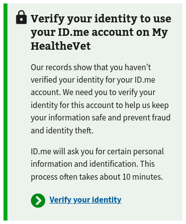
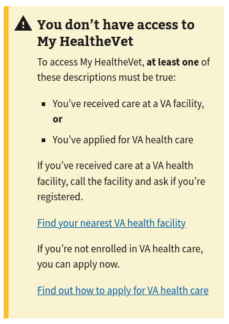
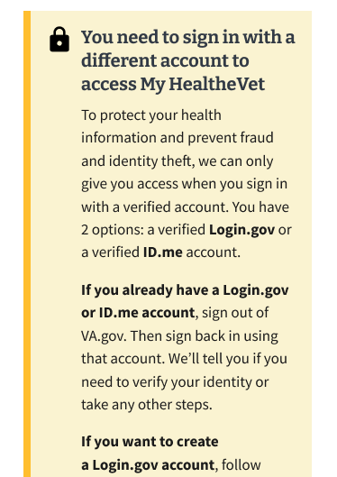
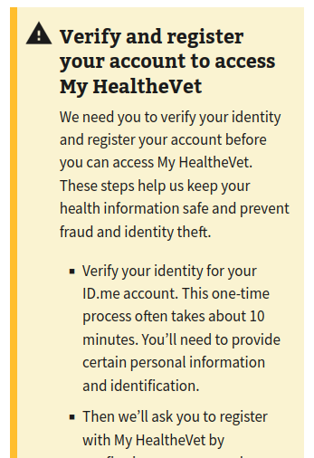

# MHV Home -- Alerts

## Current and Proposed Alerts

Implemented | Conditions | View
--- | --- | ---
✅ | Not identity-verified (< LOA3) | 
✅ | No VA patient facility registration | 
❌ | MHV basic credentials < LOA3 | 
❌ | ID.me/Login.gov credentials < LOA3 | 

Since the two proposed alerts cover the "not identity-verified" case, do we still need this alert?


## Authentication Providers

- ID.me
- Login.gov
- My HealtheVet National Portal
- DS Logon

Can a DS Logon account not be identity-verified/< LOA3?


## Suggested Alert flow

Rendering multiple alerts will confuse users. Suggestion: Create an
`AlertContainer` that renders the most relevant alert applicable to the user
session.

A user must present identity-verified credentials (LOA3/IAL2) in order to access
health data (PHI) and personal information (PII). Check these conditions first
in the `if..else` chain.

```
if MHV basic creds and LOA < 3 then
  render "Sign in with a different account" (`MhvRegistrationAlert`) alert

else if ID.me/Login.gov creds and LOA < 3 then
  render "Verify and register" (`VerifyAndRegisterAlert`) alert

else if LOA < 3 then
  render "Verify your identity" (`IdentityNotVerified`) alert

else if no facilities/not a VA patient then
  render "You don't have access" (`UnregisteredAlert`) alert

else if no MHV account
  render "Register your account w/ MHV" (`MhvRegistrationAlert`) alert

else
  no alert
  render LandingPage content
```

We have collected a decent number of conditions that could generate an alert.
We could benefit from some organization, here. Suggestion: Rename components
that wrap `<va-alert />` with the prefix `Alert` (e.g. - `AlertNoMhvAccount`).