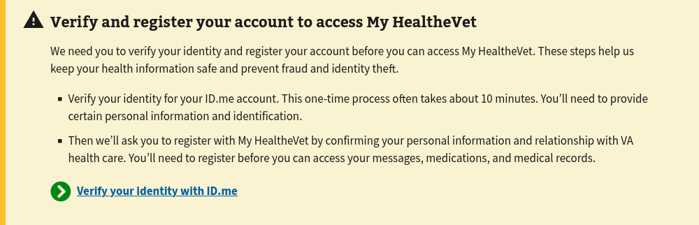
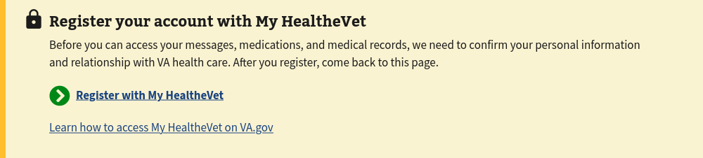
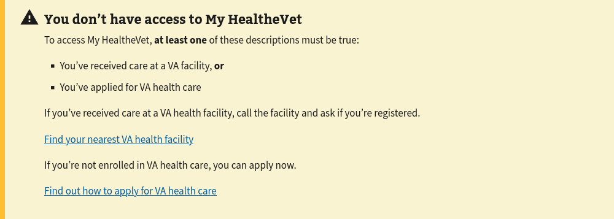
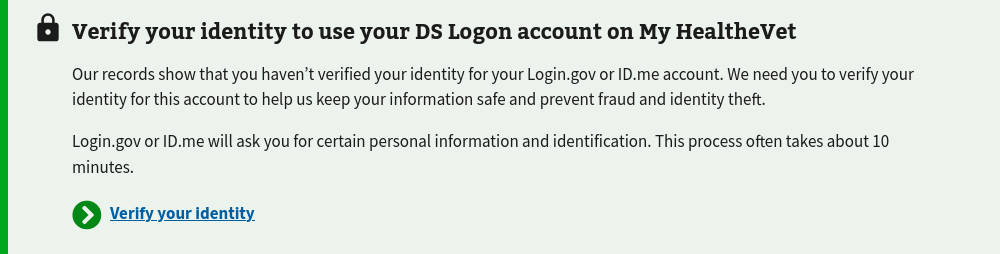

# MHV Home -- Alerts

## Current Alerts

Implemented | Conditions | View
--- | --- | ---
✅ | MHV basic credentials (LOA1) | 
✅ | ID.me/Login.gov credentials < LOA3 | 
✅ | No associated MHV account | 
✅ | No VA patient facility registration | 
❌ | Identity not verified | 


## Authentication Providers/Credential Service Providers (CSPs)

- ID.me
- Login.gov
- My HealtheVet National Portal API
- DS Logon


## Alert flow

We have collected a decent number of conditions that could generate an alert.
Rendering multiple alerts _will_ confuse users.

Below is pseudocode describing how we render the single most relevant
alert to the user.

```
if MHV basic creds and not identity-verified then
  render "Sign in with a different account"

else if ID.me/Login.gov creds and not identity-verified then
  render "Verify and register"

else if no facilities/not a VA patient then
  render "You don't have access"

else if no associated MHV account
  render "Register your account w/ MHV"

else
  no alert
```

A user must present identity-verified credentials (LOA3/IAL2) in order to access
health data (PHI) and personal information (PII). Check these conditions first
in the `if..else` chain.


## Code organization

- Components that wrap `<va-alert />` are named with the prefix `Alert` (e.g. - `AlertNoMhvAccount`).

- An `Alert` renders the most relevant alert, according to the provided pseudocode logic above.
