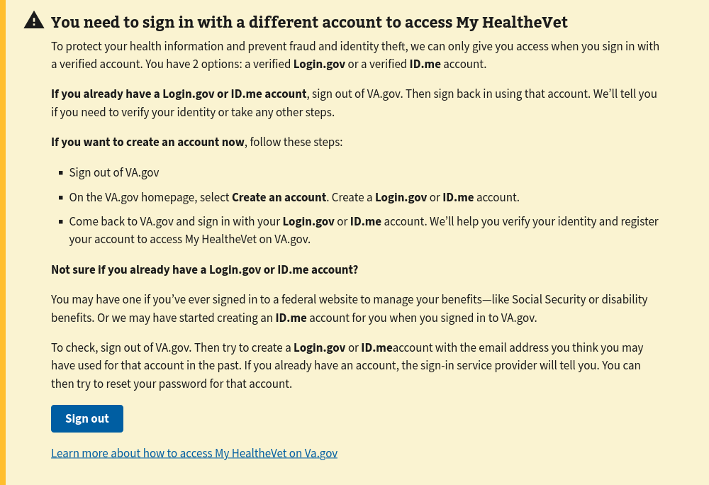
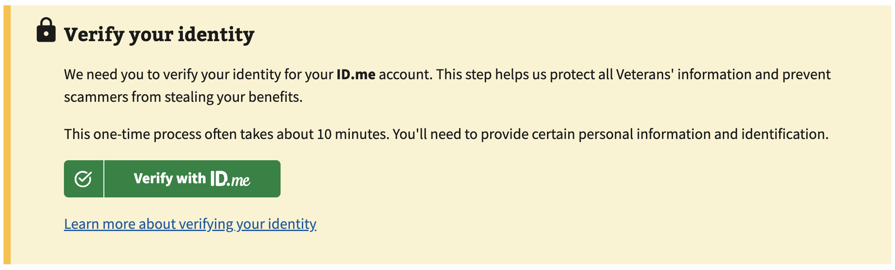
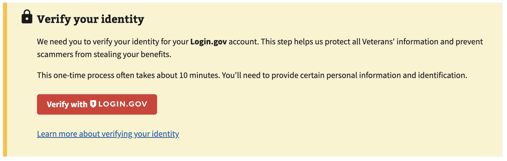
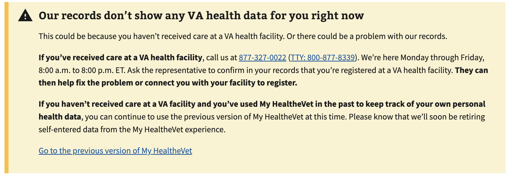
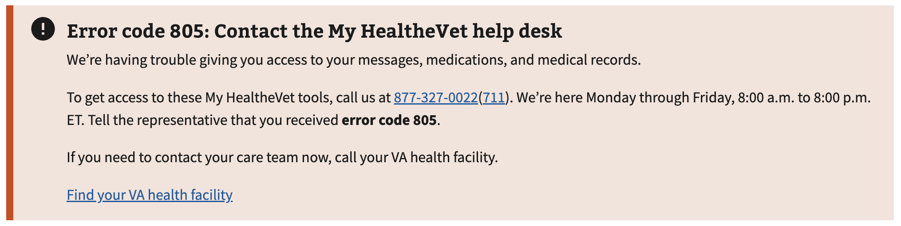
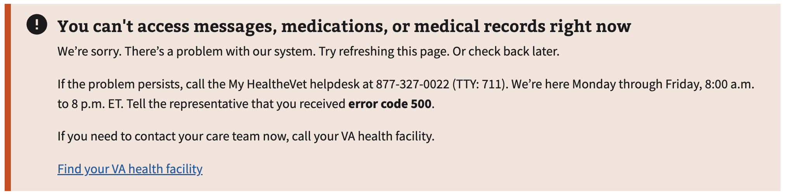
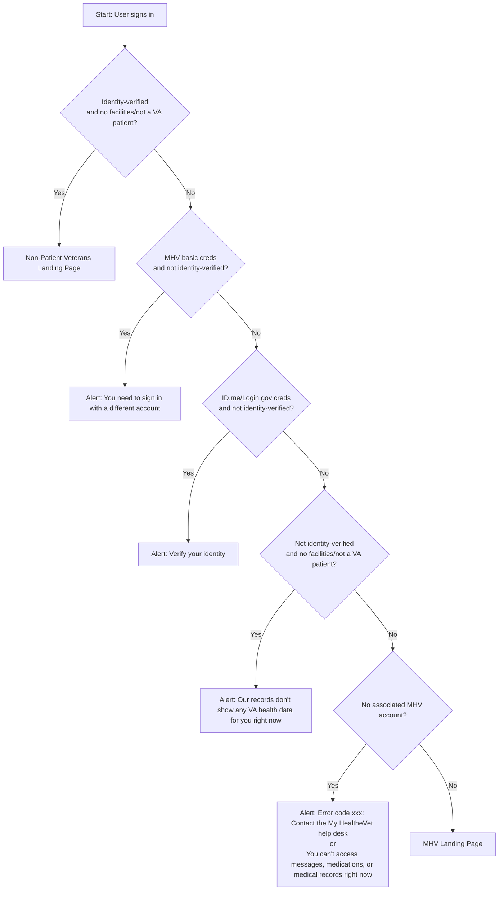

# MHV Home -- Alerts

## Current Alerts Types

Implemented | Conditions | View
--- | --- | ---
✅ | MHV basic credentials (LOA1) | 
✅ | ID.me: credentials < LOA3 | 
✅ | Login.gov: credentials < LOA3 | 
✅ | DS_Logon: credentials < LOA3 and No VA patient facility registration | 
✅ | No associated MHV account API Errors |  

## Authentication Providers/Credential Service Providers (CSPs)

- ID.me
- Login.gov
- DS Logon

## Non-Patient Landing Page

As part of Milestone 2, we replaced the alert shown to identity-verified users without a registered VA facility with a `non-patient` Veterans landing page that provides access to downloadable PDF reports for "Self-Entered Information" (SEI) and DoD history.

## Alert flow for MHV Landing Page

We have collected a decent number of conditions that could generate an alert.
Rendering multiple alerts will confuse users, so only the most relevant alert should be shown.

Below is pseudocode describing how the MHV landing page renders the single most relevant alert to the user.

A user must present identity-verified credentials (LOA3/IAL2) to access health data (PHI) and personal information (PII) on the MHV Landing Page. These conditions should be checked first in the if..else chain.

## Code organization

- Components that wrap `<va-alert />` are named with the prefix `Alert` (e.g. `AlertNoMhvAccount`).

- The main Alert component renders the single most relevant alert, following the logic described above.
