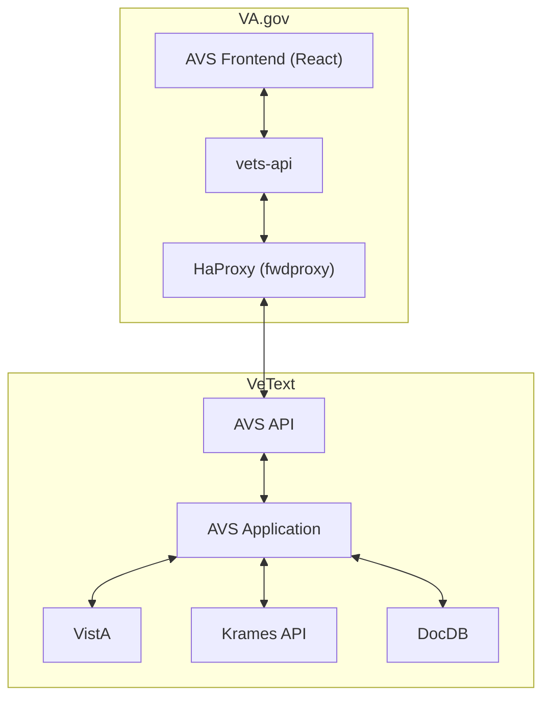
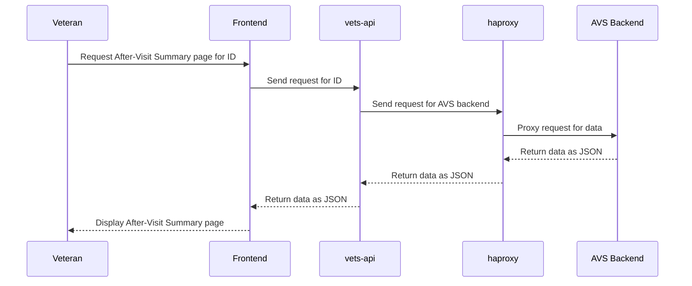

# AVS Engineering

## Overview

The AVS application provides a read-only, responsive, accessible view of a patient's [After Visit Summary](https://github.com/department-of-veterans-affairs/va.gov-team/tree/master/products/health-care/digital-health-modernization/mhv-to-va.gov/avs#overview-and-problem-statement) on VA.gov. When AVSs are printed by providers, a PDF document is created and stored in [VistA Imaging](https://dvagov.sharepoint.com/sites/vhahealth-information-management/SitePages/VistA-Imaging.aspx). Additionally, the AVS backend writes data to a JSON representation which is stored by the AVS backend. When Veterans view their past appointments on VA.gov, the appointments app queries the AVS backend by VistA station number and appointment IEN to see if an AVS document is available for that appointment. If one is available, a link to the AVS application is presented on the appointment details page.

## Automated Testing

- [Frontend tests](https://github.com/department-of-veterans-affairs/vets-website/tree/main/src/applications/avs/tests)
  - Since the AVS is not an interactive application, there are only basic end-to-end tests that confirm accordion & redirect behaviors and run accessibility checks. The bulk of the testing is done in unit tests that confirm how and when data in the JSON document is displayed.
- [Backend specs](https://github.com/department-of-veterans-affairs/vets-api/tree/master/modules/avs/spec)

## Alerting and Monitoring

- [VA.gov AVS dashboard](https://vagov.ddog-gov.com/dashboard/afd-cht-fsb/vagov-after-visit-summary)
- [VA.gov monitors](https://vagov.ddog-gov.com/monitors/manage?q=service%3Aafter-visit-summary&order=desc)
- [vets-api APM](https://vagov.ddog-gov.com/services/service/after-visit-summary?env=eks-prod)
- [AVS Backend logs](https://vetext.ddog-gov.com/logs?query=service%3Aavs-web-apache-prod%20%22%2Favs%2Fapi%22%20)

## Architecture

### Architecture Diagram

### Sequence Diagram

## Incident response  

### Points of contact for system and dependent VA backends

- VA.gov AVS
  - [AVS Contacts](https://github.com/department-of-veterans-affairs/va.gov-team/blob/master/products/health-care/digital-health-modernization/mhv-to-va.gov/avs/README.md#communications)
- Platform team (vets-website, vets-api, fwdproxy)
  - [#vfs-platform-support](https://dsva.slack.com/archives/CBU0KDSB1)
- AVS Backend
  - tag `@vetext-tier-3-team` in [#vetext-production-support](https://dsva.slack.com/archives/C052BC1893K)

### API Docs

- vets-api: https://department-of-veterans-affairs.github.io/va-digital-services-platform-docs/api-reference/?url=https://dev-api.va.gov/my_health/apidocs#/
- AVS backend: https://pvs.va.gov/avs/api/openapi

