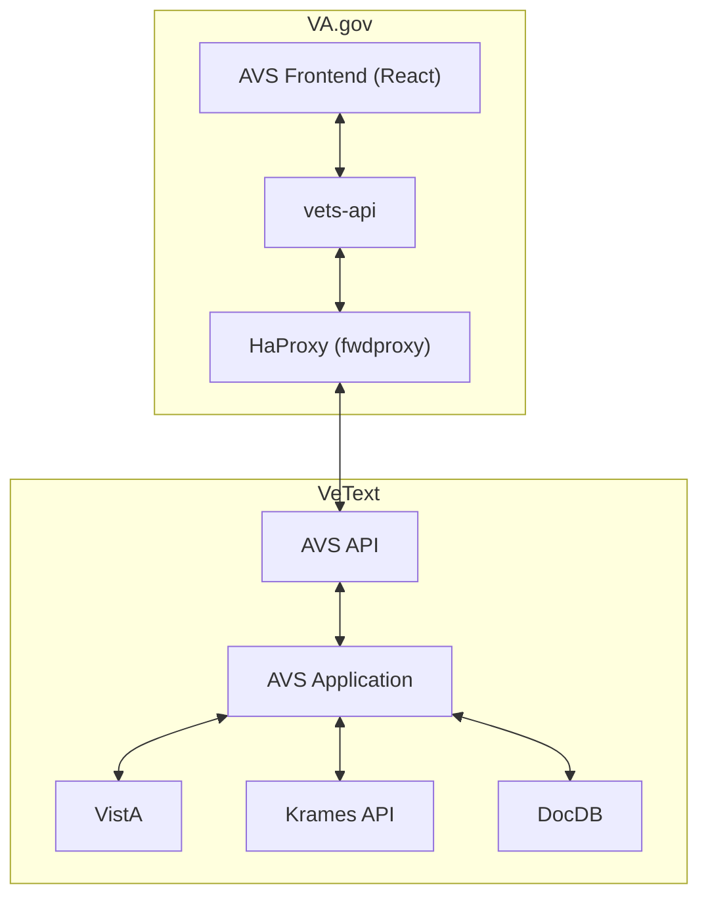
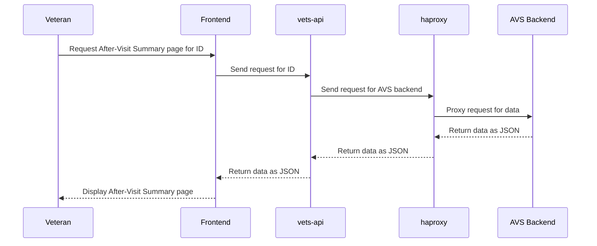

# AVS Engineering

## Architecture

### Architecture Diagram

```mermaid
flowchart TB
    subgraph VeText
    avs-api["AVS API"]<-->AvsApplication["AVS Application"]
    AvsApplication["AVS Application"]<-->VistA
    AvsApplication["AVS Application"]<-->Krames["Krames API"]
    AvsApplication["AVS Application"]<-->DocDB
    end
    subgraph VA.gov
    avs-fe["AVS Frontend (React)"]<-->vets-api
    vets-api<-->fwdproxy["HaProxy (fwdproxy)"]
    end    
    fwdproxy<-->avs-api
```

### Sequence Diagram

```mermaid
sequenceDiagram
    participant Veteran
    participant Frontend
    participant vets-api
    participant haproxy
    participant AVS Backend

    Veteran->>Frontend: Request After-Visit Summary page for ID
    Frontend->>vets-api: Send request for ID
    vets-api->>haproxy: Send request for AVS backend
    haproxy->>AVS Backend: Proxy request for data
    AVS Backend-->>haproxy: Return data as JSON
    haproxy-->>vets-api: Return data as JSON
    vets-api-->>Frontend: Return data as JSON
    Frontend-->>Veteran: Display After-Visit Summary page
```
