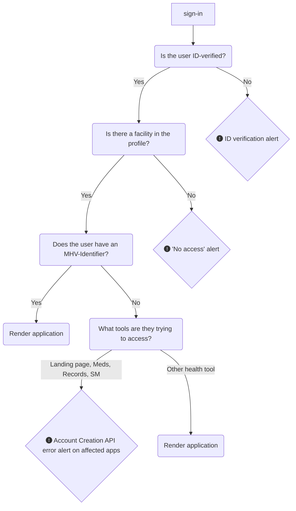

# My HealtheVet on VA.gov | Alert Standardization
To ensure a consistent Veteran experience and reduce cognitive load within the My HealtheVet-on-VA.gov portal, it is necessary to **standardize application behavior under access-limiting conditions**. This document seeks to explain the logic and standardized alert designs for each of these scenarios, so that all teams are aligned and deliver end-users a consistent user experience. 

## On this page: 
* [High-level API access logic](https://github.com/department-of-veterans-affairs/va.gov-team/blob/master/products/health-care/digital-health-modernization/mhv-to-va.gov/governance/alert-standardization.md#high-level-api-access-logic)
* [User routing in error states (fix link)](https://github.com/department-of-veterans-affairs/va.gov-team/blob/master/products/health-care/digital-health-modernization/mhv-to-va.gov/governance/alert-standardization.md#user-routing-in-error-states)
* [ID-verification alerts](https://github.com/department-of-veterans-affairs/va.gov-team/blob/master/products/health-care/digital-health-modernization/mhv-to-va.gov/governance/alert-standardization.md#ID-verification-alerts)
* [No access to My HealtheVet alerts](https://github.com/department-of-veterans-affairs/va.gov-team/blob/master/products/health-care/digital-health-modernization/mhv-to-va.gov/governance/alert-standardization.md#No-access-to-My-HealtheVet-alerts)
* [Account Creation API error alerts](https://github.com/department-of-veterans-affairs/va.gov-team/blob/master/products/health-care/digital-health-modernization/mhv-to-va.gov/governance/alert-standardization.md#account-creation-api-error-alerts)
* Oracle-Health Routing alerts (guidance coming soon)
* 404 page not found alerts (guidance coming soon)

## High-level API access logic

1. All /my-health application pages should look for an ID-verified credential (IAL2) as the first-order criteria before rendering a page for users.
2. If an ID-verified credential (IAL2) is not detected, the application should **redirect the user to the MHV-on-VA.gov landing page**, where the user will experience only: H1, lede text, and the ID-verification alert (all cards, links, and the secondary nav will not be shown).
3. If an ID-verified credential (IAL2) is detected, then /my-health application pages should look for the presence of a facility in the user's profile.
4. If there is no facility in the profile, the application should **redirect the user to the MHV-on-VA.gov landing page**, where the user will experience only: H1, lede text, and the "No access to My HealtheVet" alert.
5. If a facility is in the user's profile, the application page should next look for an MHV-Identifier (MHV UUID). 
6. For the rest of the high level logic regarding whether the page should be rendered with or without an alert, visit the [Account Creation API Overview document](https://github.com/department-of-veterans-affairs/va.gov-team/edit/master/products/health-care/digital-health-modernization/mhv-to-va.gov/account-creation-api.md).
   
## User routing under access-limiting conditions

The first two conditions required to access all applications under `/my-health/` – verified identity and facilities - will be handled centrally on the MHV-on-VA.gov landing page. (See steps 1-4 in the chart above.) The user will experience a simplified version of the landing page, which omits both the secondary nav and other /my-health tool links. We believe routing users in this way will help them avoid the frustrating experience of clicking into various health tools they are unable to use.

### ID-Verification screenshots

MHV landing page: unverified Login.gov user

MHV landing page: unverified ID.me user

MHV landing page: MHV Basic account user

### No access to My HealtheVet alert

## Account Creation API error alerts 
The account creation API effort & related error alerts are [documented separately here](https://github.com/department-of-veterans-affairs/va.gov-team/blob/master/products/health-care/digital-health-modernization/mhv-to-va.gov/account-creation-api.md).  

## Oracle Health / Cerner Routing alerts
Guidance coming soon.

## 404 Page not found alerts 
Guidance coming soon.
