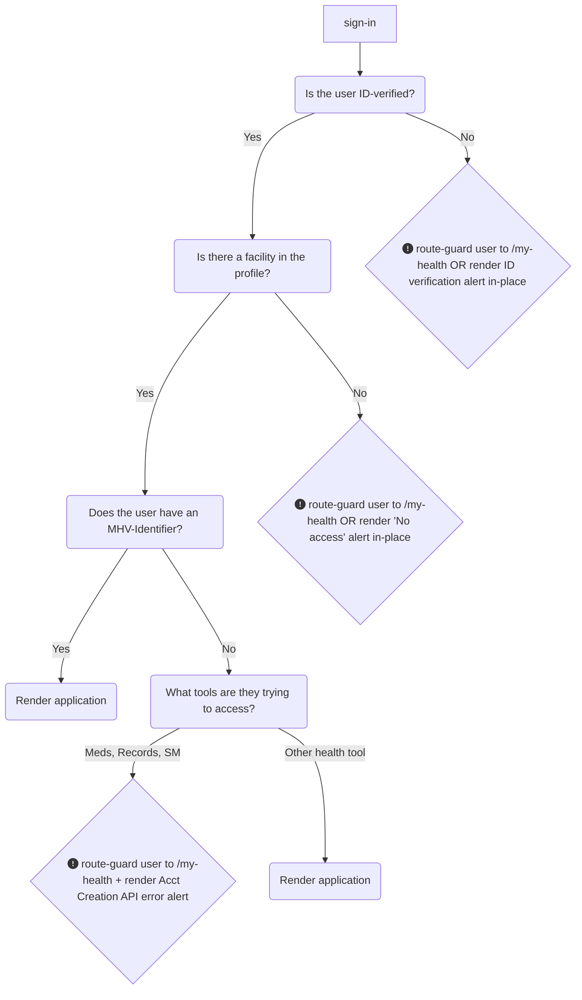

# My HealtheVet on VA.gov | Alert Standardization
To ensure a consistent Veteran experience and reduce cognitive load within the My HealtheVet-on-VA.gov portal, it is necessary to **standardize application behavior under access-limiting conditions**. This document seeks to explain the logic and standardized alert designs for each of these scenarios, so that all teams are aligned and deliver end-users a consistent user experience. 

## On this page: 
* [High-level API access logic](https://github.com/department-of-veterans-affairs/va.gov-team/blob/master/products/health-care/digital-health-modernization/mhv-to-va.gov/governance/alert-standardization.md#high-level-api-access-logic)
* [User routing under access-limiting conditions](https://github.com/department-of-veterans-affairs/va.gov-team/blob/master/products/health-care/digital-health-modernization/mhv-to-va.gov/governance/alert-standardization.md#user-routing-under-access-limiting-conditions)
* [Account Creation API error alerts](https://github.com/department-of-veterans-affairs/va.gov-team/blob/master/products/health-care/digital-health-modernization/mhv-to-va.gov/governance/alert-standardization.md#account-creation-api-error-alerts-ie-missing-mhv-uuid)
* Oracle-Health Routing alerts (guidance coming soon)
* 404 page not found alerts (guidance coming soon)

## High-level API access logic
Some applications may choose to alert users in-place rather than redirecting (route-guarding) them to the MHV landing page. Route-guarding is the preferred approach for the sake of maintaining a consistent experience across tools in the portal.

### Checks for ALL applications in the My HealtheVet portal
1. All `/my-health` application pages should look for an ID-verified credential (IAL2) as the first-order criteria before rendering a page for users. If an ID-verified credential (IAL2) is not detected, the application should **redirect the user to the MHV-on-VA.gov landing page**, where the page will render an ID-verification alert (all other page content, including access to the tools and the secondary nav bar will be suppressed).
2. If an ID-verified credential (IAL2) is detected, then `/my-health` application pages should check for the presence of a facility in the user's profile.
3. If there is no facility in the profile, the application should **redirect the user to the MHV-on-VA.gov landing page**, where the page will render a "No access to My HealtheVet" alert (all other page content, including access to all health tools tools and the secondary nav bar will be suppressed).
4. If a facility is in the user's profile, then any health portal applications that do not rely on the MHV-API backend should be rendered. 

### Checks only for applications that rely on the MHV-API backend
Affected applications: medications, medical records, and secure messages

4. If a facility is in the user's profile, but the application relies on the MHV-API back-end, check for the presence of an MHV-Identifier (MHV UUID). If there is no MHV-Identifier, see the [Account Creation API Overview document](https://github.com/department-of-veterans-affairs/va.gov-team/blob/master/products/health-care/digital-health-modernization/mhv-to-va.gov/governance/mhv-account-creation-api.md) for more information about how to handle this. 
5. If there is an MHV-Identifier present, render the application. 
   
## User routing under access-limiting conditions

Users who lack either of the first two conditions required to access all applications under `/my-health/` – verified identity and the presence of at least one facility in the profile - will be handled centrally on the MHV-on-VA.gov landing page. (See steps 1-3 in the chart above.) These users will experience a simplified version of the My HealtheVet landing page, which suppresses both the secondary nav and other `/my-health` tool links. We believe routing users in this way will help them avoid the frustrating experience of clicking into various health tools they are unable to use.

### ID-Verification screenshots

NOTE: Screenshots below are taken from this [Figma file](https://www.figma.com/design/m992k2m1DSl9MXV9hDytsQ/MHV-Account-Security-%26-Sign-In?node-id=6-13278&t=B7BN9mFl9GkeJt3a-4).

MHV landing page: unverified Login.gov user

MHV landing page: unverified ID.me user

MHV landing page: MHV Basic account user

### No access to My HealtheVet alert screenshot

MHV landing page: No access to MHV

## Missing MHV-Identifier (Account Creation API)

Users who lack the third condition: presence of an MHV-Identifier, will be access-limited to _only some applications_ that rely on the MHV-API backend. These applications include: medications, medical records, and secure messages. Applications that do not rely on the MHV-API backend do not have this requirement.

Affected applications must run a check for the presence of an MHV-Identifier (UUID). If one does exist, the application can be rendered. If one does not exist, additional steps must be taken. The Cartogrpahy team has prepared a React component to make this check as easy as possible for application teams. 

The additional steps that must be taken by affected applications if the check for an MHV-Identifier comes back as "false" are [documented in greater detail as part of Account Creation API work here](https://github.com/department-of-veterans-affairs/va.gov-team/blob/master/products/health-care/digital-health-modernization/mhv-to-va.gov/governance/mhv-account-creation-api.md)

## Oracle Health / Cerner Routing alerts
Guidance coming soon.

## 404 Page not found alerts 
Guidance coming soon.
