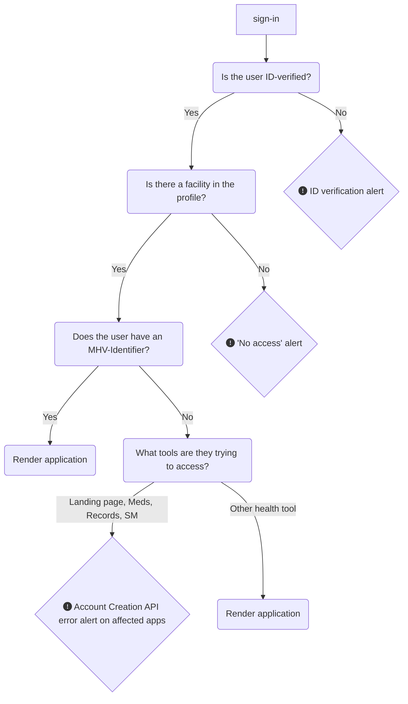

# My HealtheVet on VA.gov | Alert Standardization
Within the My HealtheVet portal, multiple alerts are required to display in one, many, or all applications that live within the `/my-health` namespace. This document seeks to explain the logic and standardized alert designs for each of these scenarios, so that all teams are aligned and deliver end-users a consistent user experience. 

## On this page: 
* High-level API access logic 
* [ID-verification alerts](https://github.com/department-of-veterans-affairs/va.gov-team/blob/master/products/health-care/digital-health-modernization/mhv-to-va.gov/governance/alert-standardization.md#ID-verification-alerts)
* [No access to My HealtheVet alerts](https://github.com/department-of-veterans-affairs/va.gov-team/blob/master/products/health-care/digital-health-modernization/mhv-to-va.gov/governance/alert-standardization.md#No-access-to-My-HealtheVet-alerts)
* Account Creation API error alerts
* Oracle-Health / Cerner Routing alerts (guidance coming soon)
* 404 page not found alerts (guidance coming soon)

## High-level API access logic

1. All impacted application pages should look for an MHV-Identifier as the third-order criteria before rendering a page for users:
    * Does the user have an ID-verified credential (IAL2)?
    * Does the user have a access to My HealtheVet (do they have a facility in their profile)?
    * Does the user have an MHV-Identifier?
3. If we do not detect an MHV-Identifier, we run a query to the Account Creation API endpoint to see if one was created at sign-in and fetch it.
4. If we see a "false" value from the Account Creation API, we will re-run it and display a loading indicator on the page beneath the global header while we wait for the response (estimated time: 1-2 seconds)
5. If we still do not see an MHV-Identifier, the solution will depend on what page the user is on:
## ID-Verification alerts

### Alert designs
For full details, [see Figma here](https://www.figma.com/design/m992k2m1DSl9MXV9hDytsQ/MHV-Account-Security-%26-Sign-In?node-id=6-13169&node-type=canvas&t=ivtTB3ovGbme2XjY-0).

## No access to My HealtheVet alerts

### Alert designs
For full details, [see Figma here](https://www.figma.com/design/m992k2m1DSl9MXV9hDytsQ/MHV-Account-Security-%26-Sign-In?node-id=6-14351&node-type=canvas&t=ivtTB3ovGbme2XjY-0).

## Account Creation API error alerts 
The account creation API effort & related error alerts are [documented separately here](https://github.com/department-of-veterans-affairs/va.gov-team/blob/master/products/health-care/digital-health-modernization/mhv-to-va.gov/account-creation-api.md).  

## Oracle Health / Cerner Routing alerts
Guidance coming soon.

## 404 Page not found alerts 
Guidance coming soon.
