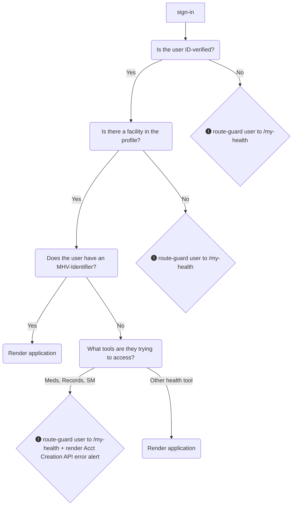

# My HealtheVet on VA.gov: Standards for account security, access, and error states
To ensure a consistent Veteran experience and reduce cognitive load within the My HealtheVet-on-VA.gov portal, it is necessary to **standardize application behavior under access-limiting conditions**. This document seeks to explain the logic and standardized alert designs for each of these scenarios, so that all teams are aligned and deliver end-users a consistent user experience. 

## On this page: 
* [High-level API access logic](https://github.com/department-of-veterans-affairs/va.gov-team/blob/master/products/health-care/digital-health-modernization/mhv-to-va.gov/governance/alert-standardization.md#high-level-api-access-logic)
* [User routing under access-limiting conditions](https://github.com/department-of-veterans-affairs/va.gov-team/blob/master/products/health-care/digital-health-modernization/mhv-to-va.gov/governance/alert-standardization.md#user-routing-under-access-limiting-conditions)
* [Missing MHV Identifier (Account Creation API)](https://github.com/department-of-veterans-affairs/va.gov-team/blob/master/products/health-care/digital-health-modernization/mhv-to-va.gov/governance/alert-standardization.md#account-creation-api-error-alerts-ie-missing-mhv-uuid)
* [Oracle-Health Routing alerts](https://github.com/department-of-veterans-affairs/va.gov-team/blob/master/products/health-care/digital-health-modernization/mhv-to-va.gov/governance/alert-standardization.md#oracle-health--cerner-routing-alerts)
* [Unauthenticated users](https://github.com/department-of-veterans-affairs/va.gov-team/edit/master/products/health-care/digital-health-modernization/mhv-to-va.gov/governance/alert-standardization.md#unauthenticated-users)
* [403 access denied component](https://github.com/department-of-veterans-affairs/va.gov-team/edit/master/products/health-care/digital-health-modernization/mhv-to-va.gov/governance/alert-standardization.md#403-access-denied-component)
* [404 page not found component](https://github.com/department-of-veterans-affairs/va.gov-team/edit/master/products/health-care/digital-health-modernization/mhv-to-va.gov/governance/alert-standardization.md#404-page-not-found-component)
* [500 internal service error alert](https://github.com/department-of-veterans-affairs/va.gov-team/edit/master/products/health-care/digital-health-modernization/mhv-to-va.gov/governance/alert-standardization.md#500-internal-service-error-component)

## High-level API access logic
Applications should route-guard any users who do not meet two high-level gating requirements to the `/my-health` landing page to see the relevant alert in place there. The goal of this requirement is to have a single place to maintain and update alerts, and to prevent users without access to My HealtheVet from getting to deeper child pages within the experience. Instead, they will see certain alerts in place at the top of the portal, where we believe it is the best place to explain and contextualize why they do not have access, and steps they need to take in order to answer questions they may have about managing their healthcare on VA.gov. 

### Checks for ALL applications in the My HealtheVet portal
1. All `/my-health` application pages should look for an ID-verified credential (IAL2) as the first-order criteria before rendering a page for users. If an ID-verified credential (IAL2) is not detected, the application should **redirect the user to the MHV-on-VA.gov landing page**, where the page will render an ID-verification alert (all other page content, including access to the tools and the secondary nav bar will be suppressed).
2. If an ID-verified credential (IAL2) is detected, then `/my-health` application pages should check for the presence of a facility in the user's profile.
3. If there is no facility in the profile, the application should **redirect the user to the MHV-on-VA.gov landing page**, ~~where the page will render a "No access to My HealtheVet" alert (all other page content, including access to all health tools tools and the secondary nav bar will be suppressed)~~ Edit made 4/23/25: For Milestone 2, the landing page will no longer render a "No access to My HealtheVet" alert, but will instead be a modified landing page for non-patient users, which will include links for these users to download their data.
4. If a facility is in the user's profile, then any health portal applications that do not rely on the MHV-API backend should be rendered. 

### Checks only for applications that rely on the MHV-API backend
Affected applications: medications, medical records, and secure messages

5. If a facility is in the user's profile, but the application relies on the MHV-API back-end, check for the presence of an MHV-Identifier (MHV UUID). If there is no MHV-Identifier, see the [Account Creation API Overview document](https://github.com/department-of-veterans-affairs/va.gov-team/blob/master/products/health-care/digital-health-modernization/mhv-to-va.gov/governance/mhv-account-creation-api.md) for more information about how to handle this. 
6. If there is an MHV-Identifier present, render the application. 
   
## User routing under access-limiting conditions

Users who lack either of the first two conditions required to access all applications under `/my-health/` – verified identity and the presence of at least one facility in the profile - will be handled centrally on the MHV-on-VA.gov landing page. (See steps 1-3 in the chart above.) These users will experience a simplified version of the My HealtheVet landing page, which suppresses both the secondary nav and other `/my-health` tool links. We believe routing users in this way will help them avoid the frustrating experience of clicking into various health tools they are unable to use.

### ID-Verification screenshots

NOTE: Screenshots below are taken from this [Figma file](https://www.figma.com/design/m992k2m1DSl9MXV9hDytsQ/MHV-Account-Security-%26-Sign-In?node-id=6-13278&t=B7BN9mFl9GkeJt3a-4).

MHV landing page: unverified Login.gov user

MHV landing page: unverified ID.me user

MHV landing page: MHV Basic account user

### No facility registration: Non-patient landing page (previously was MHV landing page: No access to MHV)

Non-patient landing page

## Missing MHV-Identifier (Account Creation API)

Users who lack the third condition: presence of an MHV-Identifier, will be access-limited to _only some applications_ that rely on the MHV-API backend. These applications include: medications, medical records, and secure messages. Applications that do not rely on the MHV-API backend do not have this requirement.

Affected applications must run a check for the presence of an MHV-Identifier (UUID). If one does exist, the application can be rendered. If one does not exist, additional steps must be taken. The Cartogrpahy team has prepared a React component to make this check as easy as possible for application teams. 

The additional steps that must be taken by affected applications if the check for an MHV-Identifier comes back as "false" are [documented in greater detail as part of Account Creation API work here](https://github.com/department-of-veterans-affairs/va.gov-team/blob/master/products/health-care/digital-health-modernization/mhv-to-va.gov/governance/mhv-account-creation-api.md)

## Oracle Health / Cerner Routing alerts
The "big four" health tools must provide routing alerts for users with OH/Cerner facilities in their profile that sends them to the My VA Health portal to manage their care related to those facilities. Once the My VA Health portal is fully integrated and combined with My HealtheVet on VA.gov, these alerts can be removed. 

### Health tool pages:
Anytime there is a presence of one or more OH/Cerner facilities in the profile, these alerts must display in-place on at least the entry-point page to the tool (page connected with the secondary navigation bar). There is a slightly varying design for a single facility vs. multiple OH/Cerner facilities in the profile. All teams currently have these alerts implemented and in-place within their applications, but the designs and content varies. All teams should standardize their alerts to reflect the standardized template version in [Figma here](https://www.figma.com/design/m992k2m1DSl9MXV9hDytsQ/MHV-Account-Security-%26-Sign-In?node-id=263-24267&p=f&t=lCwneRQNRv8cAMdX-0). 

Tool teams will need to provide their own: 
* Content for the "call to action" in the template alert heading that is most relevant to their health tool (e.g. "manage your appointments")
* Deep-link URL for the tool page they need to route users to within the My VA Health portal

#### Placement
The alerts should display beneath the page H1 and lede text (if applicable), and before any dynamic or conditional data for the user. Example below:

#### Example screenshot:

Medical records landing page: screenshot of OH/Cerner routing alert

### Benefit hub pages: 
Benefit hub pages corresponding with these tools currently have more complex versions of these alerts in place. We do not plan to update those alerts, and instead will remove them from benefit hub pages when the unauth page URLs for each tool are updated to point to the new version of the tool on VA.gov, by Milestone 1 deadline at the latest (ETA March 2025). More information about this [transition plan is available here](https://github.com/department-of-veterans-affairs/va.gov-team/blob/master/products/health-care/digital-health-modernization/mhv-to-va.gov/transition/benefit-hub-page-updates.md).

## Unauthenticated users
The entire `/my-health` portal sits behind authentication and every application under this namespace must require authentication. Thus, any unauthenticated user who attempts to access a URL within any application in this space should trigger the sign-in modal. Until a user signs in, we cannot determine whether a user has authorization to access the page they are attempting to reach. 

## 403 Access denied component
The 403 error sends the user to a new page; this error component will only be experienced by users with access to My HealtheVet who attempt to access a url within the /my-health name space that they don't have credentials for (i.e. a records url for a different user). As shown in the screenshot below, the 403 error includes guidance to call the My HealtheVet helpdesk, try other health-related resources, or navigate elsewhere within the portal using the MHV secondary nav.

[Figma file](https://www.figma.com/design/m992k2m1DSl9MXV9hDytsQ/MHV-Account-Security-%26-Access-Standards?node-id=685-14636)

403 error page for MHV users

    

## 404 Page not found component
The 404 error sends users to a new page; this error component will only be experienced by users with access to My HealtheVet who change a link under the /my-health namespace to an incorrect / non-existant url will be sent to this same 404. As shown in the screenshot below, the 404 error includes guidance to go to the the My HealtheVet landing page, call the helpdesk, try other health-related resources, or navigate elsewhere within the portal using the MHV secondary nav.

[Figma file](https://www.figma.com/design/m992k2m1DSl9MXV9hDytsQ/MHV-Account-Security-%26-Access-Standards?node-id=1071-19363&t=rNA4JxDx5GaXwOk9-1)

404 Page not found for VA.gov

## 500 Internal service error component
There are two versions of the 500 component copy; one provides basic guidance to users to recover (refresh browser) and can be used in any scenario in which the basic guidance would be the same. The other version is only a template and teams that need to deviate from the basic guidance will need to write their own copy to help users recover from the error. The intention behind creating two versions is to explicitly sanction and encourage teams to write their own copy when specific instructions would be helpful to the user. 

On the question of placement: This error component should appear after the page's H1 and lede text (if applicable) and before any other content on the page.

[Figma file](https://www.figma.com/design/m992k2m1DSl9MXV9hDytsQ/MHV-Account-Security-%26-Access-Standards?node-id=753-3)

Messages' Inbox page: 500 **with** guidance

Messages' Inbox page: 500: **no** guidance

