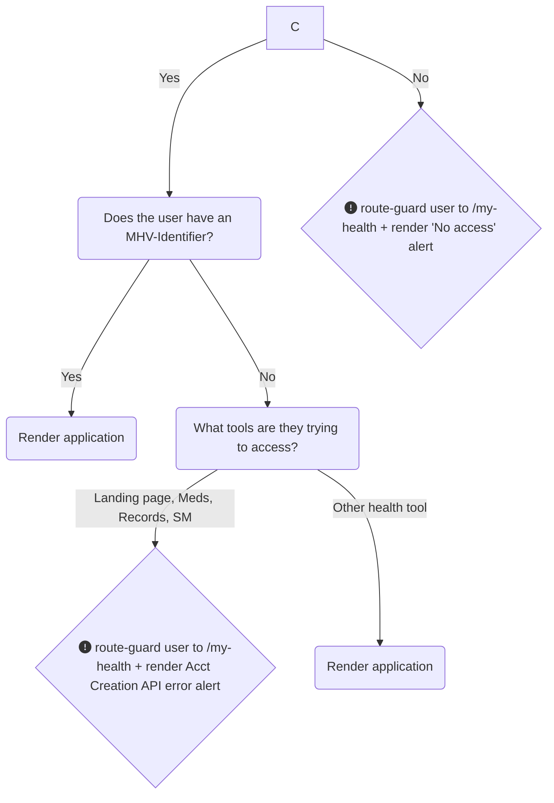

# My HealtheVet on VA.gov: Account Creation API Overview

The goal of this document is to explain what the MHV Account Creation API does, how it is called from VA.gov, and how MHV-on-VA.gov tools that require a MHV identifier should handle error scenarios. 

## Overview
A MHV-Identifier (uuid) is required by three of the "big four" health tools (medications, medical records, and secure messages) on VA.gov to retrieve user data. The account creation API seeks to solve a current-state problem, where first-time users of My HealtheVet on VA.gov must manually register for an MHV-ID on the National Portal website to assoicate a UUID with their credential. The most common use case for this API are users who set up a new **ID.me** or **Login.gov** account & attempt to access My HealtheVet for the first time.

This API automatically creates an MHV-Identifier for any Veteran who does not already have one (or retrieve it if one exists), thus removing the user burden of the manual registration step.

However, a significant portion of users will still arrive at the MHV-on-VA.gov portal without a MHV-UUID. Common causes:
- The API call during sign-in stores the MHV-UUID in a different place than MHV tools are looking for it
- The API call failed during sign-in
- The API call returned an error from the MHV back-end (see below, errors are coded `8XX`)

## On this page
* [API errors](#api-errors)
* [Potential entry points & user routing in error states](#routing)
* [Implementation logic (MVP)](#logic)
* [QA guide & test cases](#qa)
* [Planned future-state improvements](#future)
* [Resources](#resources)
* [Teams involved in this effort](#teams)

## <a name="api-errors">API errors</a>
Errors returned by the MHV Account Creation API fall into two categories: errors that require the user to call the MHV Help Desk, and technical/background errors that are transient. (The errors and triage approaches are documented in the [product guide](https://github.com/department-of-veterans-affairs/va.gov-team/tree/master/products/health-care/digital-health-modernization/mhv-to-va.gov/landing-page/contact_center).)

### User-action required errors
These are errors that require manual intervention by My HealtheVet helpdesk staff, and a user must call the helpdesk phone number and communicate the specific error code number to resolve the problem. This alert is most relevant for errors numbered 801, 805, 806, 807 from the API specifications.

### User-action required alert (error codes: 801, 805, 806, 807) (as displayed on the MHV landing page)

### Background errors
These are errors are due to background issues that helpdesk staff are not likely to be able to resolve. Instead, telling users to reload the page or try again later are the most straightforward approaches we can commmunicate at this time (MVP). These are errors numbered 802, 803, 804, 808, 809, 810, 811 from the API specifications.

### Background error alert (error codes: 802, 803, 804, 808, 809, 810) (as displayed on the MHV landing page)

For full details about the alerts above, including accessibility annotations, [see Figma here](https://www.figma.com/design/m992k2m1DSl9MXV9hDytsQ/MHV-Account-Security-%26-Sign-In?node-id=267-8158&node-type=frame&t=UPokYL4gfORKiywK-0)

## <a name="routing">Tool implementation of user routing when UUID is missing</a>
Three health tools (medications, medical records, and secure messages) require a MHV UUID to function. **If it is missing, they should redirect users to the MHV landing page,** which will attempt to retrieve the UUID and then alert the user appropriately.

**Route-guard:** The Cartography team uses this term to describe the application logic within React that can conditionally redirect users to the MHV landing page.

## <a name="logic">Implementation logic (MVP)</a>
The Account Creation API logic starts about halfway down the diagram below:

1. All impacted applications (SM, Meds, MR) should look for an MHV-Identifier before rendering a page for users.
2. If an MHV-Identifier (`userHasMhvAccount` selector from MPI) is not detected, these applications should redirect/route-guard the user to the MHV landing page for triage and alerting if necessary.

### Affected health tool applications
Tools: Medications, Medical Records, Secure Messages

There are many side-door entry points to the health tools themselves (list below). If a user without an MHV-Identifier attempts to access a URL within an affected application, they must be redirected to the `/my-health`landing page, where steps 3-6 above will take place. 

* **Side-door entry points to the affected apps:**
  * Links to Meds, MR, and SM in the My HealtheVet secondary navigation bar
  * My VA healthcare links (currently, these route to the MHV National Portal. But when we update link destinations in January, these pages will become side-door entry points to all 3 affected applications)
  * Health care benefit hub pages for the affected health tool applications - (currently, these route to the MHV National Portal. But when we update link destinations on these pages in March 2025, these pages will become side-door entry points to all 3 affected applications)
  * Cross-links from other unaffected health tool applications
  * Medications, Medical Records, and Secure Messages links

### My HealtheVet landing page implementation
3. We run a call to the Account Creation API endpoint (`/v0/user/mhv_user_account`) & display a loading indicator on the page beneath the global header while we wait for the response (estimated time: 1-2 seconds).
4. We return the response (error or otherwise) to the `mhvAccountStatus` selectors. The api call happens as a `useEffect` block on the `LandingPageContainer` component. Currently there is no new component, only this `useEffect` block. The `mhvAccountStatus` selectors then determine what is rendered: 
5. If an MHV-Identifier was created, the full page & affected application will render for the user. 
6. If we do not see an MHV-Identifier, a new `AlertMhvUserAction` alert is rendered along with a modified landing page. Page modification includes: suppressing links in grey cards for each of the affected health applications. This avoids some dead-ends to those tools that a user lacks access to, and adds clarity to the meaning of the alert.

## <a name="qa">QA guide and test cases</a>
_Add instructions to this documentation around the AC-API for tool teams so that they understand how to use redux to test whether their route-guards for the AC-API actually send users to the /my-health page to experience relevant AC-API error alerts in the case of errors. Include specific test cases & recommendations on how to validate the route-guard using redux._

## <a name="future">Planned future-state improvements</a>
As stated earlier in this document, there are many side-door entry points into the affected health tools (medications, medical records, secure messages) from across VA.gov and from even outside of it. Instead of instantly route-guarding those users to the `/my-health` page to experience these error alerts when they occur, we hypothesize that it will make more sense for users to see the relevant alerts _in place within the application they expected to access_.

**Note:** To determine whether this higher technical lift solution is worth pursuing, we will monitor and evalute error logs resulting from the MVP implementation solution and determine the severity of the problem (number and percentage of Veterans affected over time). 

### Possible iteration on the MVP implementation
We should monitor whether the presence of secondary nav on the landing page in a state where 3/4 tools cannot be accessed due to an error with the Account Creation API creates confusion for users. In the event that we believe it does add confusion, we could suppress the navigation bar as a minor iteration. Or we could move toward the future state approach for tool teams (below). 

### Future state approach for tool teams
Display these alerts in-place on the root page of your applications. If users hack their URL or somehow access deeper child page links beneath that entry point page, redirect them to the top page of your application and show them the alert in-place there. Suppress all functionality in the application, only displaying: 
* Global header
* Secondary navigation
* Breadcrumbs
* H1
* Lede text (if applicable)
* This alert
* Footer

### UX considerations on the MHV landing page

The MHV-API gates access to 3 major health tools in the portal, but many other applications do not rely on it (e.g. appointments, supply re-ordering, travel pay). Thus, we will still display secondary navigation. This opens up a side-door gateway into the tools in an error-state & all affected tools will need to route-guard users up to 'my-health' to see alerts in place there. This is applicable both for applications' landing pages and child pages. 

We also evaluated an option to ask application teams to implement error alerts on their landing pages instead of route-guarding users to the landing page. However, out of concern for application teams and the level of effort associated with implementing these error states within the tool applications, we are recommending the route-guard solution for the time being. An improved future state solution may follow based after evaluating analytics of the number of users experiencing these errors in production. 
## <a name="resources">Resources</a>
Below are links to API documentation and specifications, discovery work, and design files related to this effort. Please reach out to the involved teams with any questions about these materials.
* [Account Creation API specs](https://github.com/department-of-veterans-affairs/va.gov-team-sensitive/tree/master/teams/vsp/teams/Identity/Product%20Documentation/MHV%20account%20creation%20api%20on%20vagov) (private)
* [API requirements](https://github.com/department-of-veterans-affairs/va.gov-team/blob/master/products/identity/MHV%20account%20creation%20API/requirements.md)
* [API release plan](https://github.com/department-of-veterans-affairs/va.gov-team/blob/master/products/identity/MHV%20account%20creation%20API/release%20plan.md)
* [Implementation documentation](https://github.com/department-of-veterans-affairs/va.gov-team/blob/master/products/identity/MHV%20account%20creation%20API/vets-api%20Documentation/mhv_user_account_api.md)
* [Cartography team Mural](https://app.mural.co/t/departmentofveteransaffairs9999/m/departmentofveteransaffairs9999/1719581177532/3cbc80571562a1f162a0887c4a60e06c3014f99a)
* [Figma designs](https://www.figma.com/design/CAChU51fWYMZsgDR5RXeSc/MHV-Landing-Page?node-id=4065-9052&node-type=canvas&t=xMOSprUxBalLT5G4-0)

## <a name="teams">Teams involved in this effort</a>
* MHV Portals + Access team (Carnetta Scruggs)
  * Haritha Cheruvu - engineer
  * Sandeep Karuturi (VA,Ctr) - API Spec Contact/Product Manager (_no longer in this role_)
  * Naseera - (_taking over for Sandeep_)
  * Barry Egbert (VA,Ctr) - JWT/security MHV account creation api engineer
* Identity team (Samara Strauss)
  * Lainey Traihan - PM
  * Joe Niquette - Lead engineer
* MHV on VA.gov Cartography Team (Robyn Singleton)
  * Wes Rowe - PM
  * Daniel Cloud - engineer
  * Kevin Suarez - engineer
  * Sara Sterkenburg - information architect

**Distribution of effort:**
- The MHV Portals + Access team led by PO Carnetta Scruggs built the API. 
- The VA OCTO Identity team implemented the API onto VA.gov at sign-in. 
- The Cartography team implemented code on the MHV landing page that stores the MHV-UUID in the correct place in application state to be used by MHV tools.
- If an error is returned by the API, the Cartography team has built alerts in the front-end user experience that will help Veterans understand the problem and give them clear next steps to get a resolution. 

