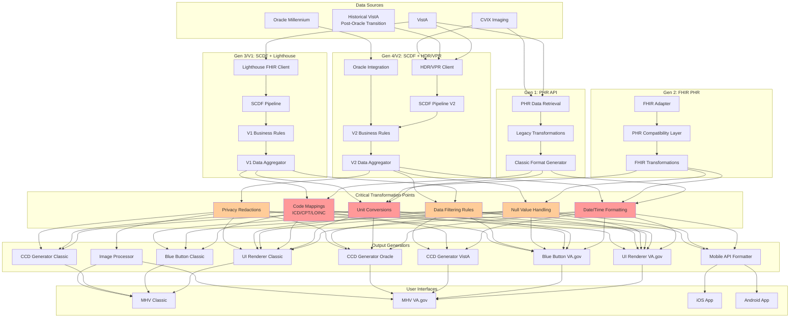
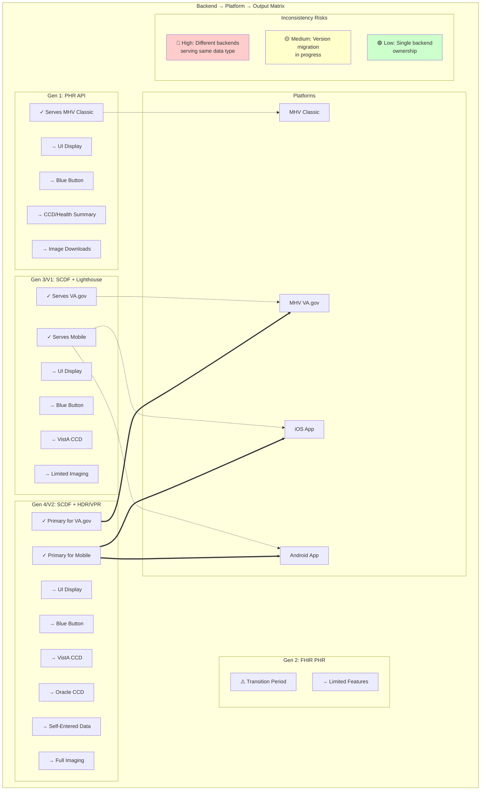
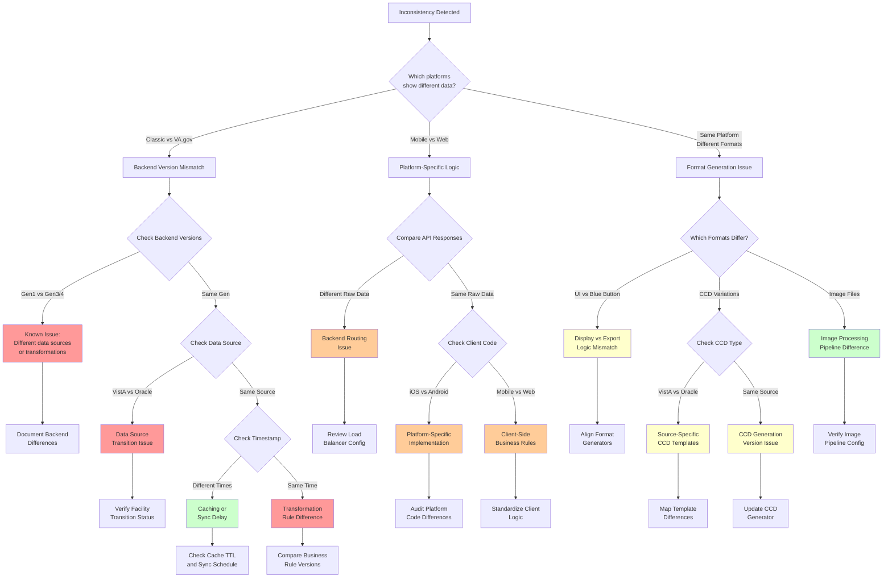
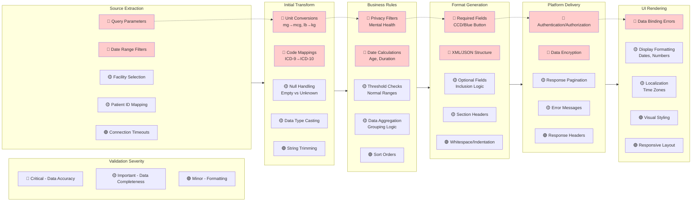

# Data Consistency Analysis - VA Health Data Systems

## Purpose

This analysis identifies and flags inconsistencies that would impact data presented in three different formats on four different platforms, based on the data sources, backend, middleware, and user interface layers, and variations in transformations and business rules applied in any of those layers to clearly identify discrepancies in the final user-facing outputs.

## System Overview

### Platforms
- **My HealtheVet Classic**: URLs starting with myhealth.va.gov
- **My HealtheVet on VA.gov**: URLs starting with va. gov/my-health
- **VA Health and Benefits mobile application for iOS**
- **VA Health and Benefits mobile application for Android**

### Native Data Sources
- **VistA**:  For VA facilities that have not transitioned to Oracle, and potentially for historical VistA data for facilities that have
- **Oracle Millennium**: For facilities that have transitioned to Oracle
- **CVIX**: For imaging data

### Data Presentation Formats
- In the user interface on My HealtheVet Classic
- In the user interface on My HealtheVet on VA. gov
- In a Blue Button report on My HealtheVet Classic
- In a Blue Button report on My HealtheVet on VA.gov
- In a CCD/VA Health Summary on My HealtheVet Classic
- In a VistA-derived CCD on My HealtheVet on VA.gov
- In an Oracle-derived CCD on My HealtheVet on VA.gov
- In a self-entered data file on My HealtheVet on VA.gov
- In an image download file on My HealtheVet Classic
- In an image download file on My HealtheVet on VA.gov

### Backend Generations
- **1st Gen**: Used the PHR API on My HealtheVet Classic
- **2nd Gen**: Used a FHIR-compatible version of the PHR API
- **3rd Gen (V1)**: Used a Spring Cloud Data Flow (SCDF) backend that got VistA data through Lighthouse Patient Health API (FHIR)
- **4th Gen (V2)**: Uses a Spring Cloud Data Flow (SCDF) backend that gets VistA data from HDR/VPR

## 1.  Detailed Data Flow Diagram

## 2. Backend-Platform Comparison Matrix

## 3. Inconsistency Troubleshooting Flowchart

## 4. Data Validation Checkpoint Visualization

## Summary and Recommendations

Based on these diagrams, here are the key areas where inconsistencies are most likely to occur:

### Critical Risk Areas (🔴 High Priority)
1. **Backend Version Differences**:  Different generations serving the same data type
2. **Data Source Transitions**:  VistA to Oracle migrations creating temporal inconsistencies
3. **Transformation Rules**: Unit conversions, code mappings, and privacy filters applied differently
4. **Required Field Handling**: Different backends may have different validation rules

### Medium Risk Areas (🟡 Monitor Closely)
1. **Platform-Specific Logic**: iOS vs Android vs Web implementations
2. **Caching and Sync Delays**: Different refresh rates across platforms
3. **Null Value Handling**:  Inconsistent treatment of missing data
4. **Format Generation**: Different templates for same output type

### Lower Risk Areas (🟢 Standard Checks)
1. **Display Formatting**: Date/time formats, number precision
2. **Sort Orders**:  Different default ordering
3. **Response Pagination**: Different page sizes
4. **Visual Styling**: CSS/layout differences

### Recommended Validation Strategy
1. **Implement checkpoints** at each transformation stage
2. **Create test accounts** with known data across all facility types
3. **Build automated comparisons** between platforms for same patient/date ranges
4. **Document all business rule versions** and their deployment locations
5. **Establish a single source of truth** for each data type during transition periods

These diagrams should help identify where to focus your consistency analysis efforts and provide a framework for systematic investigation of any discrepancies you discover. 

## Next Steps
1. Map each current production system component to its backend generation
2. Document known inconsistencies and their root causes
3. Create a test matrix covering all platform/format combinations
4. Establish monitoring for data consistency across platforms
5. Define acceptable variance thresholds for non-critical differences

-------------

## Prompt information

Prompt:
The purpose of this analysis is to identify and flag any inconsistences that would impact data presented in three different formats on four different platforms, based on the data sources, backend, middleware, and user interface layers, and variations in transformations and business rules applied in any of those layers to clearly identify discrepancies in the final user-facing outputs.

For the purposes of this analysis, here are some definitions:

There are four platforms that will be part of this analysis:
- My Healthevet Classic, which includes URLs starting with myhealth.va.gov
- My HealtheVet on VA.gov, which includes URLs starting with va.gov/my-health
- VA Health and Benefits mobile application for iOS
- VA Health and Benefits mobile application for Android

There are three native data sources:
- VistA for VA facilities that have not transitioned to Oracle, and potentially for historical VistA data for facilities that have.
- Oracle Millennium for facilities that have transitioned to Oracle
- CVIX for imaging data

There are also different formats in which data can be presented to end users:
- In the user interface on My HealtheVet Classic
- In the user interface on My HealtheVet on VA.gov
- In a Blue Button report on My HealtheVet Classic
- In a Blue Button report on My HealtheVet on VA.gov
- In a CCD/VA Health Summary on My HealtheVet Classic
- In a VistA-derived CCD on My HealtheVet on VA.gov
- In an Oracle-derived CCD on My HealtheVet on VA.gov
- In a self-entered data file on My HealtheVet on VA.gov
- In an image download file on My HealtheVet Classic
- In an image download file on My HealtheVet on VA.gov

There are also four "generations" of backends 
- 1st Gen used the PHR API on My HealtheVet Classic
- 2nd Gen used a FHIR-compatible version of the PHR API
- 3rd Gen (referred to as V1 in code and repo) used a Spring Cloud Data Flow (SCDF) backend that got VistA data though Lighthouse Patient Health API (FHIR)
- 4th Gen (referred to as V2 in code and repo) uses a Spring Cloud Data Flow (SCDF) backend that gets VistA data from HDR/VPR
